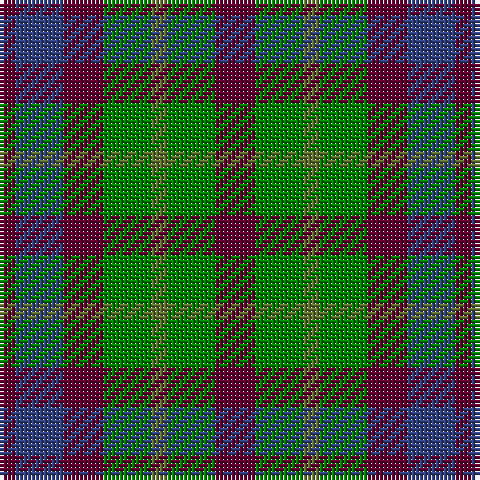

In pattern [BBBGGGB](/patterns/bbbgggb/).

This was sourced from weddslist.  It is a [7 stripes tartan](/stripes/stripes7/).

Original link http://www.weddslist.com/cgi-bin/tartans/pg.pl?source=sts

## Thread count
DR/4 B12 DR10 Ga12 G4 Ga12 DR/10

## Palette
Each colour and its ΔE from the base-6 reference it is a variant of.

| Colour | Shade | Base | ΔE (OKLab) |
|---|---|---|---|
| B | <code style="background-color:#304080;">#304080</code> `#304080` | B <code style="background-color:#2A418A;">#2A418A</code> | 0.02 |
| DR | <code style="background-color:#600030;">#600030</code> `#600030` | B <code style="background-color:#2A418A;">#2A418A</code> | 0.20 |
| G | <code style="background-color:#607030;">#607030</code> `#607030` | G <code style="background-color:#006100;">#006100</code> | 0.11 |
| Ga | <code style="background-color:#008000;">#008000</code> `#008000` | G <code style="background-color:#006100;">#006100</code> | 0.10 |

# Sample pattern

## Nearest tartans

The nearest existing variants by ΔTartan distance.

1. [Gleneagles Group](/setts/s7/r5g6y2g6r5b6r2~b3953b5-g006e21-r8c0034-y919441~x2/) — ΔT 0.59
1. [Wilson's No.137](/setts/s8/g6b3k3b3k3b3g6r2~b780078-g006818-k101010-rc80000~x2/) — ΔT 0.93
1. [Wilson's No.173](/setts/s8/g6b3k3b3k3b3g6ka2~b780078-g285800-k101010-ka000000~x2/) — ΔT 1.15
1. [Unidentified No 30](/setts/s9/k1b3k3g3r1g3k3g1r1~b2c4084-g005020-k101010-rdc0000~x2/) — ΔT 1.17
1. [MacKay Coat](/setts/s7/k4g4y1g4k4b4k1~b2c4084-g005020-k101010-ye8c000~x2/) — ΔT 1.29
1. [Unidentified No 39](/setts/s7/k4g4k1g4k4b4y1~b2c4084-g005020-k101010-ye8c000~x2/) — ΔT 1.29
1. [Durham District Tartan Tartan Number: 1089. Earliest known date: 1819 It was Wilson's practice to give the names of towns to many of his new designs. Maybe because the order came from there or because it was the name of the purchaser. There was a family of Durhams associated with the Royal Court in Edinburgh prior to the Union of the Crowns. Wilson was also a collector of tartans, receiving samples from his agents in the Highlands and from purchase orders from around the world. See 'Denholme' and 'Urquhart'. See products available Copyright © Blair Urquhart, Comrie, 2015](/setts/s5/k1g3k3b3r1~b2c2c80-g006818-k101010-rc80000~x4/) — ΔT 1.34
1. [Campbell of Breadalbane Clan Tartan Tartan Number: 1046. Earliest known date: 1810-15 The earliest reference to this pattern is called simply, Breadalbane. W. and A. Smith (1850) were the first to illustrate the sett in its present form. Wilson's of Bannockburn produced this pattern, the No. 64 or 'Abercrombie' in a variety of colours. (See Graham, MacCallum, Rollo.) See products available Copyright © Blair Urquhart, Comrie, 2015](/setts/s7/k9g9y2g9k9b9k3~b2c2c80-g006818-k101010-ye8c000~x2/) — ΔT 1.42
1. [Hirstwood (Name)](/setts/s4/y28r24g55b19~b503868-g003820-r880000-ybc8c00~x2/) — ΔT 1.45
1. [Burnicle (2015)](/setts/s6/r2k1b2k1g2k1~b2c2c80-g006818-k101010-rc80000~x28/) — ΔT 1.46

## Neighbour map

Every grey dot is one of 15726 variants placed by the first two principal components of the ΔTartan feature space (44% of its variance). Red is this tartan; blue dots are its nearest — click one to open its page.

<svg viewBox="0 0 640 380" role="img" style="max-width:100%;height:auto;border:1px solid #e0e0e0;border-radius:4px;display:block" xmlns="http://www.w3.org/2000/svg"><image href="/nn/cloud.v1.png" width="640" height="380"/><a href="/setts/s7/r5g6y2g6r5b6r2~b3953b5-g006e21-r8c0034-y919441~x2/"><circle cx="136.5" cy="306.3" r="4" fill="#3465a4"><title>Gleneagles Group</title></circle></a><a href="/setts/s8/g6b3k3b3k3b3g6r2~b780078-g006818-k101010-rc80000~x2/"><circle cx="129.7" cy="293.5" r="4" fill="#3465a4"><title>Wilson's No.137</title></circle></a><a href="/setts/s8/g6b3k3b3k3b3g6ka2~b780078-g285800-k101010-ka000000~x2/"><circle cx="133.6" cy="297.8" r="4" fill="#3465a4"><title>Wilson's No.173</title></circle></a><a href="/setts/s9/k1b3k3g3r1g3k3g1r1~b2c4084-g005020-k101010-rdc0000~x2/"><circle cx="137.1" cy="290.2" r="4" fill="#3465a4"><title>Unidentified No 30</title></circle></a><a href="/setts/s7/k4g4y1g4k4b4k1~b2c4084-g005020-k101010-ye8c000~x2/"><circle cx="166.0" cy="299.9" r="4" fill="#3465a4"><title>MacKay Coat</title></circle></a><a href="/setts/s7/k4g4k1g4k4b4y1~b2c4084-g005020-k101010-ye8c000~x2/"><circle cx="166.0" cy="299.9" r="4" fill="#3465a4"><title>Unidentified No 39</title></circle></a><a href="/setts/s5/k1g3k3b3r1~b2c2c80-g006818-k101010-rc80000~x4/"><circle cx="127.2" cy="313.8" r="4" fill="#3465a4"><title>Durham District Tartan Tartan Number: 1089. Earliest known date: 1819 It was Wilson's practice to give the names of towns to many of his new designs. Maybe because the order came from there or because it was the name of the purchaser. There was a family of Durhams associated with the Royal Court in Edinburgh prior to the Union of the Crowns. Wilson was also a collector of tartans, receiving samples from his agents in the Highlands and from purchase orders from around the world. See 'Denholme' and 'Urquhart'. See products available Copyright © Blair Urquhart, Comrie, 2015</title></circle></a><a href="/setts/s7/k9g9y2g9k9b9k3~b2c2c80-g006818-k101010-ye8c000~x2/"><circle cx="155.6" cy="291.1" r="4" fill="#3465a4"><title>Campbell of Breadalbane Clan Tartan Tartan Number: 1046. Earliest known date: 1810-15 The earliest reference to this pattern is called simply, Breadalbane. W. and A. Smith (1850) were the first to illustrate the sett in its present form. Wilson's of Bannockburn produced this pattern, the No. 64 or 'Abercrombie' in a variety of colours. (See Graham, MacCallum, Rollo.) See products available Copyright © Blair Urquhart, Comrie, 2015</title></circle></a><a href="/setts/s4/y28r24g55b19~b503868-g003820-r880000-ybc8c00~x2/"><circle cx="161.3" cy="318.9" r="4" fill="#3465a4"><title>Hirstwood (Name)</title></circle></a><a href="/setts/s6/r2k1b2k1g2k1~b2c2c80-g006818-k101010-rc80000~x28/"><circle cx="63.0" cy="325.1" r="4" fill="#3465a4"><title>Burnicle (2015)</title></circle></a><circle cx="129.4" cy="308.3" r="5" fill="#c00000"/></svg>

ID: /setts/s7/b5g6ga2g6b5ba6b2~b600030-ba304080-g008000-ga607030~x2/
