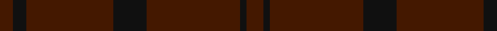

In pattern [BKBKBKB](/patterns/bkbkbkb/).

This was sourced from register-of-tartans.  It is a [7 stripes tartan](/stripes/stripes7/).

Original link https://www.tartanregister.gov.uk/tartanDetails.aspx?ref=1020

## Thread count
DR/8 K8 DR52 K20 DR56 K4 DR/10

## Palette
Each colour and its ΔE from the base-6 reference it is a variant of.

| Colour | Shade | Base | ΔE (OKLab) |
|---|---|---|---|
| DR | <code style="background-color:#441800;">#441800</code> `#441800` | B <code style="background-color:#2A418A;">#2A418A</code> | 0.23 |
| K | <code style="background-color:#101010;">#101010</code> `#101010` | K <code style="background-color:#000000;">#000000</code> | 0.17 |

# Sample pattern

## Nearest tartans

The nearest existing variants by ΔTartan distance.

1. [Hebridean Cairn Fashion Tartan Tartan Number: 6822. Earliest known date: 2005 For a new House of Edgar Collection in wedding gray. See products available Copyright © Blair Urquhart, Comrie, 2015](/setts/s8/b2g3b3g3b10g2b18g1~b484848-g6c6c6c~x4/) — ΔT 2.08
1. [Ben Dubh (The Black Mount)](/setts/s6/b4k2b16k2b16k1~b282828-k101010~x4/) — ΔT 2.78
1. [Black Spirit Fashion Tartan Tartan Number: 10119. Earliest known date: ACS Tartan See products available Copyright © Blair Urquhart, Comrie, 2015](/setts/s7/k17ka4k13ka4k3ka45k3~k010204-ka121617~x2/) — ΔT 2.98
1. [STLTH (Corporate)](/setts/s7/b4k2b4k45ba2k3ba2~b1c1c1c-ba5c5c5c-k101010~x2/) — ΔT 3.06
1. [Taiheiyo Club, Inc.](/setts/s7/k46g6k6g6k42g47k12~g003820-k101010/) — ΔT 3.07
1. [Hebridean Cairn (Fashion)](/setts/s8/b2r3b3r3b10r2b18r1~b5c5c5c-r888888~x4/) — ΔT 3.08
1. [Scottish Football Association (Corp)](/setts/s6/k120b4k12ba36g3k6~b203078-ba14283c-g006038-k101010/) — ΔT 3.20
1. [Hebridean Cairn](/setts/s14/b18r2b10r3b3r3b2r3b3r3b10r2b18r1~b5c5c5c-r888888~x4/) — ΔT 3.34
1. [Dark Island](/setts/s16/k4b2k43b20k4b2k2b4k2b2k4b20k43b2k4b2~b282828-k101010~x2/) — ΔT 3.40
1. [Cairns, David (Personal)](/setts/s5/b11ba1b4ba8r1~b393939-ba5b5b5b-ra40b00~x8/) — ΔT 3.45

## Neighbour map

Every grey dot is one of 15726 variants placed by the first two principal components of the ΔTartan feature space (44% of its variance). Red is this tartan; blue dots are its nearest — click one to open its page.

<svg viewBox="0 0 640 380" role="img" style="max-width:100%;height:auto;border:1px solid #e0e0e0;border-radius:4px;display:block" xmlns="http://www.w3.org/2000/svg"><image href="/nn/cloud.v1.png" width="640" height="380"/><a href="/setts/s8/b2g3b3g3b10g2b18g1~b484848-g6c6c6c~x4/"><circle cx="626.0" cy="302.1" r="4" fill="#3465a4"><title>Hebridean Cairn Fashion Tartan Tartan Number: 6822. Earliest known date: 2005 For a new House of Edgar Collection in wedding gray. See products available Copyright © Blair Urquhart, Comrie, 2015</title></circle></a><a href="/setts/s6/b4k2b16k2b16k1~b282828-k101010~x4/"><circle cx="626.0" cy="366.0" r="4" fill="#3465a4"><title>Ben Dubh (The Black Mount)</title></circle></a><a href="/setts/s7/k17ka4k13ka4k3ka45k3~k010204-ka121617~x2/"><circle cx="626.0" cy="325.9" r="4" fill="#3465a4"><title>Black Spirit Fashion Tartan Tartan Number: 10119. Earliest known date: ACS Tartan See products available Copyright © Blair Urquhart, Comrie, 2015</title></circle></a><a href="/setts/s7/b4k2b4k45ba2k3ba2~b1c1c1c-ba5c5c5c-k101010~x2/"><circle cx="626.0" cy="248.4" r="4" fill="#3465a4"><title>STLTH (Corporate)</title></circle></a><a href="/setts/s7/k46g6k6g6k42g47k12~g003820-k101010/"><circle cx="575.8" cy="347.5" r="4" fill="#3465a4"><title>Taiheiyo Club, Inc.</title></circle></a><a href="/setts/s8/b2r3b3r3b10r2b18r1~b5c5c5c-r888888~x4/"><circle cx="626.0" cy="282.4" r="4" fill="#3465a4"><title>Hebridean Cairn (Fashion)</title></circle></a><a href="/setts/s6/k120b4k12ba36g3k6~b203078-ba14283c-g006038-k101010/"><circle cx="626.0" cy="242.7" r="4" fill="#3465a4"><title>Scottish Football Association (Corp)</title></circle></a><a href="/setts/s14/b18r2b10r3b3r3b2r3b3r3b10r2b18r1~b5c5c5c-r888888~x4/"><circle cx="626.0" cy="263.6" r="4" fill="#3465a4"><title>Hebridean Cairn</title></circle></a><a href="/setts/s16/k4b2k43b20k4b2k2b4k2b2k4b20k43b2k4b2~b282828-k101010~x2/"><circle cx="626.0" cy="270.7" r="4" fill="#3465a4"><title>Dark Island</title></circle></a><a href="/setts/s5/b11ba1b4ba8r1~b393939-ba5b5b5b-ra40b00~x8/"><circle cx="545.7" cy="320.9" r="4" fill="#3465a4"><title>Cairns, David (Personal)</title></circle></a><circle cx="626.0" cy="335.8" r="5" fill="#c00000"/></svg>

ID: /setts/s7/b5k2b28k10b26k4b4~b441800-k101010~x2/
