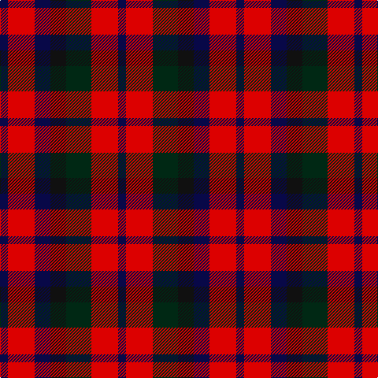

In pattern [BRBKGRB](/patterns/brbkgrb/).

This was sourced from register-of-tartans.  It is a [7 stripes tartan](/stripes/stripes7/).

Original link https://www.tartanregister.gov.uk/tartanDetails.aspx?ref=2675

## Thread count
DB/10 R34 DB20 K20 DG32 R34 DB/10

## Palette
Each colour and its ΔE from the base-6 reference it is a variant of.

| Colour | Shade | Base | ΔE (OKLab) |
|---|---|---|---|
| DB | <code style="background-color:#080848;">#080848</code> `#080848` | B <code style="background-color:#2A418A;">#2A418A</code> | 0.20 |
| DG | <code style="background-color:#002814;">#002814</code> `#002814` | G <code style="background-color:#006100;">#006100</code> | 0.20 |
| K | <code style="background-color:#101010;">#101010</code> `#101010` | K <code style="background-color:#000000;">#000000</code> | 0.17 |
| R | <code style="background-color:#DC0000;">#DC0000</code> `#DC0000` | R <code style="background-color:#CC0000;">#CC0000</code> | 0.03 |

# Sample pattern

## Nearest tartans

The nearest existing variants by ΔTartan distance.

1. [MacNaughton Clan Tartan Tartan Number: 404. Earliest known date: (1831) MacNaughtons once were found in Lochawe, Glenaray, Loch Fyne and Glenshira. Their stronghold was Dundarave castle. In 1878 the chief was restored as Sir Francis MacNaughton of Dunderawe of Bushmills in Ireland. Logan recorded the sett in his book, 'The Scottish Gael' in 1831. See products available Copyright © Blair Urquhart, Comrie, 2015](/setts/s7/b5r17g16k10b10r17b5x2~b202060-g003820-k101010-rc80000/) — ΔT 0.73
1. [MacDuff #3](/setts/s7/r10b6k8g10r6g3r6x2~b2c4084-g005020-k101010-rdc0000/) — ΔT 1.09
1. [MacKean Red (Personal)](/setts/s8/r2k4r2k4b1w1b4r1x4~b2c2c80-k101010-rc80000-wc0c0c0/) — ΔT 1.13
1. [MacDuff](/setts/s7/r10b6k8g10r6g3r6x2~b304080-g008000-k000000-rc00000/) — ΔT 1.31
1. [Chivas Regal](/setts/s5/b6k6b6r14y3x2~b003c64-k101010-rb03000-ye8c000/) — ΔT 1.36
1. [Tulsa, City of](/setts/s6/g14b8g14r14k3r14x2~b2c2c80-g003820-k101010-rc80000/) — ΔT 1.36
1. [Isle of Gigha (District)](/setts/s7/y2b4k1b4r4y4b1x8~b202060-k101010-ra00048-ybc8c00/) — ΔT 1.42
1. [Austin / Wilson's No 137](/setts/s5/b3k3b3g6r2x2~b800080-g008000-k000000-rc00000/) — ΔT 1.45
1. [Chivas Regal (Corporate)](/setts/s5/b2k2b2r5y1x12~b003c64-k101010-rb03000-ye8c000/) — ΔT 1.45
1. [Unidentified (Gow-like)](/setts/s5/r3g10r10k10r3x4~g006818-k00002c-rc80000/) — ΔT 1.46

## Neighbour map

Every grey dot is one of 15726 variants placed by the first two principal components of the ΔTartan feature space (44% of its variance). Red is this tartan; blue dots are its nearest — click one to open its page.

<svg viewBox="0 0 640 380" role="img" style="max-width:100%;height:auto;border:1px solid #e0e0e0;border-radius:4px;display:block" xmlns="http://www.w3.org/2000/svg"><image href="/nn/cloud.v1.png" width="640" height="380"/><a href="/setts/s7/b5r17g16k10b10r17b5x2~b202060-g003820-k101010-rc80000/"><circle cx="149.0" cy="282.8" r="4" fill="#3465a4"><title>MacNaughton Clan Tartan Tartan Number: 404. Earliest known date: (1831) MacNaughtons once were found in Lochawe, Glenaray, Loch Fyne and Glenshira. Their stronghold was Dundarave castle. In 1878 the chief was restored as Sir Francis MacNaughton of Dunderawe of Bushmills in Ireland. Logan recorded the sett in his book, 'The Scottish Gael' in 1831. See products available Copyright © Blair Urquhart, Comrie, 2015</title></circle></a><a href="/setts/s7/r10b6k8g10r6g3r6x2~b2c4084-g005020-k101010-rdc0000/"><circle cx="135.3" cy="290.9" r="4" fill="#3465a4"><title>MacDuff #3</title></circle></a><a href="/setts/s8/r2k4r2k4b1w1b4r1x4~b2c2c80-k101010-rc80000-wc0c0c0/"><circle cx="154.5" cy="253.9" r="4" fill="#3465a4"><title>MacKean Red (Personal)</title></circle></a><a href="/setts/s7/r10b6k8g10r6g3r6x2~b304080-g008000-k000000-rc00000/"><circle cx="114.3" cy="286.2" r="4" fill="#3465a4"><title>MacDuff</title></circle></a><a href="/setts/s5/b6k6b6r14y3x2~b003c64-k101010-rb03000-ye8c000/"><circle cx="159.1" cy="269.3" r="4" fill="#3465a4"><title>Chivas Regal</title></circle></a><a href="/setts/s6/g14b8g14r14k3r14x2~b2c2c80-g003820-k101010-rc80000/"><circle cx="181.3" cy="289.9" r="4" fill="#3465a4"><title>Tulsa, City of</title></circle></a><a href="/setts/s7/y2b4k1b4r4y4b1x8~b202060-k101010-ra00048-ybc8c00/"><circle cx="113.4" cy="249.4" r="4" fill="#3465a4"><title>Isle of Gigha (District)</title></circle></a><a href="/setts/s5/b3k3b3g6r2x2~b800080-g008000-k000000-rc00000/"><circle cx="82.8" cy="295.7" r="4" fill="#3465a4"><title>Austin / Wilson's No 137</title></circle></a><a href="/setts/s5/b2k2b2r5y1x12~b003c64-k101010-rb03000-ye8c000/"><circle cx="174.4" cy="262.5" r="4" fill="#3465a4"><title>Chivas Regal (Corporate)</title></circle></a><a href="/setts/s5/r3g10r10k10r3x4~g006818-k00002c-rc80000/"><circle cx="177.2" cy="300.9" r="4" fill="#3465a4"><title>Unidentified (Gow-like)</title></circle></a><circle cx="129.8" cy="275.0" r="5" fill="#c00000"/></svg>

ID: /setts/s7/b5r17g16k10b10r17b5x2~b080848-g002814-k101010-rdc0000/
