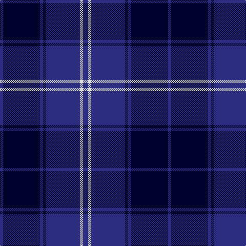

In pattern [BKBKBWB](/patterns/bkbkbwb/).

This was sourced from register-of-tartans.  It is a [7 stripes tartan](/stripes/stripes7/).

Original link https://www.tartanregister.gov.uk/tartanDetails.aspx?ref=108

## Attestations

This cloth appears in 2 source records; the oldest owns this page.

- 27/06/1995 — Argentina (register-of-tartans, [record](https://www.tartanregister.gov.uk/tartanDetails.aspx?ref=108))
- 1998 — St. Andrew Soc. of River Plate (Corp (tartans-authority, [record](http://www.tartansauthority.com/tartan-ferret/display/2487/))

## Register references

External register numbers recorded for this tartan.

- Scottish Register of Tartans: [108](https://www.tartanregister.gov.uk/tartanDetails.aspx?ref=108)
- Scottish Tartans Authority (ITI): 2487
- Scottish Tartans World Register: 2487

## Thread count
DB/6 DBa72 DB6 DBa6 DB66 LN6 DB/10

## Palette
Each colour and its ΔE from the base-6 reference it is a variant of.

| Colour | Shade | Base | ΔE (OKLab) |
|---|---|---|---|
| DB | <code style="background-color:#2C2C80;">#2C2C80</code> `#2C2C80` | B <code style="background-color:#2A418A;">#2A418A</code> | 0.06 |
| DBa | <code style="background-color:#00002C;">#00002C</code> `#00002C` | K <code style="background-color:#000000;">#000000</code> | 0.16 |
| LN | <code style="background-color:#E0E0E0;">#E0E0E0</code> `#E0E0E0` | W <code style="background-color:#F7F7F7;">#F7F7F7</code> | 0.07 |
| W | <code style="background-color:#F8F8F8;">#F8F8F8</code> `#F8F8F8` | W <code style="background-color:#F7F7F7;">#F7F7F7</code> | 0.00 |

# Sample pattern

## Nearest tartans

The nearest existing variants by ΔTartan distance.

1. [Argentina](/setts/s7/b5w3b33k3b3k36b3~b304080-k000030-we0e0e0~x2/) — ΔT 0.49
1. [Pride of Kinross](/setts/s8/k20b2k6b2k4b27w2b8~b2c2c80-k101010-wffffff~x2/) — ΔT 0.99
1. [Pride of Kinross](/setts/s8/k20b2k6b2k4b27w2b8~b2c2c80-k101010-wfcfcfc~x2/) — ΔT 0.99
1. [Auckland (Fashion)](/setts/s8/g3k3b2k16b2k2b24w2~b2c2c80-g003820-k101010-wc0c0c0~x2/) — ΔT 1.44
1. [Fenston/Morris (Personal)](/setts/s5/k33b8k4b35ba3~b0000cd-baaa00ff-k101010~x2/) — ΔT 1.51
1. [Lyndon Prep (School)](/setts/s6/b4w1b18k18y1k4~b1c0070-k101010-w98c8e8-ye8c000~x4/) — ΔT 1.54
1. [Royal Scotsman Train (Corporate)](/setts/s6/b5k2b14k14b2y2~b2c2c80-k101010-yb8b4b8~x2/) — ΔT 1.54
1. [St. Georges, Edgbaston](/setts/s7/r4k21w2k20b21k2b2~b304080-k000030-rc00000-we0e0e0~x2/) — ΔT 1.57
1. [Swan 2015, Brian E (Personal)](/setts/s7/k2b9k2b9k13w1k2~b0000cd-k101010-wffffff~x4/) — ΔT 1.60
1. [MacKay V](/setts/s6/b2k6b2k6b16r1~b000064-k000000-rc80000~x2/) — ΔT 1.61

## Neighbour map

Every grey dot is one of 15726 variants placed by the first two principal components of the ΔTartan feature space (44% of its variance). Red is this tartan; blue dots are its nearest — click one to open its page.

<svg viewBox="0 0 640 380" role="img" style="max-width:100%;height:auto;border:1px solid #e0e0e0;border-radius:4px;display:block" xmlns="http://www.w3.org/2000/svg"><image href="/nn/cloud.v1.png" width="640" height="380"/><a href="/setts/s7/b5w3b33k3b3k36b3~b304080-k000030-we0e0e0~x2/"><circle cx="366.3" cy="216.2" r="4" fill="#3465a4"><title>Argentina</title></circle></a><a href="/setts/s8/k20b2k6b2k4b27w2b8~b2c2c80-k101010-wffffff~x2/"><circle cx="387.2" cy="219.2" r="4" fill="#3465a4"><title>Pride of Kinross</title></circle></a><a href="/setts/s8/k20b2k6b2k4b27w2b8~b2c2c80-k101010-wfcfcfc~x2/"><circle cx="388.1" cy="219.6" r="4" fill="#3465a4"><title>Pride of Kinross</title></circle></a><a href="/setts/s8/g3k3b2k16b2k2b24w2~b2c2c80-g003820-k101010-wc0c0c0~x2/"><circle cx="359.4" cy="199.3" r="4" fill="#3465a4"><title>Auckland (Fashion)</title></circle></a><a href="/setts/s5/k33b8k4b35ba3~b0000cd-baaa00ff-k101010~x2/"><circle cx="342.9" cy="248.9" r="4" fill="#3465a4"><title>Fenston/Morris (Personal)</title></circle></a><a href="/setts/s6/b4w1b18k18y1k4~b1c0070-k101010-w98c8e8-ye8c000~x4/"><circle cx="365.4" cy="214.1" r="4" fill="#3465a4"><title>Lyndon Prep (School)</title></circle></a><a href="/setts/s6/b5k2b14k14b2y2~b2c2c80-k101010-yb8b4b8~x2/"><circle cx="350.4" cy="267.7" r="4" fill="#3465a4"><title>Royal Scotsman Train (Corporate)</title></circle></a><a href="/setts/s7/r4k21w2k20b21k2b2~b304080-k000030-rc00000-we0e0e0~x2/"><circle cx="344.7" cy="221.0" r="4" fill="#3465a4"><title>St. Georges, Edgbaston</title></circle></a><a href="/setts/s7/k2b9k2b9k13w1k2~b0000cd-k101010-wffffff~x4/"><circle cx="318.5" cy="229.3" r="4" fill="#3465a4"><title>Swan 2015, Brian E (Personal)</title></circle></a><a href="/setts/s6/b2k6b2k6b16r1~b000064-k000000-rc80000~x2/"><circle cx="424.4" cy="241.8" r="4" fill="#3465a4"><title>MacKay V</title></circle></a><circle cx="376.0" cy="220.8" r="5" fill="#c00000"/></svg>

ID: /setts/s7/b5w3b33k3b3k36b3~b2c2c80-k00002c-we0e0e0~x2/
