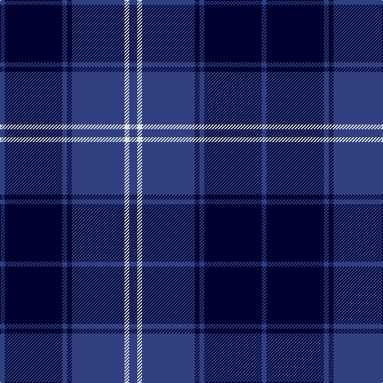

In pattern [BKBKBWB](/patterns/bkbkbwb/).

This was sourced from weddslist.  It is a [7 stripes tartan](/stripes/stripes7/).

Original link http://www.weddslist.com/cgi-bin/tartans/pg.pl?source=sts

## Thread count
B/6 DB72 B6 DB6 B66 LN6 B/10

## Palette
Each colour and its ΔE from the base-6 reference it is a variant of.

| Colour | Shade | Base | ΔE (OKLab) |
|---|---|---|---|
| B | <code style="background-color:#304080;">#304080</code> `#304080` | B <code style="background-color:#2A418A;">#2A418A</code> | 0.02 |
| DB | <code style="background-color:#000030;">#000030</code> `#000030` | K <code style="background-color:#000000;">#000000</code> | 0.17 |
| LN | <code style="background-color:#E0E0E0;">#E0E0E0</code> `#E0E0E0` | W <code style="background-color:#F7F7F7;">#F7F7F7</code> | 0.07 |

# Sample pattern

## Nearest tartans

The nearest existing variants by ΔTartan distance.

1. [Argentina](/setts/s7/b5w3b33k3b3k36b3~b2c2c80-k00002c-we0e0e0~x2/) — ΔT 0.49
1. [Pride of Kinross](/setts/s8/k20b2k6b2k4b27w2b8~b2c2c80-k101010-wffffff~x2/) — ΔT 0.91
1. [Pride of Kinross](/setts/s8/k20b2k6b2k4b27w2b8~b2c2c80-k101010-wfcfcfc~x2/) — ΔT 0.92
1. [Swan 2015, Brian E (Personal)](/setts/s7/k2b9k2b9k13w1k2~b0000cd-k101010-wffffff~x4/) — ΔT 1.42
1. [St. Georges, Edgbaston](/setts/s7/r4k21w2k20b21k2b2~b304080-k000030-rc00000-we0e0e0~x2/) — ΔT 1.44
1. [St Andrews, Earl of](/setts/s6/b52k28w5k3w2k10~b304080-k000030-we0e0e0/) — ΔT 1.44
1. [Auckland (Fashion)](/setts/s8/g3k3b2k16b2k2b24w2~b2c2c80-g003820-k101010-wc0c0c0~x2/) — ΔT 1.47
1. [Jon's Theme (Fashion)](/setts/s6/k1y2k3b12k18w1~b2c2c80-k00002c-wfcfcfc-ybc8c00~x2/) — ΔT 1.47
1. [Fenston/Morris (Personal)](/setts/s5/k33b8k4b35ba3~b0000cd-baaa00ff-k101010~x2/) — ΔT 1.49
1. [Slanj (Corporate)](/setts/s6/r4k28b3k3b25k3~b1474b4-k101010-r9c68a4~x2/) — ΔT 1.50

## Neighbour map

Every grey dot is one of 15726 variants placed by the first two principal components of the ΔTartan feature space (44% of its variance). Red is this tartan; blue dots are its nearest — click one to open its page.

<svg viewBox="0 0 640 380" role="img" style="max-width:100%;height:auto;border:1px solid #e0e0e0;border-radius:4px;display:block" xmlns="http://www.w3.org/2000/svg"><image href="/nn/cloud.v1.png" width="640" height="380"/><a href="/setts/s7/b5w3b33k3b3k36b3~b2c2c80-k00002c-we0e0e0~x2/"><circle cx="376.0" cy="220.8" r="4" fill="#3465a4"><title>Argentina</title></circle></a><a href="/setts/s8/k20b2k6b2k4b27w2b8~b2c2c80-k101010-wffffff~x2/"><circle cx="387.2" cy="219.2" r="4" fill="#3465a4"><title>Pride of Kinross</title></circle></a><a href="/setts/s8/k20b2k6b2k4b27w2b8~b2c2c80-k101010-wfcfcfc~x2/"><circle cx="388.1" cy="219.6" r="4" fill="#3465a4"><title>Pride of Kinross</title></circle></a><a href="/setts/s7/k2b9k2b9k13w1k2~b0000cd-k101010-wffffff~x4/"><circle cx="318.5" cy="229.3" r="4" fill="#3465a4"><title>Swan 2015, Brian E (Personal)</title></circle></a><a href="/setts/s7/r4k21w2k20b21k2b2~b304080-k000030-rc00000-we0e0e0~x2/"><circle cx="344.7" cy="221.0" r="4" fill="#3465a4"><title>St. Georges, Edgbaston</title></circle></a><a href="/setts/s6/b52k28w5k3w2k10~b304080-k000030-we0e0e0/"><circle cx="365.8" cy="188.7" r="4" fill="#3465a4"><title>St Andrews, Earl of</title></circle></a><a href="/setts/s8/g3k3b2k16b2k2b24w2~b2c2c80-g003820-k101010-wc0c0c0~x2/"><circle cx="359.4" cy="199.3" r="4" fill="#3465a4"><title>Auckland (Fashion)</title></circle></a><a href="/setts/s6/k1y2k3b12k18w1~b2c2c80-k00002c-wfcfcfc-ybc8c00~x2/"><circle cx="370.8" cy="193.6" r="4" fill="#3465a4"><title>Jon's Theme (Fashion)</title></circle></a><a href="/setts/s5/k33b8k4b35ba3~b0000cd-baaa00ff-k101010~x2/"><circle cx="342.9" cy="248.9" r="4" fill="#3465a4"><title>Fenston/Morris (Personal)</title></circle></a><a href="/setts/s6/r4k28b3k3b25k3~b1474b4-k101010-r9c68a4~x2/"><circle cx="320.2" cy="228.1" r="4" fill="#3465a4"><title>Slanj (Corporate)</title></circle></a><circle cx="366.3" cy="216.2" r="5" fill="#c00000"/></svg>

ID: /setts/s7/b5w3b33k3b3k36b3~b304080-k000030-we0e0e0~x2/
