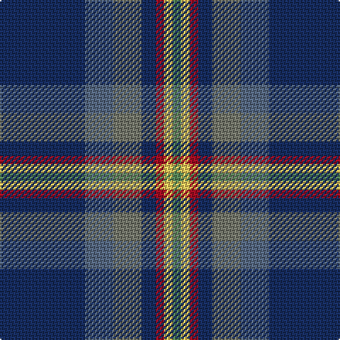

In pattern [BBGBRYG](/patterns/bbgbryg/).

This was sourced from register-of-tartans.  It is a [7 stripes tartan](/stripes/stripes7/).

Original link https://www.tartanregister.gov.uk/tartanDetails.aspx?ref=10374

## Thread count
DB/60 B20 N20 DB10 DR6 LG6 G/6

## Palette
Each colour and its ΔE from the base-6 reference it is a variant of.

| Colour | Shade | Base | ΔE (OKLab) |
|---|---|---|---|
| B | <code style="background-color:#576982;">#576982</code> `#576982` | B <code style="background-color:#2A418A;">#2A418A</code> | 0.14 |
| DB | <code style="background-color:#172D60;">#172D60</code> `#172D60` | B <code style="background-color:#2A418A;">#2A418A</code> | 0.09 |
| DR | <code style="background-color:#A20D22;">#A20D22</code> `#A20D22` | R <code style="background-color:#CC0000;">#CC0000</code> | 0.09 |
| G | <code style="background-color:#588658;">#588658</code> `#588658` | G <code style="background-color:#006100;">#006100</code> | 0.16 |
| LG | <code style="background-color:#F9C75C;">#F9C75C</code> `#F9C75C` | Y <code style="background-color:#F2BF00;">#F2BF00</code> | 0.05 |
| N | <code style="background-color:#75786C;">#75786C</code> `#75786C` | G <code style="background-color:#006100;">#006100</code> | 0.19 |

# Sample pattern

## Nearest tartans

The nearest existing variants by ΔTartan distance.

1. [Spirit of Fife (Corporate)](/setts/s8/g20w4b6ga4r28ba52g4ba12-b14283c-ba003c64-g005448-ga408060-rb468ac-wf8f8f8/) — ΔT 0.77
1. [Margach, William (Personal)](/setts/s6/r8k6b36ra6ba68w6-b1474b4-ba003c64-k101010-ra8088c-rac8002c-we0e0e0/) — ΔT 0.88
1. [Margach, William (Dumbarton)](/setts/s6/r8k6b36ra6ba68w6-b5f749c-ba433a5a-k1c1714-r86264d-raca2625-wf9f5ef/) — ΔT 0.91
1. [Cot-Hach (Personal)l)](/setts/s8/b12g40b20y4b40k4r16w4-b2c2c80-g003820-k101010-r880000-wfcfcfc-ye8c000/) — ΔT 0.94
1. [Côté-Haché (Personal)](/setts/s8/b12g40b20y4b40k4r16w4-b2c2c80-g003c14-k101010-r880000-wffffff-yffe600/) — ΔT 1.06
1. [State Seal of Iowa (Fashion)](/setts/s8/b10ba86b36w8ba12r10g50y10-b003c64-ba1474b4-g604000-r880000-we8ccb8-ybc8c00/) — ΔT 1.22
1. [Kansai St Andrews Society](/setts/s10/b60w4r6w4ba28y6g28b36r4b6-b2c4084-ba000064-g005020-rc80028-we0e0e0-yec9d9d/) — ΔT 1.23
1. [Suzugamine (Corporate)](/setts/s9/b8g10ga38ba10g10k10g10b72y6-b2c2c80-ba780078-g384020-ga006818-k000000-yd8d898/) — ΔT 1.24
1. [Laurentian University](/setts/s8/b4ba8w4ba56g56y6ba8ga4-b5c5c5c-ba203074-g005430-ga604000-we0e0e0-ye8c000/) — ΔT 1.24
1. [Vipont Family Tartan Tartan Number: 1479. Earliest known date: 1983 This count comes from a sample at the Scottish Tartans Society, in the MacGregor Hastie collection. He in turn procured it from J.Wright of Edinburgh. A contradictory note in the files says, "It was apparently designed and woven by them (J.Wright) for the family of Vipont c.1930. It is rarely if ever used today." The Scottish Viponts are an ancient family, who formerly possessed lands in Aberdour, Fife. See products available Copyright © Blair Urquhart, Comrie, 2015](/setts/s7/r8g28k6w6g24b72wa8-b2c2c80-g006818-k101010-rc80000-wc49cd8-wae0e0e0/) — ΔT 1.26

## Neighbour map

Every grey dot is one of 15726 variants placed by the first two principal components of the ΔTartan feature space (44% of its variance). Red is this tartan; blue dots are its nearest — click one to open its page.

<svg viewBox="0 0 640 380" role="img" style="max-width:100%;height:auto;border:1px solid #e0e0e0;border-radius:4px;display:block" xmlns="http://www.w3.org/2000/svg"><image href="/nn/cloud.v1.png" width="640" height="380"/><a href="/setts/s8/g20w4b6ga4r28ba52g4ba12-b14283c-ba003c64-g005448-ga408060-rb468ac-wf8f8f8/"><circle cx="247.4" cy="162.2" r="4" fill="#3465a4"><title>Spirit of Fife (Corporate)</title></circle></a><a href="/setts/s6/r8k6b36ra6ba68w6-b1474b4-ba003c64-k101010-ra8088c-rac8002c-we0e0e0/"><circle cx="271.3" cy="170.9" r="4" fill="#3465a4"><title>Margach, William (Personal)</title></circle></a><a href="/setts/s6/r8k6b36ra6ba68w6-b5f749c-ba433a5a-k1c1714-r86264d-raca2625-wf9f5ef/"><circle cx="290.7" cy="170.9" r="4" fill="#3465a4"><title>Margach, William (Dumbarton)</title></circle></a><a href="/setts/s8/b12g40b20y4b40k4r16w4-b2c2c80-g003820-k101010-r880000-wfcfcfc-ye8c000/"><circle cx="241.0" cy="183.5" r="4" fill="#3465a4"><title>Cot-Hach (Personal)l)</title></circle></a><a href="/setts/s8/b12g40b20y4b40k4r16w4-b2c2c80-g003c14-k101010-r880000-wffffff-yffe600/"><circle cx="231.3" cy="179.2" r="4" fill="#3465a4"><title>Côté-Haché (Personal)</title></circle></a><a href="/setts/s8/b10ba86b36w8ba12r10g50y10-b003c64-ba1474b4-g604000-r880000-we8ccb8-ybc8c00/"><circle cx="214.6" cy="170.4" r="4" fill="#3465a4"><title>State Seal of Iowa (Fashion)</title></circle></a><a href="/setts/s10/b60w4r6w4ba28y6g28b36r4b6-b2c4084-ba000064-g005020-rc80028-we0e0e0-yec9d9d/"><circle cx="277.5" cy="143.8" r="4" fill="#3465a4"><title>Kansai St Andrews Society</title></circle></a><a href="/setts/s9/b8g10ga38ba10g10k10g10b72y6-b2c2c80-ba780078-g384020-ga006818-k000000-yd8d898/"><circle cx="218.7" cy="151.0" r="4" fill="#3465a4"><title>Suzugamine (Corporate)</title></circle></a><a href="/setts/s8/b4ba8w4ba56g56y6ba8ga4-b5c5c5c-ba203074-g005430-ga604000-we0e0e0-ye8c000/"><circle cx="295.3" cy="154.6" r="4" fill="#3465a4"><title>Laurentian University</title></circle></a><a href="/setts/s7/r8g28k6w6g24b72wa8-b2c2c80-g006818-k101010-rc80000-wc49cd8-wae0e0e0/"><circle cx="225.6" cy="155.5" r="4" fill="#3465a4"><title>Vipont Family Tartan Tartan Number: 1479. Earliest known date: 1983 This count comes from a sample at the Scottish Tartans Society, in the MacGregor Hastie collection. He in turn procured it from J.Wright of Edinburgh. A contradictory note in the files says, &quot;It was apparently designed and woven by them (J.Wright) for the family of Vipont c.1930. It is rarely if ever used today.&quot; The Scottish Viponts are an ancient family, who formerly possessed lands in Aberdour, Fife. See products available Copyright © Blair Urquhart, Comrie, 2015</title></circle></a><circle cx="271.5" cy="176.4" r="5" fill="#c00000"/></svg>

ID: /setts/s7/b60ba20g20b10r6y6ga6-b172d60-ba576982-g75786c-ga588658-ra20d22-yf9c75c/
