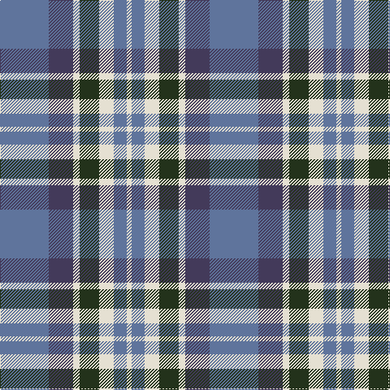

In pattern [BBWGWBW](/patterns/bbwgwbw/).

This was sourced from register-of-tartans.  It is a [7 stripes tartan](/stripes/stripes7/).

Original link https://www.tartanregister.gov.uk/tartanDetails.aspx?ref=10830

## Thread count
B/60 N30 W8 K24 W18 B16 W/6

## Palette
Each colour and its ΔE from the base-6 reference it is a variant of.

| Colour | Shade | Base | ΔE (OKLab) |
|---|---|---|---|
| B | <code style="background-color:#5F749C;">#5F749C</code> `#5F749C` | B <code style="background-color:#2A418A;">#2A418A</code> | 0.17 |
| K | <code style="background-color:#23321B;">#23321B</code> `#23321B` | G <code style="background-color:#006100;">#006100</code> | 0.16 |
| N | <code style="background-color:#433A5A;">#433A5A</code> `#433A5A` | B <code style="background-color:#2A418A;">#2A418A</code> | 0.09 |
| W | <code style="background-color:#E5E0D2;">#E5E0D2</code> `#E5E0D2` | W <code style="background-color:#F7F7F7;">#F7F7F7</code> | 0.07 |

# Sample pattern

## Nearest tartans

The nearest existing variants by ΔTartan distance.

1. [Newall (Personal)](/setts/s7/b60ba30w8g24w18b16w6-b1474b4-ba003c64-g285800-we8ccb8/) — ΔT 0.90
1. [Keela (Corporate)](/setts/s7/b14w6b4w12b32ba52r8-b003c64-ba5c8ca8-r880000-wfcfcfc/) — ΔT 1.08
1. [Crombie House Check](/setts/s6/k6w20b4g12b36g4-b2c2c80-g006818-k101010-wc0c0c0/) — ΔT 1.14
1. [All as One (Corporate)](/setts/s5/k22b76r22g22k10-b2888c4-g006818-k101010-rc80000/) — ΔT 1.16
1. [Kyle Tartan Tartan Number: 1288. Earliest known date: pre 1984 Seen in Service Station at Gretna Green in 1984 by Angela Nisbett MSTS . Berars no relation to the other two Kyles (3615 & 3616). See products available Copyright © Blair Urquhart, Comrie, 2015](/setts/s7/r38k4w8k4b10k4b10-b5c5c5c-k101010-r888888-we0e0e0/) — ΔT 1.18
1. [Yale College of Wrexham (Corporate)](/setts/s8/r9w5b57k5b9r29k18w9-b2888c4-k101010-rc80000-we0e0e0/) — ΔT 1.18
1. [Pitt (Name)](/setts/s6/b46ba36w10ba4r28ba36-b1474b4-ba003c64-rc80000-wfcfcfc/) — ΔT 1.19
1. [Donnolly](/setts/s6/b6g42b6r42b70w6-b2c2c80-g00643c-rc04c08-wfcfcfc/) — ΔT 1.22
1. [Tilburg (District)](/setts/s5/b18y18b18ba46r6-b1c1c50-ba1c6894-rc80000-yc8c44c/) — ΔT 1.25
1. [MacTavish Dress](/setts/s6/r8b56k12w24k24y6-b5c8ca8-k101010-r880000-wc0c0c0-yd09800/) — ΔT 1.27

## Neighbour map

Every grey dot is one of 15726 variants placed by the first two principal components of the ΔTartan feature space (44% of its variance). Red is this tartan; blue dots are its nearest — click one to open its page.

<svg viewBox="0 0 640 380" role="img" style="max-width:100%;height:auto;border:1px solid #e0e0e0;border-radius:4px;display:block" xmlns="http://www.w3.org/2000/svg"><image href="/nn/cloud.v1.png" width="640" height="380"/><a href="/setts/s7/b60ba30w8g24w18b16w6-b1474b4-ba003c64-g285800-we8ccb8/"><circle cx="212.4" cy="212.7" r="4" fill="#3465a4"><title>Newall (Personal)</title></circle></a><a href="/setts/s7/b14w6b4w12b32ba52r8-b003c64-ba5c8ca8-r880000-wfcfcfc/"><circle cx="209.9" cy="180.9" r="4" fill="#3465a4"><title>Keela (Corporate)</title></circle></a><a href="/setts/s6/k6w20b4g12b36g4-b2c2c80-g006818-k101010-wc0c0c0/"><circle cx="224.3" cy="207.5" r="4" fill="#3465a4"><title>Crombie House Check</title></circle></a><a href="/setts/s5/k22b76r22g22k10-b2888c4-g006818-k101010-rc80000/"><circle cx="226.4" cy="230.2" r="4" fill="#3465a4"><title>All as One (Corporate)</title></circle></a><a href="/setts/s7/r38k4w8k4b10k4b10-b5c5c5c-k101010-r888888-we0e0e0/"><circle cx="253.3" cy="187.0" r="4" fill="#3465a4"><title>Kyle Tartan Tartan Number: 1288. Earliest known date: pre 1984 Seen in Service Station at Gretna Green in 1984 by Angela Nisbett MSTS . Berars no relation to the other two Kyles (3615 &amp; 3616). See products available Copyright © Blair Urquhart, Comrie, 2015</title></circle></a><a href="/setts/s8/r9w5b57k5b9r29k18w9-b2888c4-k101010-rc80000-we0e0e0/"><circle cx="223.5" cy="167.4" r="4" fill="#3465a4"><title>Yale College of Wrexham (Corporate)</title></circle></a><a href="/setts/s6/b46ba36w10ba4r28ba36-b1474b4-ba003c64-rc80000-wfcfcfc/"><circle cx="221.7" cy="231.9" r="4" fill="#3465a4"><title>Pitt (Name)</title></circle></a><a href="/setts/s6/b6g42b6r42b70w6-b2c2c80-g00643c-rc04c08-wfcfcfc/"><circle cx="262.5" cy="205.0" r="4" fill="#3465a4"><title>Donnolly</title></circle></a><a href="/setts/s5/b18y18b18ba46r6-b1c1c50-ba1c6894-rc80000-yc8c44c/"><circle cx="192.5" cy="244.2" r="4" fill="#3465a4"><title>Tilburg (District)</title></circle></a><a href="/setts/s6/r8b56k12w24k24y6-b5c8ca8-k101010-r880000-wc0c0c0-yd09800/"><circle cx="165.5" cy="187.3" r="4" fill="#3465a4"><title>MacTavish Dress</title></circle></a><circle cx="211.8" cy="205.2" r="5" fill="#c00000"/></svg>

ID: /setts/s7/b60ba30w8g24w18b16w6-b5f749c-ba433a5a-g23321b-we5e0d2/
