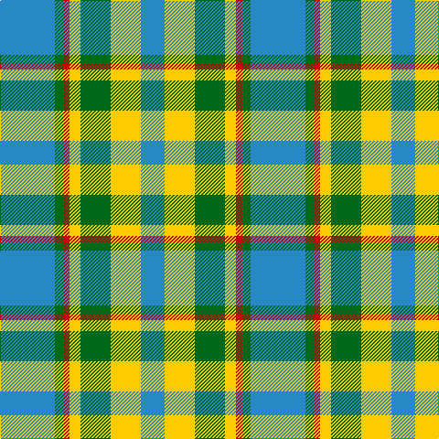

In pattern [BGRYGYB](/patterns/bgrygyb/).

This was sourced from tartans-authority.  It is a [7 stripes tartan](/stripes/stripes7/).

Original link http://www.tartansauthority.com/tartan-ferret/display/11078/

## Thread count
B/60 G9 R7 Y12 G33 Y33 B/26

## Palette
Each colour and its ΔE from the base-6 reference it is a variant of.

| Colour | Shade | Base | ΔE (OKLab) |
|---|---|---|---|
| B | <code style="background-color:#2888C4;">#2888C4</code> `#2888C4` | B <code style="background-color:#2A418A;">#2A418A</code> | 0.21 |
| G | <code style="background-color:#006818;">#006818</code> `#006818` | G <code style="background-color:#006100;">#006100</code> | 0.02 |
| R | <code style="background-color:#C80000;">#C80000</code> `#C80000` | R <code style="background-color:#CC0000;">#CC0000</code> | 0.01 |
| Y | <code style="background-color:#FCCC00;">#FCCC00</code> `#FCCC00` | Y <code style="background-color:#F2BF00;">#F2BF00</code> | 0.04 |

# Sample pattern

## Nearest tartans

The nearest existing variants by ΔTartan distance.

1. [Birnham, Blue (Dance)](/setts/s6/k6w50g32w6b50w6-b506880-g006818-k101010-wf0e0c8/) — ΔT 1.08
1. [State Seal of North Carolina (Fash.)](/setts/s7/w94g12b26ga40g12b12g56-b1474b4-g006818-ga604000-w98c8e8/) — ΔT 1.21
1. [Loch Leven](/setts/s6/b4g26b22ga8w18b4-b1474b4-g006818-ga789484-wfcfcfc/) — ΔT 1.37
1. [MacIntosh, dress](/setts/s6/r6w16b8g28r8b4-b304080-g008000-rc00000-we0e0e0/) — ΔT 1.44
1. [Riley (Personal)](/setts/s8/b52g12k16g6k16g60w6g6-b9058d8-g289c18-k101010-wfcfcfc/) — ΔT 1.45
1. [Beck-McSorley](/setts/s8/r6g6w6wa42g42w6g6w6-g285800-re87878-wc49cd8-wac0c0c0/) — ΔT 1.47
1. [Kerry County Crest (Fashion)](/setts/s10/y28b10g50b10w4g22b14w10g12y10-b2c2c80-g006818-we0e0e0-ye8c000/) — ΔT 1.48
1. [MacPherson Dress Blue (Dance) #2](/setts/s7/w10r6w52g42w6g16y6-g408060-r800028-we0e0e0-ye8c000/) — ΔT 1.48
1. [Gaelic College of St.Anns](/setts/s9/g64r8g32ga16w32b24w8b24w32-b788cb4-g007800-ga503c28-rc80000-wf8f8f8/) — ΔT 1.50
1. [Thistle and Kudzu Scottish Society](/setts/s4/b12y30g30w4-baa00ff-g006400-wffffff-y86c87c/) — ΔT 1.50

## Neighbour map

Every grey dot is one of 15726 variants placed by the first two principal components of the ΔTartan feature space (44% of its variance). Red is this tartan; blue dots are its nearest — click one to open its page.

<svg viewBox="0 0 640 380" role="img" style="max-width:100%;height:auto;border:1px solid #e0e0e0;border-radius:4px;display:block" xmlns="http://www.w3.org/2000/svg"><image href="/nn/cloud.v1.png" width="640" height="380"/><a href="/setts/s6/k6w50g32w6b50w6-b506880-g006818-k101010-wf0e0c8/"><circle cx="178.8" cy="200.4" r="4" fill="#3465a4"><title>Birnham, Blue (Dance)</title></circle></a><a href="/setts/s7/w94g12b26ga40g12b12g56-b1474b4-g006818-ga604000-w98c8e8/"><circle cx="162.6" cy="212.0" r="4" fill="#3465a4"><title>State Seal of North Carolina (Fash.)</title></circle></a><a href="/setts/s6/b4g26b22ga8w18b4-b1474b4-g006818-ga789484-wfcfcfc/"><circle cx="128.8" cy="232.5" r="4" fill="#3465a4"><title>Loch Leven</title></circle></a><a href="/setts/s6/r6w16b8g28r8b4-b304080-g008000-rc00000-we0e0e0/"><circle cx="149.6" cy="216.9" r="4" fill="#3465a4"><title>MacIntosh, dress</title></circle></a><a href="/setts/s8/b52g12k16g6k16g60w6g6-b9058d8-g289c18-k101010-wfcfcfc/"><circle cx="220.9" cy="178.8" r="4" fill="#3465a4"><title>Riley (Personal)</title></circle></a><a href="/setts/s8/r6g6w6wa42g42w6g6w6-g285800-re87878-wc49cd8-wac0c0c0/"><circle cx="222.0" cy="184.5" r="4" fill="#3465a4"><title>Beck-McSorley</title></circle></a><a href="/setts/s10/y28b10g50b10w4g22b14w10g12y10-b2c2c80-g006818-we0e0e0-ye8c000/"><circle cx="212.5" cy="178.1" r="4" fill="#3465a4"><title>Kerry County Crest (Fashion)</title></circle></a><a href="/setts/s7/w10r6w52g42w6g16y6-g408060-r800028-we0e0e0-ye8c000/"><circle cx="261.8" cy="190.2" r="4" fill="#3465a4"><title>MacPherson Dress Blue (Dance) #2</title></circle></a><a href="/setts/s9/g64r8g32ga16w32b24w8b24w32-b788cb4-g007800-ga503c28-rc80000-wf8f8f8/"><circle cx="112.9" cy="188.5" r="4" fill="#3465a4"><title>Gaelic College of St.Anns</title></circle></a><a href="/setts/s4/b12y30g30w4-baa00ff-g006400-wffffff-y86c87c/"><circle cx="161.5" cy="246.2" r="4" fill="#3465a4"><title>Thistle and Kudzu Scottish Society</title></circle></a><circle cx="206.9" cy="215.9" r="5" fill="#c00000"/></svg>

ID: /setts/s7/b60g9r7y12g33y33b26-b2888c4-g006818-rc80000-yfccc00/
