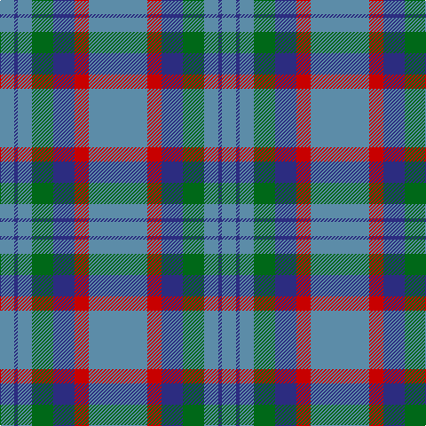

In pattern [BBBGBRB](/patterns/bbbgbrb/).

This was sourced from tartans-authority.  It is a [7 stripes tartan](/stripes/stripes7/).

Original link http://www.tartansauthority.com/tartan-ferret/display/696/

## Attestations

This cloth appears in 3 source records; the oldest owns this page.

- 1947 — Bermuda Plaid (1947) (District) (tartans-authority, [record](http://www.tartansauthority.com/tartan-ferret/display/696/))
- 01/01/1962 — Bermuda Plaid (1962) (register-of-tartans, [record](https://www.tartanregister.gov.uk/tartanDetails.aspx?ref=254))
- undated — Bermuda Plaid District Tartan Tartan Number: 696. Earliest known date: 1962 The original Bermuda Plaid was designed by Peter Macarthur Limited of Hamilton, Scotland in 1962 and was marketed on the island by Trimmingham Bros., Ltd. The colours represent the Sky, the Sea, the Coral and the Cedar trees which grow on the island. Bermuda is a British Dependant Territory. (Source: District Tartans, P Smith and G Teall, 1992) See products available Copyright © Blair Urquhart, Comrie, 2015 (house-of-tartan, [record](http://www.house-of-tartan.scotland.net/house/TartanViewjs.asp?colr=Def&tnam=696))

## Thread count
B/16 DB4 B16 G24 DB24 R16 B/66

## Palette
Each colour and its ΔE from the base-6 reference it is a variant of.

| Colour | Shade | Base | ΔE (OKLab) |
|---|---|---|---|
| B | <code style="background-color:#5C8CA8;">#5C8CA8</code> `#5C8CA8` | B <code style="background-color:#2C4084;">#2C4084</code> | 0.23 |
| DB | <code style="background-color:#2C2C80;">#2C2C80</code> `#2C2C80` | B <code style="background-color:#2C4084;">#2C4084</code> | 0.05 |
| G | <code style="background-color:#006818;">#006818</code> `#006818` | G <code style="background-color:#006400;">#006400</code> | 0.02 |
| R | <code style="background-color:#C80000;">#C80000</code> `#C80000` | R <code style="background-color:#C80000;">#C80000</code> | 0.00 |

# Sample pattern

ID: /setts/s7/b66r16ba24g24b16ba4b16-b5c8ca8-ba2c2c80-g006818-rc80000/
