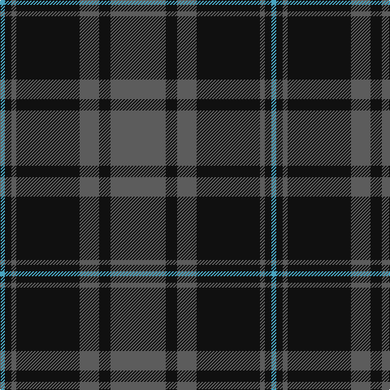

In pattern [BKBKBKY](/patterns/bkbkbky/).

This was sourced from tartans-authority.  It is a [7 stripes tartan](/stripes/stripes7/).

Original link http://www.tartansauthority.com/tartan-ferret/display/8271/

## Thread count
B/6 K8 N6 K78 N24 K14 N/68

## Palette
Each colour and its ΔE from the base-6 reference it is a variant of.

| Colour | Shade | Base | ΔE (OKLab) |
|---|---|---|---|
| B | <code style="background-color:#48A4C0;">#48A4C0</code> `#48A4C0` | Y <code style="background-color:#F2BF00;">#F2BF00</code> | 0.29 |
| K | <code style="background-color:#101010;">#101010</code> `#101010` | K <code style="background-color:#000000;">#000000</code> | 0.17 |
| N | <code style="background-color:#5C5C5C;">#5C5C5C</code> `#5C5C5C` | B <code style="background-color:#2A418A;">#2A418A</code> | 0.15 |

# Sample pattern

## Nearest tartans

The nearest existing variants by ΔTartan distance.

1. [TACC (Corporate)](/setts/s7/b68k14b24k80b6k8ba6-b5c5c5c-ba5c8ca8-k101010/) — ΔT 0.13
1. [Korner-MacPherson (Personal)](/setts/s7/b10r6b70k56b8k22b4-b5c5c5c-k101010-rc80000/) — ΔT 0.58
1. [Scottish National Party (Corporate)](/setts/s6/k6b62k6b6k54y6-b5c5c5c-k101010-ye8c000/) — ΔT 0.77
1. [Pride of the Forth](/setts/s6/b6k40ba6k6ba46k6-b3c82af-ba5c5c5c-k101010/) — ΔT 0.90
1. [Pride of the Forth](/setts/s6/k6b46k6b6k40y6-b5c5c5c-k101010-y48a4c0/) — ΔT 0.91
1. [Perthshire (New) District Tartan Tartan Number: 2188. Earliest known date: 1992 The New Perthshire District tartan has established itself through use and wont since 1992. It provides a useful alternative to the Drummond pattern which was always closely associated with Perthshire. See products available Copyright © Blair Urquhart, Comrie, 2015](/setts/s6/b52r12g32b16g6r4-b202060-g006818-rc80000/) — ΔT 1.04
1. [Brown, Barnaby (Personal)](/setts/s9/g8r4g32b8g4b8g4b40r8-b202060-g006818-rc8002c/) — ΔT 1.04
1. [Robertson of Struan 1816](/setts/s7/r12b4r4b44g40r8b8-b202060-g006818-rc80000/) — ΔT 1.19
1. [South African Air Force](/setts/s8/b60k56ba4y8ba4k56b60k8-b3c5470-ba5c8ca8-k101010-ye8c000/) — ΔT 1.20
1. [Cadence](/setts/s7/b102g10r30g74b34r12g10-b000050-g004010-rc00000/) — ΔT 1.21

## Neighbour map

Every grey dot is one of 15726 variants placed by the first two principal components of the ΔTartan feature space (44% of its variance). Red is this tartan; blue dots are its nearest — click one to open its page.

<svg viewBox="0 0 640 380" role="img" style="max-width:100%;height:auto;border:1px solid #e0e0e0;border-radius:4px;display:block" xmlns="http://www.w3.org/2000/svg"><image href="/nn/cloud.v1.png" width="640" height="380"/><a href="/setts/s7/b68k14b24k80b6k8ba6-b5c5c5c-ba5c8ca8-k101010/"><circle cx="367.7" cy="219.5" r="4" fill="#3465a4"><title>TACC (Corporate)</title></circle></a><a href="/setts/s7/b10r6b70k56b8k22b4-b5c5c5c-k101010-rc80000/"><circle cx="387.1" cy="208.1" r="4" fill="#3465a4"><title>Korner-MacPherson (Personal)</title></circle></a><a href="/setts/s6/k6b62k6b6k54y6-b5c5c5c-k101010-ye8c000/"><circle cx="340.0" cy="220.3" r="4" fill="#3465a4"><title>Scottish National Party (Corporate)</title></circle></a><a href="/setts/s6/b6k40ba6k6ba46k6-b3c82af-ba5c5c5c-k101010/"><circle cx="331.4" cy="246.1" r="4" fill="#3465a4"><title>Pride of the Forth</title></circle></a><a href="/setts/s6/k6b46k6b6k40y6-b5c5c5c-k101010-y48a4c0/"><circle cx="323.4" cy="242.5" r="4" fill="#3465a4"><title>Pride of the Forth</title></circle></a><a href="/setts/s6/b52r12g32b16g6r4-b202060-g006818-rc80000/"><circle cx="351.3" cy="233.2" r="4" fill="#3465a4"><title>Perthshire (New) District Tartan Tartan Number: 2188. Earliest known date: 1992 The New Perthshire District tartan has established itself through use and wont since 1992. It provides a useful alternative to the Drummond pattern which was always closely associated with Perthshire. See products available Copyright © Blair Urquhart, Comrie, 2015</title></circle></a><a href="/setts/s9/g8r4g32b8g4b8g4b40r8-b202060-g006818-rc8002c/"><circle cx="316.5" cy="215.2" r="4" fill="#3465a4"><title>Brown, Barnaby (Personal)</title></circle></a><a href="/setts/s7/r12b4r4b44g40r8b8-b202060-g006818-rc80000/"><circle cx="293.1" cy="216.5" r="4" fill="#3465a4"><title>Robertson of Struan 1816</title></circle></a><a href="/setts/s8/b60k56ba4y8ba4k56b60k8-b3c5470-ba5c8ca8-k101010-ye8c000/"><circle cx="308.0" cy="204.4" r="4" fill="#3465a4"><title>South African Air Force</title></circle></a><a href="/setts/s7/b102g10r30g74b34r12g10-b000050-g004010-rc00000/"><circle cx="308.4" cy="235.5" r="4" fill="#3465a4"><title>Cadence</title></circle></a><circle cx="360.8" cy="219.3" r="5" fill="#c00000"/></svg>

ID: /setts/s7/b68k14b24k78b6k8y6-b5c5c5c-k101010-y48a4c0/
