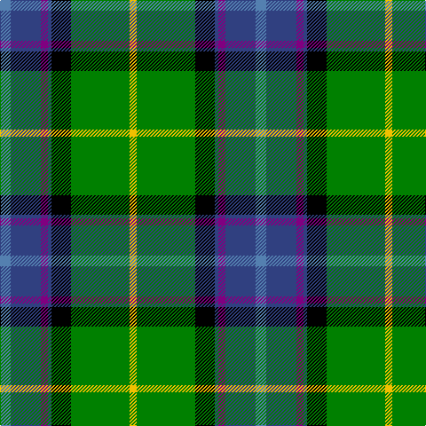

In pattern [BBBBKGY](/patterns/bbbbkgy/).

This was sourced from weddslist.  It is a [7 stripes tartan](/stripes/stripes7/).

Original link http://www.weddslist.com/cgi-bin/tartans/pg.pl?source=sts

## Thread count
Ba/12 B34 P8 B4 K22 G66 Y/8

## Palette
Each colour and its ΔE from the base-6 reference it is a variant of.

| Colour | Shade | Base | ΔE (OKLab) |
|---|---|---|---|
| B | <code style="background-color:#304080;">#304080</code> `#304080` | B <code style="background-color:#2A418A;">#2A418A</code> | 0.02 |
| Ba | <code style="background-color:#5480B0;">#5480B0</code> `#5480B0` | B <code style="background-color:#2A418A;">#2A418A</code> | 0.19 |
| G | <code style="background-color:#008000;">#008000</code> `#008000` | G <code style="background-color:#006100;">#006100</code> | 0.10 |
| K | <code style="background-color:#000000;">#000000</code> `#000000` | K <code style="background-color:#000000;">#000000</code> | 0.00 |
| P | <code style="background-color:#800080;">#800080</code> `#800080` | B <code style="background-color:#2A418A;">#2A418A</code> | 0.17 |
| Y | <code style="background-color:#F0C000;">#F0C000</code> `#F0C000` | Y <code style="background-color:#F2BF00;">#F2BF00</code> | 0.00 |

# Sample pattern

## Nearest tartans

The nearest existing variants by ΔTartan distance.

1. [Tooth](/setts/s8/g5y1r2g25k14b19w4g2x2~b304080-g008000-k000000-rc00000-we0e0e0-yf0c000/) — ΔT 0.86
1. [Shawlands International (Commem.)](/setts/s6/k3g44b27y6r10w3x2~b1c0070-g006818-k101010-rc80000-we0e0e0-yfccc00/) — ΔT 0.89
1. [Mission](/setts/s8/r2b14k1g11k2y2ga2k1x4~b5480b0-g008000-ga407050-k000000-r703000-ye0a0a0/) — ΔT 0.94
1. [Bergen Scottish](/setts/s7/b5w3r12g37k12ba21w2x2~b2c2c80-ba202060-g006818-k101010-rc80000-wf8f8f8/) — ΔT 0.95
1. [Iroquois Falls Centenary](/setts/s8/g18y6ga3w1ga3w1wa6b6x2~b000080-g006400-ga603311-wffffff-wa82cffd-y86c67c/) — ΔT 0.97
1. [Hogg Dress (Name)](/setts/s9/b34r3b8ba4b8k24g34k2w6~b4880a0-ba1c1c50-g006818-k101010-rc80000-we0e0e0/) — ΔT 0.99
1. [Tooth Family Tartan Tartan Number: 922. Earliest known date: 1980 STS collection. See products available Copyright © Blair Urquhart, Comrie, 2015](/setts/s8/g5y1r2g25k14b19w4g2x2~b2c2c80-g006818-k101010-rc80000-we0e0e0-ye8c000/) — ΔT 1.01
1. [Souza Nery](/setts/s7/y4g22r3k17r3b37w3x2~b304080-g008000-k000000-rc00020-we0e0e0-yf0c000/) — ΔT 1.03
1. [Macneil of Barra - Chief (Personal)](/setts/s7/w1r2b16k14g15k3y1x2~b1474b4-g006818-k101010-rc80000-wfcfcfc-ye8c000/) — ΔT 1.05
1. [Wishart, hunting](/setts/s7/k2b2g16ba2y1ba13w2x2~b304080-ba000050-g008000-k000000-we0e0e0-yf0c000/) — ΔT 1.05

## Neighbour map

Every grey dot is one of 15726 variants placed by the first two principal components of the ΔTartan feature space (44% of its variance). Red is this tartan; blue dots are its nearest — click one to open its page.

<svg viewBox="0 0 640 380" role="img" style="max-width:100%;height:auto;border:1px solid #e0e0e0;border-radius:4px;display:block" xmlns="http://www.w3.org/2000/svg"><image href="/nn/cloud.v1.png" width="640" height="380"/><a href="/setts/s8/g5y1r2g25k14b19w4g2x2~b304080-g008000-k000000-rc00000-we0e0e0-yf0c000/"><circle cx="190.7" cy="120.0" r="4" fill="#3465a4"><title>Tooth</title></circle></a><a href="/setts/s6/k3g44b27y6r10w3x2~b1c0070-g006818-k101010-rc80000-we0e0e0-yfccc00/"><circle cx="208.2" cy="150.0" r="4" fill="#3465a4"><title>Shawlands International (Commem.)</title></circle></a><a href="/setts/s8/r2b14k1g11k2y2ga2k1x4~b5480b0-g008000-ga407050-k000000-r703000-ye0a0a0/"><circle cx="171.1" cy="132.3" r="4" fill="#3465a4"><title>Mission</title></circle></a><a href="/setts/s7/b5w3r12g37k12ba21w2x2~b2c2c80-ba202060-g006818-k101010-rc80000-wf8f8f8/"><circle cx="167.0" cy="143.5" r="4" fill="#3465a4"><title>Bergen Scottish</title></circle></a><a href="/setts/s8/g18y6ga3w1ga3w1wa6b6x2~b000080-g006400-ga603311-wffffff-wa82cffd-y86c67c/"><circle cx="143.3" cy="127.0" r="4" fill="#3465a4"><title>Iroquois Falls Centenary</title></circle></a><a href="/setts/s9/b34r3b8ba4b8k24g34k2w6~b4880a0-ba1c1c50-g006818-k101010-rc80000-we0e0e0/"><circle cx="178.1" cy="137.7" r="4" fill="#3465a4"><title>Hogg Dress (Name)</title></circle></a><a href="/setts/s8/g5y1r2g25k14b19w4g2x2~b2c2c80-g006818-k101010-rc80000-we0e0e0-ye8c000/"><circle cx="217.1" cy="129.3" r="4" fill="#3465a4"><title>Tooth Family Tartan Tartan Number: 922. Earliest known date: 1980 STS collection. See products available Copyright © Blair Urquhart, Comrie, 2015</title></circle></a><a href="/setts/s7/y4g22r3k17r3b37w3x2~b304080-g008000-k000000-rc00020-we0e0e0-yf0c000/"><circle cx="153.4" cy="146.4" r="4" fill="#3465a4"><title>Souza Nery</title></circle></a><a href="/setts/s7/w1r2b16k14g15k3y1x2~b1474b4-g006818-k101010-rc80000-wfcfcfc-ye8c000/"><circle cx="148.5" cy="152.2" r="4" fill="#3465a4"><title>Macneil of Barra - Chief (Personal)</title></circle></a><a href="/setts/s7/k2b2g16ba2y1ba13w2x2~b304080-ba000050-g008000-k000000-we0e0e0-yf0c000/"><circle cx="190.1" cy="138.0" r="4" fill="#3465a4"><title>Wishart, hunting</title></circle></a><circle cx="167.0" cy="142.8" r="5" fill="#c00000"/></svg>

ID: /setts/s7/b6ba17bb4ba2k11g33y4x2~b5480b0-ba304080-bb800080-g008000-k000000-yf0c000/
