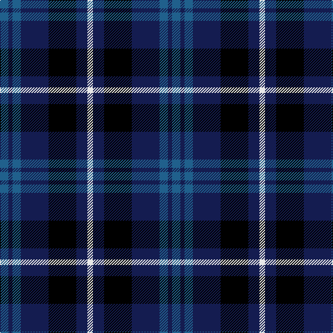

In pattern [BBBBKBW](/patterns/bbbbkbw/).

This was sourced from register-of-tartans.  It is a [7 stripes tartan](/stripes/stripes7/).

Original link https://www.tartanregister.gov.uk/tartanDetails.aspx?ref=10684

## Attestations

This cloth appears in 2 source records; the oldest owns this page.

- 28/08/2012 — Allianz Deutschland 2012 (register-of-tartans, [record](https://www.tartanregister.gov.uk/tartanDetails.aspx?ref=10684))
- undated — Allianz Deutschland 2012 Corporate Tartan Tartan Number: 10684. Earliest known date: 28 August 2012 Designed by Blair Urquhart of House of Tartan Ltd, together with the Creative Team, Allianz Deutschland, for the 2013 Scottish Visit. The tartan incorporates both the colours and the three elements of Allianz Deutschland's Corporate Trademark Device. See products available Copyright © Blair Urquhart, Comrie, 2015 (house-of-tartan, [record](http://www.house-of-tartan.scotland.net/house/TartanViewjs.asp?colr=Def&tnam=10684))

## Thread count
B/12 DB6 B12 DB40 K40 DB16 LN/8

## Palette
Each colour and its ΔE from the base-6 reference it is a variant of.

| Colour | Shade | Base | ΔE (OKLab) |
|---|---|---|---|
| B | <code style="background-color:#20608C;">#20608C</code> `#20608C` | B <code style="background-color:#2A418A;">#2A418A</code> | 0.09 |
| DB | <code style="background-color:#141C50;">#141C50</code> `#141C50` | B <code style="background-color:#2A418A;">#2A418A</code> | 0.15 |
| K | <code style="background-color:#000000;">#000000</code> `#000000` | K <code style="background-color:#000000;">#000000</code> | 0.00 |
| LN | <code style="background-color:#E8E8E8;">#E8E8E8</code> `#E8E8E8` | W <code style="background-color:#F7F7F7;">#F7F7F7</code> | 0.05 |

# Sample pattern

## Nearest tartans

The nearest existing variants by ΔTartan distance.

1. [Scottish Express International](/setts/s6/b6k29ba6k29b50ka6~b304080-ba8080d0-k000000-ka000030/) — ΔT 1.03
1. [Carrick High School](/setts/s7/k6y2k16b6k3ba18k2x2~b788cb4-ba00008c-k000000-yc88c00/) — ΔT 1.07
1. [Frobo Nairn](/setts/s5/r2b9k5g6b1x4~b00008c-g007800-k000000-r8c0000/) — ΔT 1.13
1. [Wallace Blue Dress Tartan Tartan Number: 6569. Earliest known date: See products available Copyright © Blair Urquhart, Comrie, 2015](/setts/s5/b1ba9b4k9g1x6~b2888c4-ba2c2c80-g006818-k000000/) — ΔT 1.14
1. [Eglinton](/setts/s7/k3g3k3b16k3r3k3x2~b4367ae-g11450d-k000000-raa0000/) — ΔT 1.14
1. [Eglinton](/setts/s7/k3g3k3b16k3r3k3~b4367ae-g11450d-k000000-raa0000/) — ΔT 1.14
1. [Melville](/setts/s6/k5w2g18k17b16k3~b5a3094-g004c00-k000000-wd0d0d0/) — ΔT 1.19
1. [Fletcher C](/setts/s7/b6k1b6k8r1g8r2~b000064-g004c00-k000000-rc80000/) — ΔT 1.22
1. [MacCorquodale](/setts/s7/r7k4b28k24ba24k4b4x2~b304080-ba5480b0-k000000-rc00000/) — ΔT 1.26
1. [Printing Industries of America](/setts/s8/k7r2k2ka6y1ka1y1ka4x4~k000000-ka000034-r8c0000-yc88c00/) — ΔT 1.28

## Neighbour map

Every grey dot is one of 15726 variants placed by the first two principal components of the ΔTartan feature space (44% of its variance). Red is this tartan; blue dots are its nearest — click one to open its page.

<svg viewBox="0 0 640 380" role="img" style="max-width:100%;height:auto;border:1px solid #e0e0e0;border-radius:4px;display:block" xmlns="http://www.w3.org/2000/svg"><image href="/nn/cloud.v1.png" width="640" height="380"/><a href="/setts/s6/b6k29ba6k29b50ka6~b304080-ba8080d0-k000000-ka000030/"><circle cx="252.2" cy="234.8" r="4" fill="#3465a4"><title>Scottish Express International</title></circle></a><a href="/setts/s7/k6y2k16b6k3ba18k2x2~b788cb4-ba00008c-k000000-yc88c00/"><circle cx="245.9" cy="218.8" r="4" fill="#3465a4"><title>Carrick High School</title></circle></a><a href="/setts/s5/r2b9k5g6b1x4~b00008c-g007800-k000000-r8c0000/"><circle cx="182.3" cy="247.0" r="4" fill="#3465a4"><title>Frobo Nairn</title></circle></a><a href="/setts/s5/b1ba9b4k9g1x6~b2888c4-ba2c2c80-g006818-k000000/"><circle cx="179.7" cy="232.8" r="4" fill="#3465a4"><title>Wallace Blue Dress Tartan Tartan Number: 6569. Earliest known date: See products available Copyright © Blair Urquhart, Comrie, 2015</title></circle></a><a href="/setts/s7/k3g3k3b16k3r3k3x2~b4367ae-g11450d-k000000-raa0000/"><circle cx="208.7" cy="216.8" r="4" fill="#3465a4"><title>Eglinton</title></circle></a><a href="/setts/s7/k3g3k3b16k3r3k3~b4367ae-g11450d-k000000-raa0000/"><circle cx="208.7" cy="216.8" r="4" fill="#3465a4"><title>Eglinton</title></circle></a><a href="/setts/s6/k5w2g18k17b16k3~b5a3094-g004c00-k000000-wd0d0d0/"><circle cx="183.8" cy="231.9" r="4" fill="#3465a4"><title>Melville</title></circle></a><a href="/setts/s7/b6k1b6k8r1g8r2~b000064-g004c00-k000000-rc80000/"><circle cx="164.4" cy="240.4" r="4" fill="#3465a4"><title>Fletcher C</title></circle></a><a href="/setts/s7/r7k4b28k24ba24k4b4x2~b304080-ba5480b0-k000000-rc00000/"><circle cx="140.4" cy="219.0" r="4" fill="#3465a4"><title>MacCorquodale</title></circle></a><a href="/setts/s8/k7r2k2ka6y1ka1y1ka4x4~k000000-ka000034-r8c0000-yc88c00/"><circle cx="227.9" cy="234.9" r="4" fill="#3465a4"><title>Printing Industries of America</title></circle></a><circle cx="195.9" cy="235.9" r="5" fill="#c00000"/></svg>

ID: /setts/s7/b6ba3b6ba20k20ba8w4x2~b20608c-ba141c50-k000000-we8e8e8/
