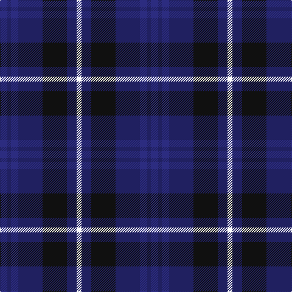

In pattern [BBBBKBW](/patterns/bbbbkbw/).

This was sourced from tartans-authority.  It is a [7 stripes tartan](/stripes/stripes7/).

Original link http://www.tartansauthority.com/tartan-ferret/display/10684/

## Thread count
DB/12 DBa6 DB12 DBa40 K40 DBa16 W/8

## Palette
Each colour and its ΔE from the base-6 reference it is a variant of.

| Colour | Shade | Base | ΔE (OKLab) |
|---|---|---|---|
| DB | <code style="background-color:#2C2C80;">#2C2C80</code> `#2C2C80` | B <code style="background-color:#2A418A;">#2A418A</code> | 0.06 |
| DBa | <code style="background-color:#202060;">#202060</code> `#202060` | B <code style="background-color:#2A418A;">#2A418A</code> | 0.11 |
| K | <code style="background-color:#101010;">#101010</code> `#101010` | K <code style="background-color:#000000;">#000000</code> | 0.17 |
| W | <code style="background-color:#FCFCFC;">#FCFCFC</code> `#FCFCFC` | W <code style="background-color:#F7F7F7;">#F7F7F7</code> | 0.01 |

# Sample pattern

## Nearest tartans

The nearest existing variants by ΔTartan distance.

1. [Brodie Countryfare (Corporate)](/setts/s7/b3k13b13ba13w2ba13w3~b2c2c80-ba1c0070-k101010-we0e0e0~x2/) — ΔT 0.94
1. [Heritage of Scotland](/setts/s7/b6w3b21k16ba6k3ba6~b2c2c80-ba780078-k101010-wf8f8f8~x2/) — ΔT 0.96
1. [Daks, Muted blue](/setts/s8/r5b12ba4ra4ba22b3ba4r5~b304080-ba000050-r806050-ra906030/) — ΔT 1.09
1. [Scottish Express International](/setts/s6/b1k4w1k4ba7k1~b9058d8-ba1c0070-k101010-wa8ace8~x4/) — ΔT 1.14
1. [Bareback (Corporate)](/setts/s6/b6k6b21k16ba36y4~b5c5c5c-ba2c2c80-k101010-ye8c000/) — ΔT 1.23
1. [St. Andrew Society](/setts/s7/b16k16ba16w3ba16k2bb3~b2c2c80-ba1c0070-bb2888c4-k101010-we0e0e0~x2/) — ΔT 1.24
1. [Scottish N. A. Business Council (Co](/setts/s10/r2b6ba6b2r2b4ba6r2b2w1~b1c0070-ba003c64-rc80000-we0e0e0~x4/) — ΔT 1.30
1. [Hamilton (Personal)](/setts/s10/b3g3b18r14b5r14b5r14b21g3~b000088-g004c00-r880000~x2/) — ΔT 1.39
1. [Scottish Open Squash (Corporate)](/setts/s5/b23ba2g11ba24w3~b1c0070-ba440044-g006818-wc0c0c0~x2/) — ΔT 1.40
1. [Clergy "Two Spirit" (Personal)](/setts/s11/b1ba3b1ba2b1k6w1k6ba6b1k1~b5c8ca8-ba2c2c80-k101010-wc49cd8~x2/) — ΔT 1.42

## Neighbour map

Every grey dot is one of 15726 variants placed by the first two principal components of the ΔTartan feature space (44% of its variance). Red is this tartan; blue dots are its nearest — click one to open its page.

<svg viewBox="0 0 640 380" role="img" style="max-width:100%;height:auto;border:1px solid #e0e0e0;border-radius:4px;display:block" xmlns="http://www.w3.org/2000/svg"><image href="/nn/cloud.v1.png" width="640" height="380"/><a href="/setts/s7/b3k13b13ba13w2ba13w3~b2c2c80-ba1c0070-k101010-we0e0e0~x2/"><circle cx="191.7" cy="254.9" r="4" fill="#3465a4"><title>Brodie Countryfare (Corporate)</title></circle></a><a href="/setts/s7/b6w3b21k16ba6k3ba6~b2c2c80-ba780078-k101010-wf8f8f8~x2/"><circle cx="223.4" cy="233.8" r="4" fill="#3465a4"><title>Heritage of Scotland</title></circle></a><a href="/setts/s8/r5b12ba4ra4ba22b3ba4r5~b304080-ba000050-r806050-ra906030/"><circle cx="278.0" cy="233.3" r="4" fill="#3465a4"><title>Daks, Muted blue</title></circle></a><a href="/setts/s6/b1k4w1k4ba7k1~b9058d8-ba1c0070-k101010-wa8ace8~x4/"><circle cx="282.7" cy="253.8" r="4" fill="#3465a4"><title>Scottish Express International</title></circle></a><a href="/setts/s6/b6k6b21k16ba36y4~b5c5c5c-ba2c2c80-k101010-ye8c000/"><circle cx="230.2" cy="235.6" r="4" fill="#3465a4"><title>Bareback (Corporate)</title></circle></a><a href="/setts/s7/b16k16ba16w3ba16k2bb3~b2c2c80-ba1c0070-bb2888c4-k101010-we0e0e0~x2/"><circle cx="212.3" cy="237.3" r="4" fill="#3465a4"><title>St. Andrew Society</title></circle></a><a href="/setts/s10/r2b6ba6b2r2b4ba6r2b2w1~b1c0070-ba003c64-rc80000-we0e0e0~x4/"><circle cx="196.5" cy="243.0" r="4" fill="#3465a4"><title>Scottish N. A. Business Council (Co</title></circle></a><a href="/setts/s10/b3g3b18r14b5r14b5r14b21g3~b000088-g004c00-r880000~x2/"><circle cx="227.4" cy="231.9" r="4" fill="#3465a4"><title>Hamilton (Personal)</title></circle></a><a href="/setts/s5/b23ba2g11ba24w3~b1c0070-ba440044-g006818-wc0c0c0~x2/"><circle cx="256.0" cy="235.4" r="4" fill="#3465a4"><title>Scottish Open Squash (Corporate)</title></circle></a><a href="/setts/s11/b1ba3b1ba2b1k6w1k6ba6b1k1~b5c8ca8-ba2c2c80-k101010-wc49cd8~x2/"><circle cx="227.1" cy="218.9" r="4" fill="#3465a4"><title>Clergy &quot;Two Spirit&quot; (Personal)</title></circle></a><circle cx="232.1" cy="248.4" r="5" fill="#c00000"/></svg>

ID: /setts/s7/b6ba3b6ba20k20ba8w4~b2c2c80-ba202060-k101010-wfcfcfc~x2/
