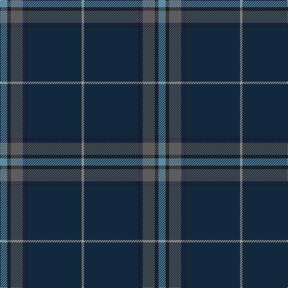

In pattern [BBBBBBY](/patterns/bbbbbby/).

This was sourced from register-of-tartans.  It is a [7 stripes tartan](/stripes/stripes7/).

Original link https://www.tartanregister.gov.uk/tartanDetails.aspx?ref=11530

## Register references

External register numbers recorded for this tartan.

- Scottish Register of Tartans: [11530](https://www.tartanregister.gov.uk/tartanDetails.aspx?ref=11530)

## Thread count
B/12 K6 Na20 DB4 K4 DN90 N/4

## Palette
Each colour and its ΔE from the base-6 reference it is a variant of.

| Colour | Shade | Base | ΔE (OKLab) |
|---|---|---|---|
| B | <code style="background-color:#5C8CA8;">#5C8CA8</code> `#5C8CA8` | B <code style="background-color:#2A418A;">#2A418A</code> | 0.23 |
| DB | <code style="background-color:#1C1C50;">#1C1C50</code> `#1C1C50` | B <code style="background-color:#2A418A;">#2A418A</code> | 0.14 |
| DN | <code style="background-color:#14283C;">#14283C</code> `#14283C` | B <code style="background-color:#2A418A;">#2A418A</code> | 0.15 |
| K | <code style="background-color:#1C1C1C;">#1C1C1C</code> `#1C1C1C` | B <code style="background-color:#2A418A;">#2A418A</code> | 0.21 |
| N | <code style="background-color:#A0A0A0;">#A0A0A0</code> `#A0A0A0` | Y <code style="background-color:#F2BF00;">#F2BF00</code> | 0.21 |
| Na | <code style="background-color:#5C5C5C;">#5C5C5C</code> `#5C5C5C` | B <code style="background-color:#2A418A;">#2A418A</code> | 0.15 |

# Sample pattern

## Nearest tartans

The nearest existing variants by ΔTartan distance.

1. [Barrance, Paul and Kelly (Personal)](/setts/s7/b3ba42k2g17ba9b3w2~b64008c-ba14283c-g005448-k101010-wffffff~x2/) — ΔT 1.07
1. [Round Table (1997)](/setts/s6/b47g14ba5bb2r3g7~b202060-ba440044-bb4c3428-g285800-r880000~x2/) — ΔT 1.21
1. [CAL FIRE Local 2881](/setts/s10/b56g11r2g7k2g7r2g7ba3y4~b141e46-ba00008c-g003820-k101010-rdc0000-yd87c00~x2/) — ΔT 1.25
1. [Raymond of Doune](/setts/s8/r4g10y1w1b4w1b25r2~b14283c-g003820-r880000-wc0c0c0-yd09800~x2/) — ΔT 1.25
1. [Carbon](/setts/s9/b68k4b18ba20k3w3k10y8ya4~b3c3232-ba434546-k101010-wd2d2d2-y919598-yaf8880e/) — ΔT 1.27
1. [CAL FIRE Local 2881](/setts/s10/b56g11r2g7k2g7r2g7ba3y4~b2c2c80-ba202060-g003820-k101010-rc80000-yd09800~x2/) — ΔT 1.30
1. [Law Enforcement Officers' Memorial](/setts/s8/b6ba4k37g6ba80r4k4y4~b1c0070-ba2c2c80-g006818-k101010-r888888-ybc8c00/) — ΔT 1.37
1. [Silver Thistle (Fashion)](/setts/s7/g4b3k6ba20k46r2k4~b2c2c80-ba303070-g006818-k101010-r888888~x2/) — ΔT 1.42
1. [Dama Weekend (Fashion)](/setts/s11/b42ba2b2ba4g4y2g6k9g2k2r2~b1c1c50-ba5c5c5c-g5c6428-k101010-rc80000-ybc8c00~x2/) — ΔT 1.50
1. [State Seal of Arkansas (Fashion)](/setts/s10/b49y3g13b12r4b5k7ga26b4r2~b003c64-g604000-ga5c6428-k101010-rc80000-ybc8c00~x2/) — ΔT 1.54

## Neighbour map

Every grey dot is one of 15726 variants placed by the first two principal components of the ΔTartan feature space (44% of its variance). Red is this tartan; blue dots are its nearest — click one to open its page.

<svg viewBox="0 0 640 380" role="img" style="max-width:100%;height:auto;border:1px solid #e0e0e0;border-radius:4px;display:block" xmlns="http://www.w3.org/2000/svg"><image href="/nn/cloud.v1.png" width="640" height="380"/><a href="/setts/s7/b3ba42k2g17ba9b3w2~b64008c-ba14283c-g005448-k101010-wffffff~x2/"><circle cx="448.6" cy="178.5" r="4" fill="#3465a4"><title>Barrance, Paul and Kelly (Personal)</title></circle></a><a href="/setts/s6/b47g14ba5bb2r3g7~b202060-ba440044-bb4c3428-g285800-r880000~x2/"><circle cx="440.5" cy="183.1" r="4" fill="#3465a4"><title>Round Table (1997)</title></circle></a><a href="/setts/s10/b56g11r2g7k2g7r2g7ba3y4~b141e46-ba00008c-g003820-k101010-rdc0000-yd87c00~x2/"><circle cx="403.3" cy="122.0" r="4" fill="#3465a4"><title>CAL FIRE Local 2881</title></circle></a><a href="/setts/s8/r4g10y1w1b4w1b25r2~b14283c-g003820-r880000-wc0c0c0-yd09800~x2/"><circle cx="414.5" cy="155.3" r="4" fill="#3465a4"><title>Raymond of Doune</title></circle></a><a href="/setts/s9/b68k4b18ba20k3w3k10y8ya4~b3c3232-ba434546-k101010-wd2d2d2-y919598-yaf8880e/"><circle cx="402.1" cy="135.6" r="4" fill="#3465a4"><title>Carbon</title></circle></a><a href="/setts/s10/b56g11r2g7k2g7r2g7ba3y4~b2c2c80-ba202060-g003820-k101010-rc80000-yd09800~x2/"><circle cx="387.5" cy="112.2" r="4" fill="#3465a4"><title>CAL FIRE Local 2881</title></circle></a><a href="/setts/s8/b6ba4k37g6ba80r4k4y4~b1c0070-ba2c2c80-g006818-k101010-r888888-ybc8c00/"><circle cx="379.2" cy="137.6" r="4" fill="#3465a4"><title>Law Enforcement Officers' Memorial</title></circle></a><a href="/setts/s7/g4b3k6ba20k46r2k4~b2c2c80-ba303070-g006818-k101010-r888888~x2/"><circle cx="473.1" cy="179.8" r="4" fill="#3465a4"><title>Silver Thistle (Fashion)</title></circle></a><a href="/setts/s11/b42ba2b2ba4g4y2g6k9g2k2r2~b1c1c50-ba5c5c5c-g5c6428-k101010-rc80000-ybc8c00~x2/"><circle cx="364.9" cy="110.1" r="4" fill="#3465a4"><title>Dama Weekend (Fashion)</title></circle></a><a href="/setts/s10/b49y3g13b12r4b5k7ga26b4r2~b003c64-g604000-ga5c6428-k101010-rc80000-ybc8c00~x2/"><circle cx="357.0" cy="139.7" r="4" fill="#3465a4"><title>State Seal of Arkansas (Fashion)</title></circle></a><circle cx="432.8" cy="145.7" r="5" fill="#c00000"/></svg>

ID: /setts/s7/b6ba3bb10bc2ba2bd45y2~b5c8ca8-ba1c1c1c-bb5c5c5c-bc1c1c50-bd14283c-ya0a0a0~x2/
