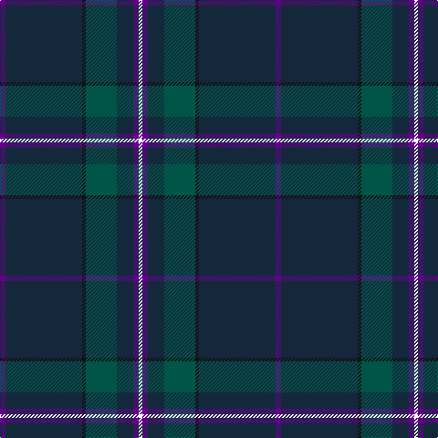

In pattern [BBKGBBW](/patterns/bbkgbbw/).

This was sourced from register-of-tartans.  It is a [7 stripes tartan](/stripes/stripes7/).

Original link https://www.tartanregister.gov.uk/tartanDetails.aspx?ref=11319

## Thread count
P/6 DN84 K4 G34 DN18 P6 W/4

## Palette
Each colour and its ΔE from the base-6 reference it is a variant of.

| Colour | Shade | Base | ΔE (OKLab) |
|---|---|---|---|
| DN | <code style="background-color:#14283C;">#14283C</code> `#14283C` | B <code style="background-color:#2A418A;">#2A418A</code> | 0.15 |
| G | <code style="background-color:#005448;">#005448</code> `#005448` | G <code style="background-color:#006100;">#006100</code> | 0.10 |
| K | <code style="background-color:#101010;">#101010</code> `#101010` | K <code style="background-color:#000000;">#000000</code> | 0.17 |
| P | <code style="background-color:#64008C;">#64008C</code> `#64008C` | B <code style="background-color:#2A418A;">#2A418A</code> | 0.14 |
| W | <code style="background-color:#FFFFFF;">#FFFFFF</code> `#FFFFFF` | W <code style="background-color:#F7F7F7;">#F7F7F7</code> | 0.02 |

# Sample pattern

## Nearest tartans

The nearest existing variants by ΔTartan distance.

1. [Round Table (1997)](/setts/s6/b94g28ba10bb4r6g14-b202060-ba440044-bb4c3428-g285800-r880000/) — ΔT 0.95
1. [Silver Thistle (Fashion)](/setts/s7/g8b6k12ba40k92r4k8-b2c2c80-ba303070-g006818-k101010-r888888/) — ΔT 1.01
1. [Raymond of Doune](/setts/s8/r8g20y2w2b8w2b50r4-b14283c-g003820-r880000-wc0c0c0-yd09800/) — ΔT 1.06
1. [Vonarb, Alfred (Personal)](/setts/s7/b12ba6bb20bc4ba4bd90y4-b5c8ca8-ba1c1c1c-bb5c5c5c-bc1c1c50-bd14283c-ya0a0a0/) — ΔT 1.07
1. [Edinburgh Crystal](/setts/s5/b120w8k24ba12r12-b14283c-ba2c2c80-k101010-rc80000-wc0c0c0/) — ΔT 1.24
1. [Green Swamp Youth Campers](/setts/s6/k16r4k26y4g96b12-b2c2c80-g003820-k101010-rc80000-ye8c000/) — ΔT 1.33
1. [Aberdeen Mither Kirk (St Nicholas)](/setts/s9/b116r6g32ra6y4g14b58ra6r4-b003c64-g5c6428-r888888-ra880000-ybc8c00/) — ΔT 1.47
1. [Royal British Legion Scotland (Corp)](/setts/s8/y8b4ba60k6b16ba10b2r4-b440044-ba202060-k101010-rc80000-ybc8c00/) — ΔT 1.51
1. [Green Swamp Youth Campers](/setts/s6/k16r4k26y4g96b12-b2474e8-g004028-k101010-rc82828-ye0a126/) — ΔT 1.52
1. [Pinehurst Resort](/setts/s7/k16r4k16r4g56b4g4-b505050-g0c5454-k000034-r8c0000/) — ΔT 1.53

## Neighbour map

Every grey dot is one of 15726 variants placed by the first two principal components of the ΔTartan feature space (44% of its variance). Red is this tartan; blue dots are its nearest — click one to open its page.

<svg viewBox="0 0 640 380" role="img" style="max-width:100%;height:auto;border:1px solid #e0e0e0;border-radius:4px;display:block" xmlns="http://www.w3.org/2000/svg"><image href="/nn/cloud.v1.png" width="640" height="380"/><a href="/setts/s6/b94g28ba10bb4r6g14-b202060-ba440044-bb4c3428-g285800-r880000/"><circle cx="438.1" cy="183.1" r="4" fill="#3465a4"><title>Round Table (1997)</title></circle></a><a href="/setts/s7/g8b6k12ba40k92r4k8-b2c2c80-ba303070-g006818-k101010-r888888/"><circle cx="471.0" cy="178.8" r="4" fill="#3465a4"><title>Silver Thistle (Fashion)</title></circle></a><a href="/setts/s8/r8g20y2w2b8w2b50r4-b14283c-g003820-r880000-wc0c0c0-yd09800/"><circle cx="411.9" cy="155.0" r="4" fill="#3465a4"><title>Raymond of Doune</title></circle></a><a href="/setts/s7/b12ba6bb20bc4ba4bd90y4-b5c8ca8-ba1c1c1c-bb5c5c5c-bc1c1c50-bd14283c-ya0a0a0/"><circle cx="429.8" cy="145.8" r="4" fill="#3465a4"><title>Vonarb, Alfred (Personal)</title></circle></a><a href="/setts/s5/b120w8k24ba12r12-b14283c-ba2c2c80-k101010-rc80000-wc0c0c0/"><circle cx="441.2" cy="194.5" r="4" fill="#3465a4"><title>Edinburgh Crystal</title></circle></a><a href="/setts/s6/k16r4k26y4g96b12-b2c2c80-g003820-k101010-rc80000-ye8c000/"><circle cx="434.0" cy="183.8" r="4" fill="#3465a4"><title>Green Swamp Youth Campers</title></circle></a><a href="/setts/s9/b116r6g32ra6y4g14b58ra6r4-b003c64-g5c6428-r888888-ra880000-ybc8c00/"><circle cx="511.6" cy="156.2" r="4" fill="#3465a4"><title>Aberdeen Mither Kirk (St Nicholas)</title></circle></a><a href="/setts/s8/y8b4ba60k6b16ba10b2r4-b440044-ba202060-k101010-rc80000-ybc8c00/"><circle cx="446.6" cy="146.5" r="4" fill="#3465a4"><title>Royal British Legion Scotland (Corp)</title></circle></a><a href="/setts/s6/k16r4k26y4g96b12-b2474e8-g004028-k101010-rc82828-ye0a126/"><circle cx="404.2" cy="169.0" r="4" fill="#3465a4"><title>Green Swamp Youth Campers</title></circle></a><a href="/setts/s7/k16r4k16r4g56b4g4-b505050-g0c5454-k000034-r8c0000/"><circle cx="389.4" cy="200.5" r="4" fill="#3465a4"><title>Pinehurst Resort</title></circle></a><circle cx="446.5" cy="177.8" r="5" fill="#c00000"/></svg>

ID: /setts/s7/b6ba84k4g34ba18b6w4-b64008c-ba14283c-g005448-k101010-wffffff/
