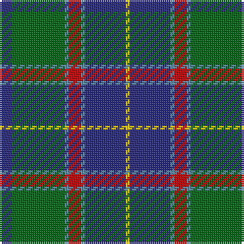

In pattern [BGBRBBY](/patterns/bgbrbby/).

This was sourced from tartans-authority.  It is a [7 stripes tartan](/stripes/stripes7/).

Original link http://www.tartansauthority.com/tartan-ferret/display/10637/

## Thread count
DB/6 G26 B2 R6 B2 DB20 Y/2

## Palette
Each colour and its ΔE from the base-6 reference it is a variant of.

| Colour | Shade | Base | ΔE (OKLab) |
|---|---|---|---|
| B | <code style="background-color:#5C8CA8;">#5C8CA8</code> `#5C8CA8` | B <code style="background-color:#2A418A;">#2A418A</code> | 0.23 |
| DB | <code style="background-color:#2C2C80;">#2C2C80</code> `#2C2C80` | B <code style="background-color:#2A418A;">#2A418A</code> | 0.06 |
| G | <code style="background-color:#006818;">#006818</code> `#006818` | G <code style="background-color:#006100;">#006100</code> | 0.02 |
| R | <code style="background-color:#C80000;">#C80000</code> `#C80000` | R <code style="background-color:#CC0000;">#CC0000</code> | 0.01 |
| Y | <code style="background-color:#FCCC00;">#FCCC00</code> `#FCCC00` | Y <code style="background-color:#F2BF00;">#F2BF00</code> | 0.04 |

# Sample pattern

## Nearest tartans

The nearest existing variants by ΔTartan distance.

1. [Canine All Dogs](/setts/s6/r10b6g48ba48r8y4-b2888c4-ba2c2c80-g006818-rc80000-ye8c000/) — ΔT 0.51
1. [Snodgrass Family Tartan Tartan Number: 1216. Earliest known date: 1978 Designed for the Snodgrass Clan Association. It is based on the Cunningham tartan, and the colours chosen were, Black, Green and Gold - of the Snodgrass Coat of Arms, Green - for the 'grasy place' (sic) alluded to in the name, and Blue - representing the traditional Highland 'Blue Bonnet'. See products available Copyright © Blair Urquhart, Comrie, 2015](/setts/s8/k6r2y2b22g26b10r2y2-b2c2c80-g006818-k101010-rc80000-ye8c000/) — ΔT 0.55
1. [MX-5 Owners' Club](/setts/s7/r12b54ba4g4ba4g60w8-b2c2c80-ba2888c4-g006818-rc80000-wfcfcfc/) — ΔT 0.69
1. [MacThomas Clan Tartan Tartan Number: 407. Earliest known date: 1975 Designed by David Thomas - former director of the Strathmore Woollen Co. in Forfar who still (in 2011) weave this tartan. Adopted by Clan Society in 1975, and registered with Lord Lyon in 1979. See products available Copyright © Blair Urquhart, Comrie, 2015](/setts/s7/b6r4b44k22g48w4g6-b2c2c80-g006818-k101010-ra00048-wc49cd8/) — ΔT 0.70
1. [Ednie (Personal)](/setts/s7/b44k16g16r4g16k4ra4-b1474b4-g006818-k101010-rb468ac-rac80000/) — ΔT 0.74
1. [State Seal of Washington (Fashion)](/setts/s7/b10g56w10k40y10b94y8-b1474b4-g604000-k101010-we8ccb8-ybc8c00/) — ΔT 0.76
1. [Dunbartonshire](/setts/s9/g44k8g4r16b4r16b52w8b4-b304080-g008000-k000000-r802040-w90d0f0/) — ΔT 0.81
1. [DeLoughery (Personal)](/setts/s6/b40k12y8b6g40w4-b38409c-g006818-k101010-wfcfcfc-ya08858/) — ΔT 0.85
1. [Jones Htg (Name)](/setts/s10/b8ba4b4ba16k6b16g6b8g48ga4-b780078-ba2888c4-g006818-ga289c18-k101010/) — ΔT 0.87
1. [Carmichael](/setts/s6/k10g64b64r6b6y6-b2c2c80-g006818-k000000-rc80000-ye8c000/) — ΔT 0.87

## Neighbour map

Every grey dot is one of 15726 variants placed by the first two principal components of the ΔTartan feature space (44% of its variance). Red is this tartan; blue dots are its nearest — click one to open its page.

<svg viewBox="0 0 640 380" role="img" style="max-width:100%;height:auto;border:1px solid #e0e0e0;border-radius:4px;display:block" xmlns="http://www.w3.org/2000/svg"><image href="/nn/cloud.v1.png" width="640" height="380"/><a href="/setts/s6/r10b6g48ba48r8y4-b2888c4-ba2c2c80-g006818-rc80000-ye8c000/"><circle cx="214.9" cy="185.1" r="4" fill="#3465a4"><title>Canine All Dogs</title></circle></a><a href="/setts/s8/k6r2y2b22g26b10r2y2-b2c2c80-g006818-k101010-rc80000-ye8c000/"><circle cx="236.5" cy="167.0" r="4" fill="#3465a4"><title>Snodgrass Family Tartan Tartan Number: 1216. Earliest known date: 1978 Designed for the Snodgrass Clan Association. It is based on the Cunningham tartan, and the colours chosen were, Black, Green and Gold - of the Snodgrass Coat of Arms, Green - for the 'grasy place' (sic) alluded to in the name, and Blue - representing the traditional Highland 'Blue Bonnet'. See products available Copyright © Blair Urquhart, Comrie, 2015</title></circle></a><a href="/setts/s7/r12b54ba4g4ba4g60w8-b2c2c80-ba2888c4-g006818-rc80000-wfcfcfc/"><circle cx="238.3" cy="155.9" r="4" fill="#3465a4"><title>MX-5 Owners' Club</title></circle></a><a href="/setts/s7/b6r4b44k22g48w4g6-b2c2c80-g006818-k101010-ra00048-wc49cd8/"><circle cx="229.1" cy="189.9" r="4" fill="#3465a4"><title>MacThomas Clan Tartan Tartan Number: 407. Earliest known date: 1975 Designed by David Thomas - former director of the Strathmore Woollen Co. in Forfar who still (in 2011) weave this tartan. Adopted by Clan Society in 1975, and registered with Lord Lyon in 1979. See products available Copyright © Blair Urquhart, Comrie, 2015</title></circle></a><a href="/setts/s7/b44k16g16r4g16k4ra4-b1474b4-g006818-k101010-rb468ac-rac80000/"><circle cx="208.5" cy="190.4" r="4" fill="#3465a4"><title>Ednie (Personal)</title></circle></a><a href="/setts/s7/b10g56w10k40y10b94y8-b1474b4-g604000-k101010-we8ccb8-ybc8c00/"><circle cx="215.1" cy="174.3" r="4" fill="#3465a4"><title>State Seal of Washington (Fashion)</title></circle></a><a href="/setts/s9/g44k8g4r16b4r16b52w8b4-b304080-g008000-k000000-r802040-w90d0f0/"><circle cx="190.8" cy="158.5" r="4" fill="#3465a4"><title>Dunbartonshire</title></circle></a><a href="/setts/s6/b40k12y8b6g40w4-b38409c-g006818-k101010-wfcfcfc-ya08858/"><circle cx="202.7" cy="199.9" r="4" fill="#3465a4"><title>DeLoughery (Personal)</title></circle></a><a href="/setts/s10/b8ba4b4ba16k6b16g6b8g48ga4-b780078-ba2888c4-g006818-ga289c18-k101010/"><circle cx="233.9" cy="156.1" r="4" fill="#3465a4"><title>Jones Htg (Name)</title></circle></a><a href="/setts/s6/k10g64b64r6b6y6-b2c2c80-g006818-k000000-rc80000-ye8c000/"><circle cx="246.8" cy="185.5" r="4" fill="#3465a4"><title>Carmichael</title></circle></a><circle cx="232.1" cy="175.1" r="5" fill="#c00000"/></svg>

ID: /setts/s7/b6g26ba2r6ba2b20y2-b2c2c80-ba5c8ca8-g006818-rc80000-yfccc00/
