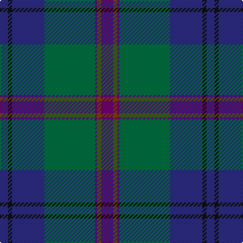

In pattern [BGBGBKB](/patterns/bgbgbkb/).

This was sourced from register-of-tartans.  It is a [7 stripes tartan](/stripes/stripes7/).

Original link https://www.tartanregister.gov.uk/tartanDetails.aspx?ref=2070

## Attestations

This cloth appears in 2 source records; the oldest owns this page.

- 01/01/2000 — Lawrie (register-of-tartans, [record](https://www.tartanregister.gov.uk/tartanDetails.aspx?ref=2070))
- 2000 — Lawrie (Name) (tartans-authority, [record](http://www.tartansauthority.com/tartan-ferret/display/4219/))

## Thread count
DB/8 K4 DB32 G50 P2 T4 P/12

## Palette
Each colour and its ΔE from the base-6 reference it is a variant of.

| Colour | Shade | Base | ΔE (OKLab) |
|---|---|---|---|
| DB | <code style="background-color:#2C2C84;">#2C2C84</code> `#2C2C84` | B <code style="background-color:#2A418A;">#2A418A</code> | 0.05 |
| G | <code style="background-color:#007040;">#007040</code> `#007040` | G <code style="background-color:#006100;">#006100</code> | 0.07 |
| K | <code style="background-color:#101010;">#101010</code> `#101010` | K <code style="background-color:#000000;">#000000</code> | 0.17 |
| P | <code style="background-color:#700070;">#700070</code> `#700070` | B <code style="background-color:#2A418A;">#2A418A</code> | 0.16 |
| T | <code style="background-color:#784400;">#784400</code> `#784400` | G <code style="background-color:#006100;">#006100</code> | 0.16 |

# Sample pattern

## Nearest tartans

The nearest existing variants by ΔTartan distance.

1. [Lowry](/setts/s7/b6y2b1g25ba16k2ba4x2~b440044-ba282878-g006438-k101010-yd8b000/) — ΔT 0.40
1. [Laurie](/setts/s7/b6r2b1g25ba16k2ba4x2~b6c006c-ba28287c-g005c34-k101010-rc80000/) — ΔT 0.53
1. [Lawrie Clan Tartan Tartan Number: 3202. Earliest known date: 2000 One of a set of three similar designs for Laurie, Lawrie and Lowry, designed by Peter MacDonald for Iain Laurie. See products available Copyright © Blair Urquhart, Comrie, 2015](/setts/s7/b6r2b1g25ba16k2ba4x2~b440044-ba2c2c80-g006818-k101010-r945008/) — ΔT 0.57
1. [Laurie Clan Tartan Tartan Number: 3201. Earliest known date: 2000 One of a set of three similar designs for Laurie, Lawrie and Lowry, designed by Peter MacDonald for Iain Laurie. See products available Copyright © Blair Urquhart, Comrie, 2015](/setts/s7/b6r2b1g25ba16k2ba4x2~b440044-ba2c2c80-g006818-k101010-rc80000/) — ΔT 0.67
1. [MacFadzean](/setts/s6/b48w2k20g22r3g4x2~b2c4084-g005020-k101010-rdc0000-we0e0e0/) — ΔT 0.70
1. [Colquhoun](/setts/s7/b4k2b16w1k8g24r4x2~b2c4084-g005020-k101010-rdc0000-we0e0e0/) — ΔT 0.98
1. [Dollar Academy (1999)](/setts/s8/w2b19k4b4k4g9ba2k1x4~b003c64-ba1c0070-g006818-k101010-wc0c0c0/) — ΔT 1.04
1. [Lowry Clan Tartan Tartan Number: 3203. Earliest known date: 2000 One of a set of three similar designs for Laurie, Lawrie and Lowry, designed by Peter MacDonald for Iain Laurie. See products available Copyright © Blair Urquhart, Comrie, 2015](/setts/s7/b6y2b1g25ba16k2ba4x2~b440044-ba2c2c80-g006818-k101010-ye8c000/) — ΔT 1.04
1. [Spirit of South Lanarkshire (Distric](/setts/s7/b13g2b12k8r1ba35y1x2~b4880a8-ba344054-g289c18-k101010-rc80000-ybc8c00/) — ΔT 1.08
1. [Weisfeld (Name)](/setts/s7/k6b3g28w1ba28b2w3x2~b2c2c80-ba202060-g00643c-k101010-we0e0e0/) — ΔT 1.12

## Neighbour map

Every grey dot is one of 15726 variants placed by the first two principal components of the ΔTartan feature space (44% of its variance). Red is this tartan; blue dots are its nearest — click one to open its page.

<svg viewBox="0 0 640 380" role="img" style="max-width:100%;height:auto;border:1px solid #e0e0e0;border-radius:4px;display:block" xmlns="http://www.w3.org/2000/svg"><image href="/nn/cloud.v1.png" width="640" height="380"/><a href="/setts/s7/b6y2b1g25ba16k2ba4x2~b440044-ba282878-g006438-k101010-yd8b000/"><circle cx="301.2" cy="162.7" r="4" fill="#3465a4"><title>Lowry</title></circle></a><a href="/setts/s7/b6r2b1g25ba16k2ba4x2~b6c006c-ba28287c-g005c34-k101010-rc80000/"><circle cx="321.9" cy="169.3" r="4" fill="#3465a4"><title>Laurie</title></circle></a><a href="/setts/s7/b6r2b1g25ba16k2ba4x2~b440044-ba2c2c80-g006818-k101010-r945008/"><circle cx="301.9" cy="162.9" r="4" fill="#3465a4"><title>Lawrie Clan Tartan Tartan Number: 3202. Earliest known date: 2000 One of a set of three similar designs for Laurie, Lawrie and Lowry, designed by Peter MacDonald for Iain Laurie. See products available Copyright © Blair Urquhart, Comrie, 2015</title></circle></a><a href="/setts/s7/b6r2b1g25ba16k2ba4x2~b440044-ba2c2c80-g006818-k101010-rc80000/"><circle cx="296.9" cy="160.1" r="4" fill="#3465a4"><title>Laurie Clan Tartan Tartan Number: 3201. Earliest known date: 2000 One of a set of three similar designs for Laurie, Lawrie and Lowry, designed by Peter MacDonald for Iain Laurie. See products available Copyright © Blair Urquhart, Comrie, 2015</title></circle></a><a href="/setts/s6/b48w2k20g22r3g4x2~b2c4084-g005020-k101010-rdc0000-we0e0e0/"><circle cx="311.9" cy="176.3" r="4" fill="#3465a4"><title>MacFadzean</title></circle></a><a href="/setts/s7/b4k2b16w1k8g24r4x2~b2c4084-g005020-k101010-rdc0000-we0e0e0/"><circle cx="262.6" cy="168.4" r="4" fill="#3465a4"><title>Colquhoun</title></circle></a><a href="/setts/s8/w2b19k4b4k4g9ba2k1x4~b003c64-ba1c0070-g006818-k101010-wc0c0c0/"><circle cx="303.2" cy="175.0" r="4" fill="#3465a4"><title>Dollar Academy (1999)</title></circle></a><a href="/setts/s7/b6y2b1g25ba16k2ba4x2~b440044-ba2c2c80-g006818-k101010-ye8c000/"><circle cx="282.7" cy="155.1" r="4" fill="#3465a4"><title>Lowry Clan Tartan Tartan Number: 3203. Earliest known date: 2000 One of a set of three similar designs for Laurie, Lawrie and Lowry, designed by Peter MacDonald for Iain Laurie. See products available Copyright © Blair Urquhart, Comrie, 2015</title></circle></a><a href="/setts/s7/b13g2b12k8r1ba35y1x2~b4880a8-ba344054-g289c18-k101010-rc80000-ybc8c00/"><circle cx="324.8" cy="132.7" r="4" fill="#3465a4"><title>Spirit of South Lanarkshire (Distric</title></circle></a><a href="/setts/s7/k6b3g28w1ba28b2w3x2~b2c2c80-ba202060-g00643c-k101010-we0e0e0/"><circle cx="265.4" cy="146.3" r="4" fill="#3465a4"><title>Weisfeld (Name)</title></circle></a><circle cx="308.3" cy="163.9" r="5" fill="#c00000"/></svg>

ID: /setts/s7/b6g2b1ga25ba16k2ba4x2~b700070-ba2c2c84-g784400-ga007040-k101010/
