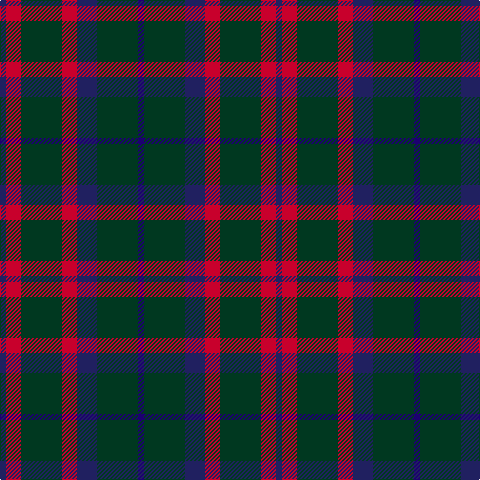

In pattern [BGBRGRB](/patterns/bgbrgrb/).

This was sourced from house-of-tartan.  It is a [7 stripes tartan](/stripes/stripes7/).

Original link http://www.house-of-tartan.scotland.net/house/TartanViewjs.asp?colr=Def&tnam=106

## Thread count
DB/6 R15 DG41 R15 DB20 DG41 DBa/6

## Palette
Each colour and its ΔE from the base-6 reference it is a variant of.

| Colour | Shade | Base | ΔE (OKLab) |
|---|---|---|---|
| DB | <code style="background-color:#202060;">#202060</code> `#202060` | B <code style="background-color:#2A418A;">#2A418A</code> | 0.11 |
| DBa | <code style="background-color:#1C0070;">#1C0070</code> `#1C0070` | B <code style="background-color:#2A418A;">#2A418A</code> | 0.14 |
| DG | <code style="background-color:#003820;">#003820</code> `#003820` | G <code style="background-color:#006100;">#006100</code> | 0.15 |
| R | <code style="background-color:#C8002C;">#C8002C</code> `#C8002C` | R <code style="background-color:#CC0000;">#CC0000</code> | 0.03 |

# Sample pattern

## Nearest tartans

The nearest existing variants by ΔTartan distance.

1. [Bean of Freeport (Personal)](/setts/s7/b6r15g41r15b20g41ba6-b003c64-ba1c0070-g003820-rc8002c/) — ΔT 0.35
1. [Klappert (Name)](/setts/s9/b32k26b14g6r4g6b14k26b32-b5c5c5c-g604000-k101010-rc80000/) — ΔT 0.82
1. [Process Safety Solutions Ltd](/setts/s10/r8k22b16g4b16k26g4k26r10k4-b646464-g004028-k101010-r960028/) — ΔT 0.93
1. [Glen Nevis #1 (Fashion)](/setts/s8/g16r4g4r6g16b24g4y4-b1c0070-g003820-r880000-ye8c000/) — ΔT 1.01
1. [Bean of Freeport Htg (Corporate)](/setts/s7/b6r15g41r15b20g41ba6-b003c64-ba1c0070-g006438-rc8002c/) — ΔT 1.05
1. [Process Safety Solutions Ltd](/setts/s10/r8k22b16g4b16k26g4k26r10k4-b5c5c5c-g003820-k101010-rc80000/) — ΔT 1.07
1. [Murray](/setts/s6/b6k32g32k32ba6b6-b3c82af-ba2c4084-g005020-k101010/) — ΔT 1.08
1. [Glen Nevis #1](/setts/s8/g16r4g4r6g16b24g4y4-b000064-g002814-r880000-yc89600/) — ΔT 1.09
1. [Cameron Hunting](/setts/s7/r6g20r6g28b32g6y4-b000052-g11450d-raa0000-yaaaa00/) — ΔT 1.10
1. [Cameron Hunting](/setts/s7/r3g10r3g14b16g3y2-b000052-g11450d-raa0000-yaaaa00/) — ΔT 1.10

## Neighbour map

Every grey dot is one of 15726 variants placed by the first two principal components of the ΔTartan feature space (44% of its variance). Red is this tartan; blue dots are its nearest — click one to open its page.

<svg viewBox="0 0 640 380" role="img" style="max-width:100%;height:auto;border:1px solid #e0e0e0;border-radius:4px;display:block" xmlns="http://www.w3.org/2000/svg"><image href="/nn/cloud.v1.png" width="640" height="380"/><a href="/setts/s7/b6r15g41r15b20g41ba6-b003c64-ba1c0070-g003820-rc8002c/"><circle cx="309.8" cy="257.6" r="4" fill="#3465a4"><title>Bean of Freeport (Personal)</title></circle></a><a href="/setts/s9/b32k26b14g6r4g6b14k26b32-b5c5c5c-g604000-k101010-rc80000/"><circle cx="322.9" cy="247.9" r="4" fill="#3465a4"><title>Klappert (Name)</title></circle></a><a href="/setts/s10/r8k22b16g4b16k26g4k26r10k4-b646464-g004028-k101010-r960028/"><circle cx="292.7" cy="245.4" r="4" fill="#3465a4"><title>Process Safety Solutions Ltd</title></circle></a><a href="/setts/s8/g16r4g4r6g16b24g4y4-b1c0070-g003820-r880000-ye8c000/"><circle cx="261.3" cy="242.0" r="4" fill="#3465a4"><title>Glen Nevis #1 (Fashion)</title></circle></a><a href="/setts/s7/b6r15g41r15b20g41ba6-b003c64-ba1c0070-g006438-rc8002c/"><circle cx="303.7" cy="253.9" r="4" fill="#3465a4"><title>Bean of Freeport Htg (Corporate)</title></circle></a><a href="/setts/s10/r8k22b16g4b16k26g4k26r10k4-b5c5c5c-g003820-k101010-rc80000/"><circle cx="283.4" cy="240.2" r="4" fill="#3465a4"><title>Process Safety Solutions Ltd</title></circle></a><a href="/setts/s6/b6k32g32k32ba6b6-b3c82af-ba2c4084-g005020-k101010/"><circle cx="298.9" cy="276.1" r="4" fill="#3465a4"><title>Murray</title></circle></a><a href="/setts/s8/g16r4g4r6g16b24g4y4-b000064-g002814-r880000-yc89600/"><circle cx="273.1" cy="249.9" r="4" fill="#3465a4"><title>Glen Nevis #1</title></circle></a><a href="/setts/s7/r6g20r6g28b32g6y4-b000052-g11450d-raa0000-yaaaa00/"><circle cx="283.0" cy="237.6" r="4" fill="#3465a4"><title>Cameron Hunting</title></circle></a><a href="/setts/s7/r3g10r3g14b16g3y2-b000052-g11450d-raa0000-yaaaa00/"><circle cx="283.0" cy="237.6" r="4" fill="#3465a4"><title>Cameron Hunting</title></circle></a><circle cx="305.1" cy="254.2" r="5" fill="#c00000"/></svg>

ID: /setts/s7/b6g41ba20r15g41r15ba6-b1c0070-ba202060-g003820-rc8002c/
