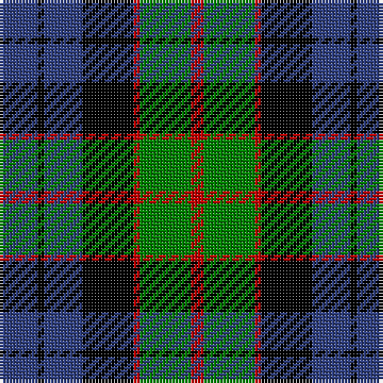

In pattern [BKBKRGR](/patterns/bkbkrgr/).

This was sourced from weddslist.  It is a [7 stripes tartan](/stripes/stripes7/).

Original link http://www.weddslist.com/cgi-bin/tartans/pg.pl?source=sts

## Thread count
B/12 K2 B12 K16 R2 G16 R/4

## Palette
Each colour and its ΔE from the base-6 reference it is a variant of.

| Colour | Shade | Base | ΔE (OKLab) |
|---|---|---|---|
| B | <code style="background-color:#304080;">#304080</code> `#304080` | B <code style="background-color:#2A418A;">#2A418A</code> | 0.02 |
| G | <code style="background-color:#008000;">#008000</code> `#008000` | G <code style="background-color:#006100;">#006100</code> | 0.10 |
| K | <code style="background-color:#000000;">#000000</code> `#000000` | K <code style="background-color:#000000;">#000000</code> | 0.00 |
| R | <code style="background-color:#C00000;">#C00000</code> `#C00000` | R <code style="background-color:#CC0000;">#CC0000</code> | 0.03 |

# Sample pattern

## Nearest tartans

The nearest existing variants by ΔTartan distance.

1. [Fletcher](/setts/s7/b6k1b6k8r1g8k2x2~b304080-g008000-k000000-rc00000/) — ΔT 0.49
1. [Alexander, hunting](/setts/s9/b12r2b4r4k15b4g4b2g12x2~b304080-g008000-k000000-rc00000/) — ΔT 0.62
1. [Baird](/setts/s8/b3k2b8k8g8ba1g1ba3x2~b304080-ba800080-g008000-k000000/) — ΔT 0.65
1. [Murray](/setts/s6/b2k2b12k8g11r2x2~b304080-g008000-k000000-rc00000/) — ΔT 0.69
1. [Morrison](/setts/s6/k3g14k14g2b14r3x2~b304080-g008000-k000000-rc00000/) — ΔT 0.71
1. [Blair](/setts/s7/b3r1b10k8g10r1g3x4~b304080-g008000-k000000-rc00000/) — ΔT 0.82
1. [Fletcher #2](/setts/s7/b10k3b10k14r2g14k4x2~b1474b4-g007800-k000000-rc80000/) — ΔT 0.82
1. [Unnamed, No 115](/setts/s8/b10k6ba1g6k1g6ba1k6x2~b304080-ba5480b0-g008000-k000000/) — ΔT 0.83
1. [Ferguson](/setts/s6/g4b24r3k24g25k4x2~b304080-g008000-k000000-rc00000/) — ΔT 0.86
1. [Wilson's, No 150 "Coburg"](/setts/s6/g18b2g4k14ba12k3x2~b5480b0-ba800080-g008000-k000000/) — ΔT 0.87

## Neighbour map

Every grey dot is one of 15726 variants placed by the first two principal components of the ΔTartan feature space (44% of its variance). Red is this tartan; blue dots are its nearest — click one to open its page.

<svg viewBox="0 0 640 380" role="img" style="max-width:100%;height:auto;border:1px solid #e0e0e0;border-radius:4px;display:block" xmlns="http://www.w3.org/2000/svg"><image href="/nn/cloud.v1.png" width="640" height="380"/><a href="/setts/s7/b6k1b6k8r1g8k2x2~b304080-g008000-k000000-rc00000/"><circle cx="154.4" cy="232.0" r="4" fill="#3465a4"><title>Fletcher</title></circle></a><a href="/setts/s9/b12r2b4r4k15b4g4b2g12x2~b304080-g008000-k000000-rc00000/"><circle cx="141.9" cy="210.7" r="4" fill="#3465a4"><title>Alexander, hunting</title></circle></a><a href="/setts/s8/b3k2b8k8g8ba1g1ba3x2~b304080-ba800080-g008000-k000000/"><circle cx="125.7" cy="215.8" r="4" fill="#3465a4"><title>Baird</title></circle></a><a href="/setts/s6/b2k2b12k8g11r2x2~b304080-g008000-k000000-rc00000/"><circle cx="148.6" cy="240.0" r="4" fill="#3465a4"><title>Murray</title></circle></a><a href="/setts/s6/k3g14k14g2b14r3x2~b304080-g008000-k000000-rc00000/"><circle cx="133.2" cy="235.5" r="4" fill="#3465a4"><title>Morrison</title></circle></a><a href="/setts/s7/b3r1b10k8g10r1g3x4~b304080-g008000-k000000-rc00000/"><circle cx="163.6" cy="212.9" r="4" fill="#3465a4"><title>Blair</title></circle></a><a href="/setts/s7/b10k3b10k14r2g14k4x2~b1474b4-g007800-k000000-rc80000/"><circle cx="127.6" cy="238.9" r="4" fill="#3465a4"><title>Fletcher #2</title></circle></a><a href="/setts/s8/b10k6ba1g6k1g6ba1k6x2~b304080-ba5480b0-g008000-k000000/"><circle cx="142.3" cy="214.2" r="4" fill="#3465a4"><title>Unnamed, No 115</title></circle></a><a href="/setts/s6/g4b24r3k24g25k4x2~b304080-g008000-k000000-rc00000/"><circle cx="151.1" cy="225.4" r="4" fill="#3465a4"><title>Ferguson</title></circle></a><a href="/setts/s6/g18b2g4k14ba12k3x2~b5480b0-ba800080-g008000-k000000/"><circle cx="173.6" cy="222.1" r="4" fill="#3465a4"><title>Wilson's, No 150 &quot;Coburg&quot;</title></circle></a><circle cx="143.6" cy="227.6" r="5" fill="#c00000"/></svg>

ID: /setts/s7/b6k1b6k8r1g8r2x2~b304080-g008000-k000000-rc00000/
