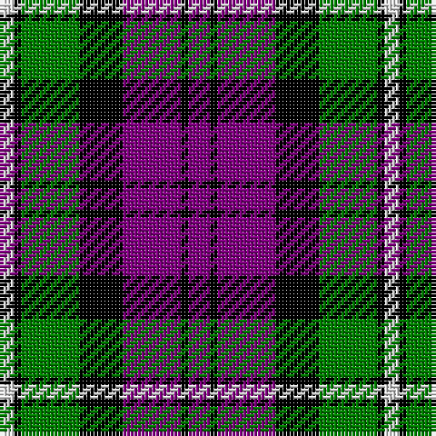

In pattern [BKBKGKW](/patterns/bkbkgkw/).

This was sourced from weddslist.  It is a [7 stripes tartan](/stripes/stripes7/).

Original link http://www.weddslist.com/cgi-bin/tartans/pg.pl?source=sts

## Thread count
LN/4 K2 G16 K12 P16 K2 P/6

## Palette
Each colour and its ΔE from the base-6 reference it is a variant of.

| Colour | Shade | Base | ΔE (OKLab) |
|---|---|---|---|
| G | <code style="background-color:#008000;">#008000</code> `#008000` | G <code style="background-color:#006100;">#006100</code> | 0.10 |
| K | <code style="background-color:#000000;">#000000</code> `#000000` | K <code style="background-color:#000000;">#000000</code> | 0.00 |
| LN | <code style="background-color:#E0E0E0;">#E0E0E0</code> `#E0E0E0` | W <code style="background-color:#F7F7F7;">#F7F7F7</code> | 0.07 |
| P | <code style="background-color:#800080;">#800080</code> `#800080` | B <code style="background-color:#2A418A;">#2A418A</code> | 0.17 |

# Sample pattern

## Nearest tartans

The nearest existing variants by ΔTartan distance.

1. [Wilson's, No 76](/setts/s6/g6b34k36w4g34k6-b800080-g008000-k000000-we0e0e0/) — ΔT 0.85
1. [Wilson's, No 100](/setts/s6/g6b34k36y4g34k6-b800080-g008000-k000000-yf0c000/) — ΔT 0.91
1. [Edinburgh International Conference Centre](/setts/s6/r8b38r6k40ra48b6-b304080-k000000-r806050-ra906030/) — ΔT 0.96
1. [MacNeil 2](/setts/s6/w4b20k20g18k6w4-b800080-g008000-k000000-we0e0e0/) — ΔT 0.96
1. [Gordon of Esslemont](/setts/s7/y12g6y6g44k46b46k8-b800080-g008000-k000000-yf0c000/) — ΔT 0.98
1. [Meg, Merrilees](/setts/s6/w46b12w12r10k70r20-b304080-k000000-rc00000-we0e0e0/) — ΔT 1.00
1. [Utah (US State)](/setts/s8/w12r18g54r18b12r18b18w6-b1c0070-g003820-r880000-we0e0e0/) — ΔT 1.01
1. [Brough](/setts/s7/r40k28w4k28g18r6g22-g008000-k000030-rc00000-we0e0e0/) — ΔT 1.05
1. [Colquhoun](/setts/s7/b12k6b42k46w6g48r6-b800080-g008000-k000000-rc00000-we0e0e0/) — ΔT 1.07
1. [Clerk](/setts/s6/b20k4g4k4r12k4-b304080-g008000-k000000-rc00000/) — ΔT 1.08

## Neighbour map

Every grey dot is one of 15726 variants placed by the first two principal components of the ΔTartan feature space (44% of its variance). Red is this tartan; blue dots are its nearest — click one to open its page.

<svg viewBox="0 0 640 380" role="img" style="max-width:100%;height:auto;border:1px solid #e0e0e0;border-radius:4px;display:block" xmlns="http://www.w3.org/2000/svg"><image href="/nn/cloud.v1.png" width="640" height="380"/><a href="/setts/s6/g6b34k36w4g34k6-b800080-g008000-k000000-we0e0e0/"><circle cx="152.0" cy="212.7" r="4" fill="#3465a4"><title>Wilson's, No 76</title></circle></a><a href="/setts/s6/g6b34k36y4g34k6-b800080-g008000-k000000-yf0c000/"><circle cx="153.1" cy="213.0" r="4" fill="#3465a4"><title>Wilson's, No 100</title></circle></a><a href="/setts/s6/r8b38r6k40ra48b6-b304080-k000000-r806050-ra906030/"><circle cx="150.4" cy="221.8" r="4" fill="#3465a4"><title>Edinburgh International Conference Centre</title></circle></a><a href="/setts/s6/w4b20k20g18k6w4-b800080-g008000-k000000-we0e0e0/"><circle cx="104.8" cy="239.3" r="4" fill="#3465a4"><title>MacNeil 2</title></circle></a><a href="/setts/s7/y12g6y6g44k46b46k8-b800080-g008000-k000000-yf0c000/"><circle cx="119.3" cy="202.5" r="4" fill="#3465a4"><title>Gordon of Esslemont</title></circle></a><a href="/setts/s6/w46b12w12r10k70r20-b304080-k000000-rc00000-we0e0e0/"><circle cx="157.2" cy="202.0" r="4" fill="#3465a4"><title>Meg, Merrilees</title></circle></a><a href="/setts/s8/w12r18g54r18b12r18b18w6-b1c0070-g003820-r880000-we0e0e0/"><circle cx="156.1" cy="205.7" r="4" fill="#3465a4"><title>Utah (US State)</title></circle></a><a href="/setts/s7/r40k28w4k28g18r6g22-g008000-k000030-rc00000-we0e0e0/"><circle cx="159.4" cy="218.5" r="4" fill="#3465a4"><title>Brough</title></circle></a><a href="/setts/s7/b12k6b42k46w6g48r6-b800080-g008000-k000000-rc00000-we0e0e0/"><circle cx="118.0" cy="185.9" r="4" fill="#3465a4"><title>Colquhoun</title></circle></a><a href="/setts/s6/b20k4g4k4r12k4-b304080-g008000-k000000-rc00000/"><circle cx="170.4" cy="233.1" r="4" fill="#3465a4"><title>Clerk</title></circle></a><circle cx="145.7" cy="208.2" r="5" fill="#c00000"/></svg>

ID: /setts/s7/b6k2b16k12g16k2w4-b800080-g008000-k000000-we0e0e0/
