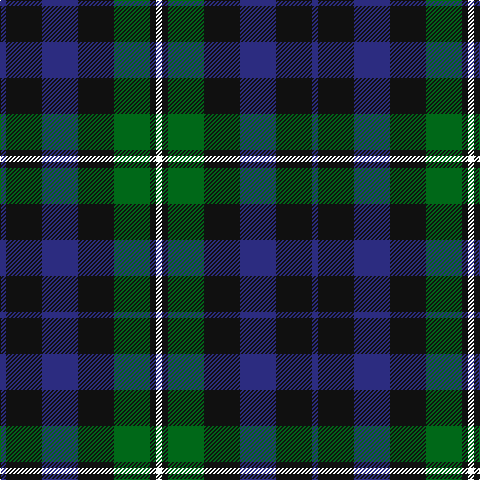

In pattern [BKBKGKW](/patterns/bkbkgkw/).

This was sourced from tartans-authority.  It is a [7 stripes tartan](/stripes/stripes7/).

Original link http://www.tartansauthority.com/tartan-ferret/display/212/

## Attestations

This cloth appears in 2 source records; the oldest owns this page.

- 1831 — Forbes - 1947 (Lyon Court) (tartans-authority, [record](http://www.tartansauthority.com/tartan-ferret/display/212/))
- 01/01/1949 — Forbes, Ancient (register-of-tartans, [record](https://www.tartanregister.gov.uk/tartanDetails.aspx?ref=1225))

## Thread count
DB/6 K36 DB36 K36 G36 K6 W/6

## Palette
Each colour and its ΔE from the base-6 reference it is a variant of.

| Colour | Shade | Base | ΔE (OKLab) |
|---|---|---|---|
| DB | <code style="background-color:#2C2C80;">#2C2C80</code> `#2C2C80` | B <code style="background-color:#2C4084;">#2C4084</code> | 0.05 |
| G | <code style="background-color:#006818;">#006818</code> `#006818` | G <code style="background-color:#006400;">#006400</code> | 0.02 |
| K | <code style="background-color:#101010;">#101010</code> `#101010` | K <code style="background-color:#000000;">#000000</code> | 0.17 |
| W | <code style="background-color:#FCFCFC;">#FCFCFC</code> `#FCFCFC` | W <code style="background-color:#F4F4F0;">#F4F4F0</code> | 0.03 |

# Sample pattern

## Nearest tartans

The nearest existing variants by ΔTartan distance.

1. [Forbes Ancient Clan Tartan Tartan Number: 212. Earliest known date: Logan 1831 Lord Lyon includes the word 'Ancient' in register entry. The Clan Forbes is said to originate from one Ochonochar, who slew a bear to gain possession of the Braes of Forbes in Aberdeenshire. The charter for the land was granted later in 1271. See products available Copyright © Blair Urquhart, Comrie, 2015](/setts/s7/b2k12b12k12g12k2w2-b2c2c80-g006818-k101010-we0e0e0/) — ΔT 0.20
1. [Glen Nevis #1 (Fashion)](/setts/s8/g16r4g4r6g16b24g4y4-b1c0070-g003820-r880000-ye8c000/) — ΔT 0.94
1. [MacLaggan Artifact Tartan Tartan Number: 1045. Earliest known date: pre 1856 Same as Graham of Montrose. From Baronage of Angus & Mearns 1856. Dalgety Archives say "Family . . . of Glenquiech". Is this Glen Quaich in Perthshire which runs from Amulree up into the hills that lead down to Kenmore on Loch Tay? See products available Copyright © Blair Urquhart, Comrie, 2015](/setts/s7/k28g24w4g24k28b28k4-b2c2c80-g006818-k101010-we0e0e0/) — ΔT 0.95
1. [Blackrock (Corporate)](/setts/s8/g20w8r8k16g40ka12g6ka20-g003820-k101010-ka00002c-r880000-wfcfcfc/) — ΔT 1.02
1. [BlackRock (Symmetrical)](/setts/s8/g20w8r8k16g40ka12g6ka20-g003820-k101010-ka00002c-r880000-wffffff/) — ΔT 1.02
1. [Triad Highland Games Proposed](/setts/s7/r4b32k32r4k32g32r4-b2888c4-g006818-k101010-re87878/) — ΔT 1.04
1. [MacArthur of Milton Hunting Clan Tartan Tartan Number: 700. Earliest known date: 1823 This is the older of the two MacArthur setts, which links the clan with the Campbells. See products available Copyright © Blair Urquhart, Comrie, 2015](/setts/s6/g28b4g4k16ba18k4-b2c2c80-ba780078-g006818-k101010/) — ΔT 1.06
1. [MacArthur of Milton (Clan)](/setts/s6/g28b4g4k16ba16k4-b28287c-ba700070-g006c3c-k101010/) — ΔT 1.06
1. [MacLaggan](/setts/s7/k26g24w4g24k26b24k4-b440044-g006818-k101010-wffffff/) — ΔT 1.08
1. [Gunn - 1810 (Clan)](/setts/s6/r8g24k24g4b24g6-b1c0070-g006818-k101010-rc80000/) — ΔT 1.12

## Neighbour map

Every grey dot is one of 15726 variants placed by the first two principal components of the ΔTartan feature space (44% of its variance). Red is this tartan; blue dots are its nearest — click one to open its page.

<svg viewBox="0 0 640 380" role="img" style="max-width:100%;height:auto;border:1px solid #e0e0e0;border-radius:4px;display:block" xmlns="http://www.w3.org/2000/svg"><image href="/nn/cloud.v1.png" width="640" height="380"/><a href="/setts/s7/b2k12b12k12g12k2w2-b2c2c80-g006818-k101010-we0e0e0/"><circle cx="219.8" cy="253.7" r="4" fill="#3465a4"><title>Forbes Ancient Clan Tartan Tartan Number: 212. Earliest known date: Logan 1831 Lord Lyon includes the word 'Ancient' in register entry. The Clan Forbes is said to originate from one Ochonochar, who slew a bear to gain possession of the Braes of Forbes in Aberdeenshire. The charter for the land was granted later in 1271. See products available Copyright © Blair Urquhart, Comrie, 2015</title></circle></a><a href="/setts/s8/g16r4g4r6g16b24g4y4-b1c0070-g003820-r880000-ye8c000/"><circle cx="261.3" cy="242.0" r="4" fill="#3465a4"><title>Glen Nevis #1 (Fashion)</title></circle></a><a href="/setts/s7/k28g24w4g24k28b28k4-b2c2c80-g006818-k101010-we0e0e0/"><circle cx="191.0" cy="263.5" r="4" fill="#3465a4"><title>MacLaggan Artifact Tartan Tartan Number: 1045. Earliest known date: pre 1856 Same as Graham of Montrose. From Baronage of Angus &amp; Mearns 1856. Dalgety Archives say &quot;Family . . . of Glenquiech&quot;. Is this Glen Quaich in Perthshire which runs from Amulree up into the hills that lead down to Kenmore on Loch Tay? See products available Copyright © Blair Urquhart, Comrie, 2015</title></circle></a><a href="/setts/s8/g20w8r8k16g40ka12g6ka20-g003820-k101010-ka00002c-r880000-wfcfcfc/"><circle cx="200.7" cy="228.4" r="4" fill="#3465a4"><title>Blackrock (Corporate)</title></circle></a><a href="/setts/s8/g20w8r8k16g40ka12g6ka20-g003820-k101010-ka00002c-r880000-wffffff/"><circle cx="199.8" cy="228.0" r="4" fill="#3465a4"><title>BlackRock (Symmetrical)</title></circle></a><a href="/setts/s7/r4b32k32r4k32g32r4-b2888c4-g006818-k101010-re87878/"><circle cx="192.2" cy="224.0" r="4" fill="#3465a4"><title>Triad Highland Games Proposed</title></circle></a><a href="/setts/s6/g28b4g4k16ba18k4-b2c2c80-ba780078-g006818-k101010/"><circle cx="218.8" cy="242.0" r="4" fill="#3465a4"><title>MacArthur of Milton Hunting Clan Tartan Tartan Number: 700. Earliest known date: 1823 This is the older of the two MacArthur setts, which links the clan with the Campbells. See products available Copyright © Blair Urquhart, Comrie, 2015</title></circle></a><a href="/setts/s6/g28b4g4k16ba16k4-b28287c-ba700070-g006c3c-k101010/"><circle cx="230.6" cy="244.8" r="4" fill="#3465a4"><title>MacArthur of Milton (Clan)</title></circle></a><a href="/setts/s7/k26g24w4g24k26b24k4-b440044-g006818-k101010-wffffff/"><circle cx="183.5" cy="263.7" r="4" fill="#3465a4"><title>MacLaggan</title></circle></a><a href="/setts/s6/r8g24k24g4b24g6-b1c0070-g006818-k101010-rc80000/"><circle cx="164.8" cy="260.4" r="4" fill="#3465a4"><title>Gunn - 1810 (Clan)</title></circle></a><circle cx="213.7" cy="251.1" r="5" fill="#c00000"/></svg>

ID: /setts/s7/b6k36b36k36g36k6w6-b2c2c80-g006818-k101010-wfcfcfc/
