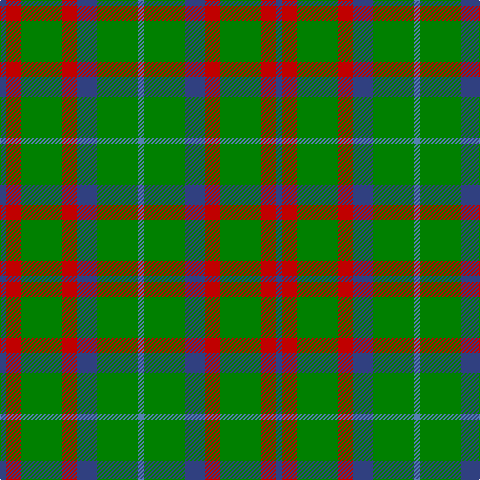

In pattern [BGBRGRB](/patterns/bgbrgrb/).

This was sourced from weddslist.  It is a [7 stripes tartan](/stripes/stripes7/).

Original link http://www.weddslist.com/cgi-bin/tartans/pg.pl?source=sts

## Thread count
B/6 R15 G41 R15 B20 G41 Ba/6

## Palette
Each colour and its ΔE from the base-6 reference it is a variant of.

| Colour | Shade | Base | ΔE (OKLab) |
|---|---|---|---|
| B | <code style="background-color:#304080;">#304080</code> `#304080` | B <code style="background-color:#2C4084;">#2C4084</code> | 0.01 |
| Ba | <code style="background-color:#5480B0;">#5480B0</code> `#5480B0` | B <code style="background-color:#2C4084;">#2C4084</code> | 0.20 |
| G | <code style="background-color:#008000;">#008000</code> `#008000` | G <code style="background-color:#006400;">#006400</code> | 0.09 |
| R | <code style="background-color:#C00000;">#C00000</code> `#C00000` | R <code style="background-color:#C80000;">#C80000</code> | 0.02 |

# Sample pattern

## Nearest tartans

The nearest existing variants by ΔTartan distance.

1. [Cameron, hunting](/setts/s7/r6g20r6g28b32g6y4-b304080-g008000-rc00000-yf0c000/) — ΔT 0.73
1. [Cameron of Lochiel (Hunting) Clan/Family Tartan Tartan Number: 5351. Earliest known date: 01/01/1940 Design close to Cameron Hunting which has two red lines shown in Vestiarium Scoticum. This design evolved in the 1940s by J G MacKay of Portree and was first put on show at the Cameron Gathering at Achnacarry in 1956. (original STA ref: 1535) See products available Copyright © Blair Urquhart, Comrie, 2015](/setts/s7/r5g20r5g20b24g6y4-b2c2c80-g006818-rc80000-ye8c000/) — ΔT 0.93
1. [MacKintosh Hunting](/setts/s7/y4g24b12r6g24r8b2-b2c2c80-g006818-rc80000-ye8c000/) — ΔT 1.07
1. [Cub Scouts of America](/setts/s5/g40b8r32y8g20-b00008c-g146400-r8c0000-yc88c00/) — ΔT 1.19
1. [Hall](/setts/s11/g12r6b12r6g24r6b12r6g24r6y3-b304080-g008000-rc00000-yf0c000/) — ΔT 1.20
1. [Bean of Freeport Htg (Corporate)](/setts/s7/b6r15g41r15b20g41ba6-b003c64-ba1c0070-g006438-rc8002c/) — ΔT 1.22
1. [Cameron Hunting Clan Tartan Tartan Number: 1535. Earliest known date: 1956 A document written in Latin of 1689 descibes the Cameron men from Lochaber as being clad in blue and yellow when they followed their great Chief, Sir Ewan Cameron, to battle and victory at Killiecrankie. This new design was evolved in the 1940s by J G MacKay of Portree and first put on show at the Cameron Gathering at Achnacarry in 1956. The original Cameron first appeared in the Vestiarium Scoticum (1842). See products available Copyright © Blair Urquhart, Comrie, 2015](/setts/s7/r6g20r6g28b32g6y4-b2c2c80-g006818-re87878-ye8c000/) — ΔT 1.25
1. [Salvation Army Htg (Corporate)](/setts/s7/b20g32k4y8k4g32b16-b1c1c50-g285800-k101010-ycca800/) — ΔT 1.28
1. [Lauder Clan Tartan Tartan Number: 709. Earliest known date: 1842 Possibly designed by Sir Thomas Dick Lauder who was a particular friend of the Sobieski brothers. The Setts No: 87. W & A K Johnston(1906). See products available Copyright © Blair Urquhart, Comrie, 2015](/setts/s6/g6b16g6k8g30r4-b2c2c80-g006818-k101010-rc80000/) — ΔT 1.32
1. [Confederate Cavalry (Military)](/setts/s6/g4ga28g16ga6g24y4-g003820-ga8c7038-yd09800/) — ΔT 1.33

## Neighbour map

Every grey dot is one of 15726 variants placed by the first two principal components of the ΔTartan feature space (44% of its variance). Red is this tartan; blue dots are its nearest — click one to open its page.

<svg viewBox="0 0 640 380" role="img" style="max-width:100%;height:auto;border:1px solid #e0e0e0;border-radius:4px;display:block" xmlns="http://www.w3.org/2000/svg"><image href="/nn/cloud.v1.png" width="640" height="380"/><a href="/setts/s7/r6g20r6g28b32g6y4-b304080-g008000-rc00000-yf0c000/"><circle cx="271.3" cy="228.1" r="4" fill="#3465a4"><title>Cameron, hunting</title></circle></a><a href="/setts/s7/r5g20r5g20b24g6y4-b2c2c80-g006818-rc80000-ye8c000/"><circle cx="262.7" cy="245.5" r="4" fill="#3465a4"><title>Cameron of Lochiel (Hunting) Clan/Family Tartan Tartan Number: 5351. Earliest known date: 01/01/1940 Design close to Cameron Hunting which has two red lines shown in Vestiarium Scoticum. This design evolved in the 1940s by J G MacKay of Portree and was first put on show at the Cameron Gathering at Achnacarry in 1956. (original STA ref: 1535) See products available Copyright © Blair Urquhart, Comrie, 2015</title></circle></a><a href="/setts/s7/y4g24b12r6g24r8b2-b2c2c80-g006818-rc80000-ye8c000/"><circle cx="321.5" cy="214.8" r="4" fill="#3465a4"><title>MacKintosh Hunting</title></circle></a><a href="/setts/s5/g40b8r32y8g20-b00008c-g146400-r8c0000-yc88c00/"><circle cx="279.8" cy="280.0" r="4" fill="#3465a4"><title>Cub Scouts of America</title></circle></a><a href="/setts/s11/g12r6b12r6g24r6b12r6g24r6y3-b304080-g008000-rc00000-yf0c000/"><circle cx="240.8" cy="213.4" r="4" fill="#3465a4"><title>Hall</title></circle></a><a href="/setts/s7/b6r15g41r15b20g41ba6-b003c64-ba1c0070-g006438-rc8002c/"><circle cx="303.7" cy="253.9" r="4" fill="#3465a4"><title>Bean of Freeport Htg (Corporate)</title></circle></a><a href="/setts/s7/r6g20r6g28b32g6y4-b2c2c80-g006818-re87878-ye8c000/"><circle cx="265.4" cy="226.0" r="4" fill="#3465a4"><title>Cameron Hunting Clan Tartan Tartan Number: 1535. Earliest known date: 1956 A document written in Latin of 1689 descibes the Cameron men from Lochaber as being clad in blue and yellow when they followed their great Chief, Sir Ewan Cameron, to battle and victory at Killiecrankie. This new design was evolved in the 1940s by J G MacKay of Portree and first put on show at the Cameron Gathering at Achnacarry in 1956. The original Cameron first appeared in the Vestiarium Scoticum (1842). See products available Copyright © Blair Urquhart, Comrie, 2015</title></circle></a><a href="/setts/s7/b20g32k4y8k4g32b16-b1c1c50-g285800-k101010-ycca800/"><circle cx="293.6" cy="247.9" r="4" fill="#3465a4"><title>Salvation Army Htg (Corporate)</title></circle></a><a href="/setts/s6/g6b16g6k8g30r4-b2c2c80-g006818-k101010-rc80000/"><circle cx="326.6" cy="248.4" r="4" fill="#3465a4"><title>Lauder Clan Tartan Tartan Number: 709. Earliest known date: 1842 Possibly designed by Sir Thomas Dick Lauder who was a particular friend of the Sobieski brothers. The Setts No: 87. W &amp; A K Johnston(1906). See products available Copyright © Blair Urquhart, Comrie, 2015</title></circle></a><a href="/setts/s6/g4ga28g16ga6g24y4-g003820-ga8c7038-yd09800/"><circle cx="336.7" cy="270.6" r="4" fill="#3465a4"><title>Confederate Cavalry (Military)</title></circle></a><circle cx="283.4" cy="243.9" r="5" fill="#c00000"/></svg>

ID: /setts/s7/b6r15g41r15b20g41ba6-b304080-ba5480b0-g008000-rc00000/
