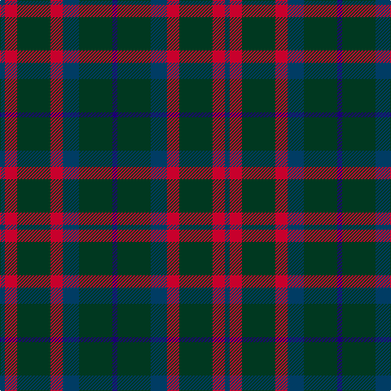

In pattern [BGBRGRB](/patterns/bgbrgrb/).

This was sourced from register-of-tartans.  It is a [7 stripes tartan](/stripes/stripes7/).

Original link https://www.tartanregister.gov.uk/tartanDetails.aspx?ref=232

## Thread count
DB/6 R15 DG41 R15 DB20 DG41 DBa/6

## Palette
Each colour and its ΔE from the base-6 reference it is a variant of.

| Colour | Shade | Base | ΔE (OKLab) |
|---|---|---|---|
| DB | <code style="background-color:#003C64;">#003C64</code> `#003C64` | B <code style="background-color:#2A418A;">#2A418A</code> | 0.08 |
| DBa | <code style="background-color:#1C0070;">#1C0070</code> `#1C0070` | B <code style="background-color:#2A418A;">#2A418A</code> | 0.14 |
| DBb | <code style="background-color:#202060;">#202060</code> `#202060` | B <code style="background-color:#2A418A;">#2A418A</code> | 0.11 |
| DG | <code style="background-color:#003820;">#003820</code> `#003820` | G <code style="background-color:#006100;">#006100</code> | 0.15 |
| DR | <code style="background-color:#880000;">#880000</code> `#880000` | R <code style="background-color:#CC0000;">#CC0000</code> | 0.15 |
| DY | <code style="background-color:#D09800;">#D09800</code> `#D09800` | Y <code style="background-color:#F2BF00;">#F2BF00</code> | 0.12 |
| G | <code style="background-color:#285800;">#285800</code> `#285800` | G <code style="background-color:#006100;">#006100</code> | 0.03 |
| K | <code style="background-color:#101010;">#101010</code> `#101010` | K <code style="background-color:#000000;">#000000</code> | 0.17 |
| LP | <code style="background-color:#A8ACE8;">#A8ACE8</code> `#A8ACE8` | W <code style="background-color:#F7F7F7;">#F7F7F7</code> | 0.23 |
| N | <code style="background-color:#C0C0C0;">#C0C0C0</code> `#C0C0C0` | W <code style="background-color:#F7F7F7;">#F7F7F7</code> | 0.17 |
| P | <code style="background-color:#6C0070;">#6C0070</code> `#6C0070` | B <code style="background-color:#2A418A;">#2A418A</code> | 0.16 |
| R | <code style="background-color:#C8002C;">#C8002C</code> `#C8002C` | R <code style="background-color:#CC0000;">#CC0000</code> | 0.03 |

# Sample pattern

## Nearest tartans

The nearest existing variants by ΔTartan distance.

1. [Bean Hunting Clan Tartan Tartan Number: 106. Earliest known date: 1987 The weaving and wearing of this tartan is 'Restricted'. This is not a legal definition and is applied by the Scottish Tartans Society irrespective of Design Patent or Copyright, in the spirit of a gentlemans agreement. Interested parties should contact the person listed under 'Source:' in this document. See products available Copyright © Blair Urquhart, Comrie, 2015](/setts/s7/b6g41ba20r15g41r15ba6~b1c0070-ba202060-g003820-rc8002c/) — ΔT 0.35
1. [Klappert (Name)](/setts/s9/b16k13b7g3r2g3b7k13b16~b5c5c5c-g604000-k101010-rc80000~x2/) — ΔT 0.81
1. [Bean of Freeport Htg (Corporate)](/setts/s7/b6r15g41r15b20g41ba6~b003c64-ba1c0070-g006438-rc8002c/) — ΔT 0.84
1. [Murray](/setts/s6/b3k16g16k16ba3b3~b3c82af-ba2c4084-g005020-k101010~x2/) — ΔT 1.04
1. [Klappert Name Tartan Tartan Number: 10468. Earliest known date: 2011 This tartan was designed to celebrate the advent of the third generation of Klapperts in Denmark. The Klappert family name is currently only shared by four people in Denmark, all closely related. The family has visited Scotland frequently and has embraced the Scottish culture. This tartan represents the family's love of Scotland. The colours reflect the family's heritage and enviroment: black symbolises the dark Nordic winter and the dark grey is the cold sea which embraces the vast Danish coastline. The dark red symbolises this family's foundation in Denmark. The brown is a reference to the longships which carried the Vikings to Scotland. See products available Copyright © Blair Urquhart, Comrie, 2015](/setts/s9/b16k13b7g3r2g3b7k13b16~b3c4440-g5c381c-k000410-rb42430~x2/) — ΔT 1.04
1. [Klappert, Denmark (Personal)](/setts/s9/b16k13b7g3r2g3b7k13b16~b3f4441-g5c391d-k010512-rb62531~x2/) — ΔT 1.09
1. [Process Safety Solutions Ltd](/setts/s10/r4k11b8g2b8k13g2k13r5k2~b646464-g004028-k101010-r960028~x2/) — ΔT 1.12
1. [Glen Nevis #1 (Fashion)](/setts/s8/g8r2g2r3g8b12g2y2~b1c0070-g003820-r880000-ye8c000~x2/) — ΔT 1.15
1. [Glen Nevis #1](/setts/s8/g8r2g2r3g8b12g2y2~b000064-g002814-r880000-yc89600~x2/) — ΔT 1.16
1. [Cameron Hunting](/setts/s7/r3g10r3g14b16g3y2~b000052-g11450d-raa0000-yaaaa00~x2/) — ΔT 1.17

## Neighbour map

Every grey dot is one of 15726 variants placed by the first two principal components of the ΔTartan feature space (44% of its variance). Red is this tartan; blue dots are its nearest — click one to open its page.

<svg viewBox="0 0 640 380" role="img" style="max-width:100%;height:auto;border:1px solid #e0e0e0;border-radius:4px;display:block" xmlns="http://www.w3.org/2000/svg"><image href="/nn/cloud.v1.png" width="640" height="380"/><a href="/setts/s7/b6g41ba20r15g41r15ba6~b1c0070-ba202060-g003820-rc8002c/"><circle cx="304.7" cy="255.0" r="4" fill="#3465a4"><title>Bean Hunting Clan Tartan Tartan Number: 106. Earliest known date: 1987 The weaving and wearing of this tartan is 'Restricted'. This is not a legal definition and is applied by the Scottish Tartans Society irrespective of Design Patent or Copyright, in the spirit of a gentlemans agreement. Interested parties should contact the person listed under 'Source:' in this document. See products available Copyright © Blair Urquhart, Comrie, 2015</title></circle></a><a href="/setts/s9/b16k13b7g3r2g3b7k13b16~b5c5c5c-g604000-k101010-rc80000~x2/"><circle cx="322.6" cy="248.5" r="4" fill="#3465a4"><title>Klappert (Name)</title></circle></a><a href="/setts/s7/b6r15g41r15b20g41ba6~b003c64-ba1c0070-g006438-rc8002c/"><circle cx="303.3" cy="254.2" r="4" fill="#3465a4"><title>Bean of Freeport Htg (Corporate)</title></circle></a><a href="/setts/s6/b3k16g16k16ba3b3~b3c82af-ba2c4084-g005020-k101010~x2/"><circle cx="298.3" cy="276.9" r="4" fill="#3465a4"><title>Murray</title></circle></a><a href="/setts/s9/b16k13b7g3r2g3b7k13b16~b3c4440-g5c381c-k000410-rb42430~x2/"><circle cx="336.4" cy="259.8" r="4" fill="#3465a4"><title>Klappert Name Tartan Tartan Number: 10468. Earliest known date: 2011 This tartan was designed to celebrate the advent of the third generation of Klapperts in Denmark. The Klappert family name is currently only shared by four people in Denmark, all closely related. The family has visited Scotland frequently and has embraced the Scottish culture. This tartan represents the family's love of Scotland. The colours reflect the family's heritage and enviroment: black symbolises the dark Nordic winter and the dark grey is the cold sea which embraces the vast Danish coastline. The dark red symbolises this family's foundation in Denmark. The brown is a reference to the longships which carried the Vikings to Scotland. See products available Copyright © Blair Urquhart, Comrie, 2015</title></circle></a><a href="/setts/s9/b16k13b7g3r2g3b7k13b16~b3f4441-g5c391d-k010512-rb62531~x2/"><circle cx="340.7" cy="260.9" r="4" fill="#3465a4"><title>Klappert, Denmark (Personal)</title></circle></a><a href="/setts/s10/r4k11b8g2b8k13g2k13r5k2~b646464-g004028-k101010-r960028~x2/"><circle cx="292.4" cy="246.2" r="4" fill="#3465a4"><title>Process Safety Solutions Ltd</title></circle></a><a href="/setts/s8/g8r2g2r3g8b12g2y2~b1c0070-g003820-r880000-ye8c000~x2/"><circle cx="261.3" cy="242.6" r="4" fill="#3465a4"><title>Glen Nevis #1 (Fashion)</title></circle></a><a href="/setts/s8/g8r2g2r3g8b12g2y2~b000064-g002814-r880000-yc89600~x2/"><circle cx="273.3" cy="250.2" r="4" fill="#3465a4"><title>Glen Nevis #1</title></circle></a><a href="/setts/s7/r3g10r3g14b16g3y2~b000052-g11450d-raa0000-yaaaa00~x2/"><circle cx="282.7" cy="238.7" r="4" fill="#3465a4"><title>Cameron Hunting</title></circle></a><circle cx="309.5" cy="258.0" r="5" fill="#c00000"/></svg>

ID: /setts/s7/b6r15g41r15b20g41ba6~b003c64-ba1c0070-g003820-rc8002c/
