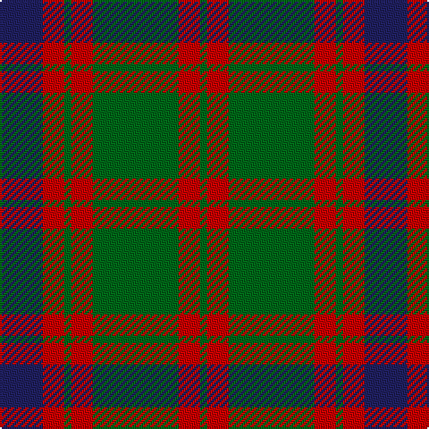

In pattern [BRGRGRG](/patterns/brgrgrg/).

This was sourced from tartans-authority.  It is a [7 stripes tartan](/stripes/stripes7/).

Original link http://www.tartansauthority.com/tartan-ferret/display/516/

## Thread count
DB/24 R12 G4 R12 G48 R12 G/4

## Palette
Each colour and its ΔE from the base-6 reference it is a variant of.

| Colour | Shade | Base | ΔE (OKLab) |
|---|---|---|---|
| DB | <code style="background-color:#202060;">#202060</code> `#202060` | B <code style="background-color:#2A418A;">#2A418A</code> | 0.11 |
| G | <code style="background-color:#006818;">#006818</code> `#006818` | G <code style="background-color:#006100;">#006100</code> | 0.02 |
| R | <code style="background-color:#C80000;">#C80000</code> `#C80000` | R <code style="background-color:#CC0000;">#CC0000</code> | 0.01 |

# Sample pattern

## Nearest tartans

The nearest existing variants by ΔTartan distance.

1. [Skene](/setts/s7/b6r3g1r3g12r3g1x2~b304080-g008000-rc00000/) — ΔT 0.61
1. [Logan](/setts/s7/b8r3b1r3g14r3b1x4~b304080-g008000-rc00000/) — ΔT 0.79
1. [Glasgow, City of](/setts/s7/g28r4b25r22g27r4b2x2~b780078-g006818-rc80000/) — ΔT 0.89
1. [Nithsdale (3 colours) (District)](/setts/s10/b10r2g2r6g16r1g2r1g3r6x4~b202060-g006818-rc80000/) — ΔT 0.89
1. [Nithsdale District Tartan Tartan Number: 533. Earliest known date: 1930 Nithsdale, the valley of the River Nith, stretches over 50 miles, north and south, through the the length of Dumfriesshire to the sea, an area with historic connections with the Johnstons and Maxwells. The tartan was designed by Arthur Galt of Messrs Hugh Galt and Sons Ltd., Barrhill, Glasgow, for Councillor John Hannay. See products available Copyright © Blair Urquhart, Comrie, 2015](/setts/s10/b10r2g2r6g16r1g2r1g3r6x2~b2c2c80-g006818-rc80000/) — ΔT 0.91
1. [Logan](/setts/s7/b8r3b1r3g14r3b1x4~b2c4084-g005020-rdc0000/) — ΔT 0.97
1. [Glasgow, Ciity of (District)](/setts/s7/g28r4b25r22g27r4b2x2~b440044-g285800-rc80000/) — ΔT 0.98
1. [Skene D](/setts/s7/b9r6g2r6g18r6g2~b00004c-g004c00-rc80000/) — ΔT 1.02
1. [Nithsdale](/setts/s10/b10r2g2r6g16r1g2r1g3r6x2~b304080-g008000-rc00000/) — ΔT 1.05
1. [Robertson of Struan](/setts/s7/r6b2r2b21g20r4g4x2~b304080-g008000-rc00000/) — ΔT 1.07

## Neighbour map

Every grey dot is one of 15726 variants placed by the first two principal components of the ΔTartan feature space (44% of its variance). Red is this tartan; blue dots are its nearest — click one to open its page.

<svg viewBox="0 0 640 380" role="img" style="max-width:100%;height:auto;border:1px solid #e0e0e0;border-radius:4px;display:block" xmlns="http://www.w3.org/2000/svg"><image href="/nn/cloud.v1.png" width="640" height="380"/><a href="/setts/s7/b6r3g1r3g12r3g1x2~b304080-g008000-rc00000/"><circle cx="296.2" cy="216.0" r="4" fill="#3465a4"><title>Skene</title></circle></a><a href="/setts/s7/b8r3b1r3g14r3b1x4~b304080-g008000-rc00000/"><circle cx="277.9" cy="205.0" r="4" fill="#3465a4"><title>Logan</title></circle></a><a href="/setts/s7/g28r4b25r22g27r4b2x2~b780078-g006818-rc80000/"><circle cx="297.7" cy="223.8" r="4" fill="#3465a4"><title>Glasgow, City of</title></circle></a><a href="/setts/s10/b10r2g2r6g16r1g2r1g3r6x4~b202060-g006818-rc80000/"><circle cx="300.8" cy="184.0" r="4" fill="#3465a4"><title>Nithsdale (3 colours) (District)</title></circle></a><a href="/setts/s10/b10r2g2r6g16r1g2r1g3r6x2~b2c2c80-g006818-rc80000/"><circle cx="303.2" cy="184.6" r="4" fill="#3465a4"><title>Nithsdale District Tartan Tartan Number: 533. Earliest known date: 1930 Nithsdale, the valley of the River Nith, stretches over 50 miles, north and south, through the the length of Dumfriesshire to the sea, an area with historic connections with the Johnstons and Maxwells. The tartan was designed by Arthur Galt of Messrs Hugh Galt and Sons Ltd., Barrhill, Glasgow, for Councillor John Hannay. See products available Copyright © Blair Urquhart, Comrie, 2015</title></circle></a><a href="/setts/s7/b8r3b1r3g14r3b1x4~b2c4084-g005020-rdc0000/"><circle cx="287.1" cy="207.8" r="4" fill="#3465a4"><title>Logan</title></circle></a><a href="/setts/s7/g28r4b25r22g27r4b2x2~b440044-g285800-rc80000/"><circle cx="305.2" cy="228.4" r="4" fill="#3465a4"><title>Glasgow, Ciity of (District)</title></circle></a><a href="/setts/s7/b9r6g2r6g18r6g2~b00004c-g004c00-rc80000/"><circle cx="254.3" cy="234.5" r="4" fill="#3465a4"><title>Skene D</title></circle></a><a href="/setts/s10/b10r2g2r6g16r1g2r1g3r6x2~b304080-g008000-rc00000/"><circle cx="300.1" cy="183.7" r="4" fill="#3465a4"><title>Nithsdale</title></circle></a><a href="/setts/s7/r6b2r2b21g20r4g4x2~b304080-g008000-rc00000/"><circle cx="266.9" cy="219.3" r="4" fill="#3465a4"><title>Robertson of Struan</title></circle></a><circle cx="297.2" cy="216.5" r="5" fill="#c00000"/></svg>

ID: /setts/s7/b6r3g1r3g12r3g1x4~b202060-g006818-rc80000/
