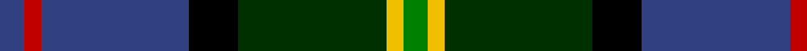

In pattern [BRBKGYG](/patterns/brbkgyg/).

This was sourced from weddslist.  It is a [7 stripes tartan](/stripes/stripes7/).

Original link http://www.weddslist.com/cgi-bin/tartans/pg.pl?source=sts

## Thread count
B/6 R4 B36 K12 DG36 Y4 G/6

## Palette
Each colour and its ΔE from the base-6 reference it is a variant of.

| Colour | Shade | Base | ΔE (OKLab) |
|---|---|---|---|
| B | <code style="background-color:#304080;">#304080</code> `#304080` | B <code style="background-color:#2A418A;">#2A418A</code> | 0.02 |
| DG | <code style="background-color:#003000;">#003000</code> `#003000` | G <code style="background-color:#006100;">#006100</code> | 0.17 |
| G | <code style="background-color:#008000;">#008000</code> `#008000` | G <code style="background-color:#006100;">#006100</code> | 0.10 |
| K | <code style="background-color:#000000;">#000000</code> `#000000` | K <code style="background-color:#000000;">#000000</code> | 0.00 |
| R | <code style="background-color:#C00000;">#C00000</code> `#C00000` | R <code style="background-color:#CC0000;">#CC0000</code> | 0.03 |
| Y | <code style="background-color:#F0C000;">#F0C000</code> `#F0C000` | Y <code style="background-color:#F2BF00;">#F2BF00</code> | 0.00 |

# Sample pattern

## Nearest tartans

The nearest existing variants by ΔTartan distance.

1. [Royal Burgh of Peebles (District)](/setts/s7/r6g6b8g34k26ba52w6-b2c2c80-ba14283c-g006818-k101010-rc80000-wf8f8f8/) — ΔT 0.67
1. [McComb (Personal)](/setts/s7/b6r4b36k12g36y4ga6-b2c2c80-g006818-ga408060-k101010-rc80000-ye8c000/) — ΔT 0.71
1. [Yates (Personal)](/setts/s8/k58r6b48ba12k16w8ba16ra12-b003c64-ba5c5c5c-k101010-rc80000-ra888888-we0e0e0/) — ΔT 0.73
1. [Cornish Hunting District Tartan Tartan Number: 1568. Earliest known date: 1984 The Cornish Hunting tartan was first produced in 1984, and was marketed by the firm, Cornovi Creations, Cornwall. It is based on the Cornish National tartan designed by E.E. Morton-Nance, who regarded tartan as the heritage of all Celts, not Scots alone. (P Smith and G Teall, District Tartans, 1992) The hunting sett replaces the 'National' yellow with dark green and the azure with a darker shade of blue. Cornish Hunting is a registered design (No. 514267). See products available Copyright © Blair Urquhart, Comrie, 2015](/setts/s7/w10k52y4g48b14k6r6-b003c64-g003820-k101010-rc80000-we0e0e0-ye8c000/) — ΔT 0.78
1. [MacLean, Donald Personal Tartan Tartan Number: 3440. Earliest known date: pre 2002 From Pendleton Woolen Mills of Oregon, owners of the only copy of Clans Originaux. EBW 8.11.02. This is the same as MacTaggart #408 and #409!!! See products available Copyright © Blair Urquhart, Comrie, 2015](/setts/s7/g32w6g6k20b24r4ka6-b1c0070-g006818-k101010-ka000000-r880000-wa8ace8/) — ΔT 0.79
1. [James (Personal)](/setts/s7/r8k24y4g48y4b24ya8-b242470-g004828-k101010-rc80000-yb0b430-yab4bcc0/) — ΔT 0.80
1. [Tombow 21st School Memorial](/setts/s9/g16b12k72ka12k8ga72g12ga8w8-b2c2c80-g604000-ga006818-k000034-ka000000-wc8c8c8/) — ΔT 0.84
1. [Morris of Eddergoll (Personal)](/setts/s6/w4b40r6k20g40y4-b1c0070-g006818-k101010-rc80000-wf8f8f8-yd09800/) — ΔT 0.85
1. [Christian Hunting (Personal)](/setts/s7/r6g4b54k38g54ba4y6-b2c2c80-ba780078-g006818-k101010-rc80000-ye8c000/) — ΔT 0.86
1. [Blairmore](/setts/s8/b68w10b10r10b10ba52g66ra12-b000050-ba401000-g008000-rc00000-ra806050-we0e0e0/) — ΔT 0.90

## Neighbour map

Every grey dot is one of 15726 variants placed by the first two principal components of the ΔTartan feature space (44% of its variance). Red is this tartan; blue dots are its nearest — click one to open its page.

<svg viewBox="0 0 640 380" role="img" style="max-width:100%;height:auto;border:1px solid #e0e0e0;border-radius:4px;display:block" xmlns="http://www.w3.org/2000/svg"><image href="/nn/cloud.v1.png" width="640" height="380"/><a href="/setts/s7/r6g6b8g34k26ba52w6-b2c2c80-ba14283c-g006818-k101010-rc80000-wf8f8f8/"><circle cx="150.6" cy="186.1" r="4" fill="#3465a4"><title>Royal Burgh of Peebles (District)</title></circle></a><a href="/setts/s7/b6r4b36k12g36y4ga6-b2c2c80-g006818-ga408060-k101010-rc80000-ye8c000/"><circle cx="180.1" cy="180.1" r="4" fill="#3465a4"><title>McComb (Personal)</title></circle></a><a href="/setts/s8/k58r6b48ba12k16w8ba16ra12-b003c64-ba5c5c5c-k101010-rc80000-ra888888-we0e0e0/"><circle cx="170.0" cy="175.0" r="4" fill="#3465a4"><title>Yates (Personal)</title></circle></a><a href="/setts/s7/w10k52y4g48b14k6r6-b003c64-g003820-k101010-rc80000-we0e0e0-ye8c000/"><circle cx="191.3" cy="160.1" r="4" fill="#3465a4"><title>Cornish Hunting District Tartan Tartan Number: 1568. Earliest known date: 1984 The Cornish Hunting tartan was first produced in 1984, and was marketed by the firm, Cornovi Creations, Cornwall. It is based on the Cornish National tartan designed by E.E. Morton-Nance, who regarded tartan as the heritage of all Celts, not Scots alone. (P Smith and G Teall, District Tartans, 1992) The hunting sett replaces the 'National' yellow with dark green and the azure with a darker shade of blue. Cornish Hunting is a registered design (No. 514267). See products available Copyright © Blair Urquhart, Comrie, 2015</title></circle></a><a href="/setts/s7/g32w6g6k20b24r4ka6-b1c0070-g006818-k101010-ka000000-r880000-wa8ace8/"><circle cx="125.0" cy="193.2" r="4" fill="#3465a4"><title>MacLean, Donald Personal Tartan Tartan Number: 3440. Earliest known date: pre 2002 From Pendleton Woolen Mills of Oregon, owners of the only copy of Clans Originaux. EBW 8.11.02. This is the same as MacTaggart #408 and #409!!! See products available Copyright © Blair Urquhart, Comrie, 2015</title></circle></a><a href="/setts/s7/r8k24y4g48y4b24ya8-b242470-g004828-k101010-rc80000-yb0b430-yab4bcc0/"><circle cx="158.7" cy="166.4" r="4" fill="#3465a4"><title>James (Personal)</title></circle></a><a href="/setts/s9/g16b12k72ka12k8ga72g12ga8w8-b2c2c80-g604000-ga006818-k000034-ka000000-wc8c8c8/"><circle cx="149.6" cy="157.6" r="4" fill="#3465a4"><title>Tombow 21st School Memorial</title></circle></a><a href="/setts/s6/w4b40r6k20g40y4-b1c0070-g006818-k101010-rc80000-wf8f8f8-yd09800/"><circle cx="134.0" cy="179.0" r="4" fill="#3465a4"><title>Morris of Eddergoll (Personal)</title></circle></a><a href="/setts/s7/r6g4b54k38g54ba4y6-b2c2c80-ba780078-g006818-k101010-rc80000-ye8c000/"><circle cx="169.6" cy="162.6" r="4" fill="#3465a4"><title>Christian Hunting (Personal)</title></circle></a><a href="/setts/s8/b68w10b10r10b10ba52g66ra12-b000050-ba401000-g008000-rc00000-ra806050-we0e0e0/"><circle cx="114.5" cy="177.1" r="4" fill="#3465a4"><title>Blairmore</title></circle></a><circle cx="172.3" cy="178.2" r="5" fill="#c00000"/></svg>

ID: /setts/s7/b6r4b36k12g36y4ga6-b304080-g003000-ga008000-k000000-rc00000-yf0c000/
