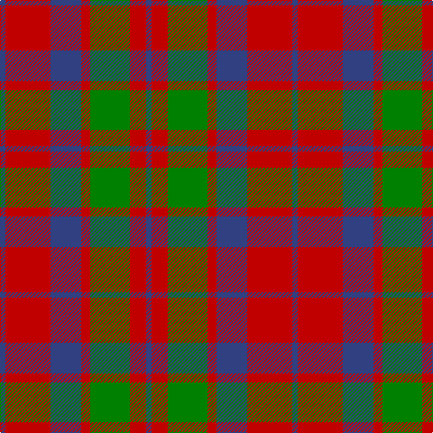

In pattern [BRBRGRB](/patterns/brbrgrb/).

This was sourced from weddslist.  It is a [7 stripes tartan](/stripes/stripes7/).

Original link http://www.weddslist.com/cgi-bin/tartans/pg.pl?source=sts

## Thread count
B/6 R50 B34 R10 G44 R18 B/6

## Palette
Each colour and its ΔE from the base-6 reference it is a variant of.

| Colour | Shade | Base | ΔE (OKLab) |
|---|---|---|---|
| B | <code style="background-color:#304080;">#304080</code> `#304080` | B <code style="background-color:#2C4084;">#2C4084</code> | 0.01 |
| G | <code style="background-color:#008000;">#008000</code> `#008000` | G <code style="background-color:#006400;">#006400</code> | 0.09 |
| R | <code style="background-color:#C00000;">#C00000</code> `#C00000` | R <code style="background-color:#C80000;">#C80000</code> | 0.02 |

# Sample pattern

## Nearest tartans

The nearest existing variants by ΔTartan distance.

1. [MacFadyan (MacGregor Hastie)](/setts/s7/b6r50b34r10g44r18b6-b2c2c80-g006818-rc80000/) — ΔT 0.47
1. [Glasgow, City of](/setts/s7/g56r8b50r44g54r8b4-b780078-g006818-rc80000/) — ΔT 0.91
1. [Fraser (Wilson 1820)](/setts/s9/b8r8b40r40b4r40g40r4b8-b2c2c80-g006818-rc80000/) — ΔT 0.97
1. [Convention of the Baronage (Corp)](/setts/s9/g12r36b4g36r4g4r36ba36r4-b2888c4-ba2c2c80-g006818-rc80000/) — ΔT 1.07
1. [Sydney (Nova Scotia) (District)](/setts/s8/r32k8w4k8r12ra22r4ra32-k101010-r888888-rab84c00-we0e0e0/) — ΔT 1.08
1. [Skene D](/setts/s7/b9r6g2r6g18r6g2-b00004c-g004c00-rc80000/) — ΔT 1.10
1. [Unidentified, Early 18th C](/setts/s10/b6r46b6r52b6r6b50r6g48r6-b304080-g008000-rc00000/) — ΔT 1.10
1. [Glasgow, Ciity of (District)](/setts/s7/g56r8b50r44g54r8b4-b440044-g285800-rc80000/) — ΔT 1.10
1. [Lumsden 1797](/setts/s9/b20r100b80r20g20r20g80r100g20-b304080-g008000-rc00000/) — ΔT 1.12
1. [Bronte House Check](/setts/s6/r10g60b13y24b24g8-b2c294f-g6b380d-rfc0fc0-yd4ad7d/) — ΔT 1.12

## Neighbour map

Every grey dot is one of 15726 variants placed by the first two principal components of the ΔTartan feature space (44% of its variance). Red is this tartan; blue dots are its nearest — click one to open its page.

<svg viewBox="0 0 640 380" role="img" style="max-width:100%;height:auto;border:1px solid #e0e0e0;border-radius:4px;display:block" xmlns="http://www.w3.org/2000/svg"><image href="/nn/cloud.v1.png" width="640" height="380"/><a href="/setts/s7/b6r50b34r10g44r18b6-b2c2c80-g006818-rc80000/"><circle cx="266.0" cy="232.8" r="4" fill="#3465a4"><title>MacFadyan (MacGregor Hastie)</title></circle></a><a href="/setts/s7/g56r8b50r44g54r8b4-b780078-g006818-rc80000/"><circle cx="298.3" cy="222.3" r="4" fill="#3465a4"><title>Glasgow, City of</title></circle></a><a href="/setts/s9/b8r8b40r40b4r40g40r4b8-b2c2c80-g006818-rc80000/"><circle cx="283.5" cy="208.7" r="4" fill="#3465a4"><title>Fraser (Wilson 1820)</title></circle></a><a href="/setts/s9/g12r36b4g36r4g4r36ba36r4-b2888c4-ba2c2c80-g006818-rc80000/"><circle cx="250.8" cy="196.2" r="4" fill="#3465a4"><title>Convention of the Baronage (Corp)</title></circle></a><a href="/setts/s8/r32k8w4k8r12ra22r4ra32-k101010-r888888-rab84c00-we0e0e0/"><circle cx="243.8" cy="212.3" r="4" fill="#3465a4"><title>Sydney (Nova Scotia) (District)</title></circle></a><a href="/setts/s7/b9r6g2r6g18r6g2-b00004c-g004c00-rc80000/"><circle cx="255.3" cy="232.7" r="4" fill="#3465a4"><title>Skene D</title></circle></a><a href="/setts/s10/b6r46b6r52b6r6b50r6g48r6-b304080-g008000-rc00000/"><circle cx="301.1" cy="201.5" r="4" fill="#3465a4"><title>Unidentified, Early 18th C</title></circle></a><a href="/setts/s7/g56r8b50r44g54r8b4-b440044-g285800-rc80000/"><circle cx="305.6" cy="226.9" r="4" fill="#3465a4"><title>Glasgow, Ciity of (District)</title></circle></a><a href="/setts/s9/b20r100b80r20g20r20g80r100g20-b304080-g008000-rc00000/"><circle cx="275.1" cy="243.9" r="4" fill="#3465a4"><title>Lumsden 1797</title></circle></a><a href="/setts/s6/r10g60b13y24b24g8-b2c294f-g6b380d-rfc0fc0-yd4ad7d/"><circle cx="248.2" cy="221.9" r="4" fill="#3465a4"><title>Bronte House Check</title></circle></a><circle cx="268.3" cy="234.6" r="5" fill="#c00000"/></svg>

ID: /setts/s7/b6r50b34r10g44r18b6-b304080-g008000-rc00000/
