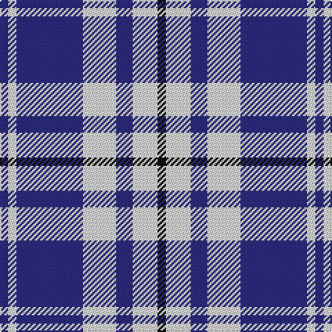

In pattern [BWBWBWK](/patterns/bwbwbwk/).

This was sourced from tartans-authority.  It is a [7 stripes tartan](/stripes/stripes7/).

Original link http://www.tartansauthority.com/tartan-ferret/display/7772/

## Thread count
DB/6 LN6 DB48 LN24 DB12 LN18 K/6

## Palette
Each colour and its ΔE from the base-6 reference it is a variant of.

| Colour | Shade | Base | ΔE (OKLab) |
|---|---|---|---|
| DB | <code style="background-color:#2C2C80;">#2C2C80</code> `#2C2C80` | B <code style="background-color:#2C4084;">#2C4084</code> | 0.05 |
| K | <code style="background-color:#101010;">#101010</code> `#101010` | K <code style="background-color:#000000;">#000000</code> | 0.17 |
| LN | <code style="background-color:#E0E0E0;">#E0E0E0</code> `#E0E0E0` | W <code style="background-color:#F4F4F0;">#F4F4F0</code> | 0.06 |

# Sample pattern

## Nearest tartans

The nearest existing variants by ΔTartan distance.

1. [Ailsa, Navy (Dance)](/setts/s6/b16w6b56w64k6w8-b1c0070-k101010-wf0e0c8/) — ΔT 0.91
1. [Buchanan Dress Blue (Dance)](/setts/s6/w10b32w10b32w66r6-b1c0070-r880000-wf8f8f8/) — ΔT 1.11
1. [Buchanan Dress Blue Clan Tartan Tartan Number: 1672. Earliest known date: pre 2003 One of a number of dress tartans produced by Hugh Macpherson, a kiltmaker in Edinburgh, intended for dancing and other informal occassions. The 'dress' version of clan tartan is usually created by substituting white for one of the 'ground' colours. See products available Copyright © Blair Urquhart, Comrie, 2015](/setts/s6/w10b32w10b32w66r6-b2c2c80-rc80000-we0e0e0/) — ΔT 1.13
1. [MacPherson Dress, Royal Blue (Dance)](/setts/s7/w10k6w52b42w6b16y6-b1c0070-k101010-we0e0e0-ye8c000/) — ΔT 1.18
1. [MacMugen](/setts/s6/k9y48k12y9k36w6-k000030-we0e0e0-yb0b0b0/) — ΔT 1.25
1. [UEFA (Glasgow)](/setts/s6/r48b16y20b120y20b16-b3850c8-rc80000-ye8c000/) — ΔT 1.31
1. [MacPherson Dress Blue (Dance)](/setts/s7/w10k6w52b42w6b16y6-b2c2c80-k101010-we0e0e0-ye8c000/) — ΔT 1.34
1. [Yorkshire, The Spirit of](/setts/s10/b38y4b6w14b6w14b18w6b4w38-b2c4084-we0e0e0-yfadc00/) — ΔT 1.34
1. [Jubilation (Commemorative)](/setts/s8/b16w4b22w26b60w26r22b4-b1c0070-rc80000-we0e0e0/) — ΔT 1.36
1. [Buchanan, dress Blue](/setts/s6/w10b32w10b32w66r6-b304080-rc00000-we0e0e0/) — ΔT 1.37

## Neighbour map

Every grey dot is one of 15726 variants placed by the first two principal components of the ΔTartan feature space (44% of its variance). Red is this tartan; blue dots are its nearest — click one to open its page.

<svg viewBox="0 0 640 380" role="img" style="max-width:100%;height:auto;border:1px solid #e0e0e0;border-radius:4px;display:block" xmlns="http://www.w3.org/2000/svg"><image href="/nn/cloud.v1.png" width="640" height="380"/><a href="/setts/s6/b16w6b56w64k6w8-b1c0070-k101010-wf0e0c8/"><circle cx="278.0" cy="192.6" r="4" fill="#3465a4"><title>Ailsa, Navy (Dance)</title></circle></a><a href="/setts/s6/w10b32w10b32w66r6-b1c0070-r880000-wf8f8f8/"><circle cx="283.2" cy="198.1" r="4" fill="#3465a4"><title>Buchanan Dress Blue (Dance)</title></circle></a><a href="/setts/s6/w10b32w10b32w66r6-b2c2c80-rc80000-we0e0e0/"><circle cx="294.8" cy="202.1" r="4" fill="#3465a4"><title>Buchanan Dress Blue Clan Tartan Tartan Number: 1672. Earliest known date: pre 2003 One of a number of dress tartans produced by Hugh Macpherson, a kiltmaker in Edinburgh, intended for dancing and other informal occassions. The 'dress' version of clan tartan is usually created by substituting white for one of the 'ground' colours. See products available Copyright © Blair Urquhart, Comrie, 2015</title></circle></a><a href="/setts/s7/w10k6w52b42w6b16y6-b1c0070-k101010-we0e0e0-ye8c000/"><circle cx="228.4" cy="179.3" r="4" fill="#3465a4"><title>MacPherson Dress, Royal Blue (Dance)</title></circle></a><a href="/setts/s6/k9y48k12y9k36w6-k000030-we0e0e0-yb0b0b0/"><circle cx="250.1" cy="222.7" r="4" fill="#3465a4"><title>MacMugen</title></circle></a><a href="/setts/s6/r48b16y20b120y20b16-b3850c8-rc80000-ye8c000/"><circle cx="346.5" cy="218.6" r="4" fill="#3465a4"><title>UEFA (Glasgow)</title></circle></a><a href="/setts/s7/w10k6w52b42w6b16y6-b2c2c80-k101010-we0e0e0-ye8c000/"><circle cx="233.1" cy="179.5" r="4" fill="#3465a4"><title>MacPherson Dress Blue (Dance)</title></circle></a><a href="/setts/s10/b38y4b6w14b6w14b18w6b4w38-b2c4084-we0e0e0-yfadc00/"><circle cx="263.7" cy="185.8" r="4" fill="#3465a4"><title>Yorkshire, The Spirit of</title></circle></a><a href="/setts/s8/b16w4b22w26b60w26r22b4-b1c0070-rc80000-we0e0e0/"><circle cx="287.0" cy="190.0" r="4" fill="#3465a4"><title>Jubilation (Commemorative)</title></circle></a><a href="/setts/s6/w10b32w10b32w66r6-b304080-rc00000-we0e0e0/"><circle cx="299.0" cy="203.7" r="4" fill="#3465a4"><title>Buchanan, dress Blue</title></circle></a><circle cx="279.3" cy="210.6" r="5" fill="#c00000"/></svg>

ID: /setts/s7/b6w6b48w24b12w18k6-b2c2c80-k101010-we0e0e0/
