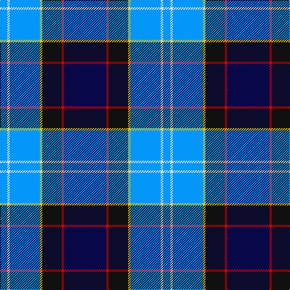

In pattern [BRKYBWB](/patterns/brkybwb/).

This was sourced from register-of-tartans.  It is a [7 stripes tartan](/stripes/stripes7/).

Original link https://www.tartanregister.gov.uk/tartanDetails.aspx?ref=4224

## Thread count
B/12 LN4 B50 Y4 K32 R4 DB/70

## Palette
Each colour and its ΔE from the base-6 reference it is a variant of.

| Colour | Shade | Base | ΔE (OKLab) |
|---|---|---|---|
| B | <code style="background-color:#0596FA;">#0596FA</code> `#0596FA` | B <code style="background-color:#2A418A;">#2A418A</code> | 0.27 |
| DB | <code style="background-color:#080848;">#080848</code> `#080848` | B <code style="background-color:#2A418A;">#2A418A</code> | 0.20 |
| K | <code style="background-color:#101010;">#101010</code> `#101010` | K <code style="background-color:#000000;">#000000</code> | 0.17 |
| LN | <code style="background-color:#E0E0E0;">#E0E0E0</code> `#E0E0E0` | W <code style="background-color:#F7F7F7;">#F7F7F7</code> | 0.07 |
| R | <code style="background-color:#DC0000;">#DC0000</code> `#DC0000` | R <code style="background-color:#CC0000;">#CC0000</code> | 0.03 |
| Y | <code style="background-color:#E8C000;">#E8C000</code> `#E8C000` | Y <code style="background-color:#F2BF00;">#F2BF00</code> | 0.02 |

# Sample pattern

## Nearest tartans

The nearest existing variants by ΔTartan distance.

1. [Unidentified 7](/setts/s7/b70r4k32y4ba50w4ba12-b000050-ba8080d0-k000000-rc00000-we0e0e0-yf0c000/) — ΔT 0.73
1. [US Forces (Thurso) Regimental Tartan Tartan Number: 549. Earliest known date: 1986 Originally listed as MacNeil, this sett was identified by Ken Dalgliesh, weaver in Selkirk, in 1999. See products available Copyright © Blair Urquhart, Comrie, 2015](/setts/s7/b70r4k32y4ba50w4ba12-b202060-ba2888c4-k101010-rc80000-we0e0e0-ye8c000/) — ΔT 0.83
1. [Arundel County (Dalgleish)](/setts/s8/g8k12b64k16y4k16ba20r8-b00008c-ba788cb4-g007800-k000000-r8c0000-yc88c00/) — ΔT 1.15
1. [US Air Force Reserve Pipe Band Military Tartan Tartan Number: 2437. Earliest known date: 01/01/1988 One of a series of US Military tartans woven exclusively by the Strathmore Woollen Company of Forfar and adopted by the Band of the Air Force Reserve, Georgia, USA in the early 1990s. Although this has no official US Military recognition, it has been widely accepted by US servicemen and their families with Air Force connections as a representative design. Originally called 'Lady Jane of St Cirus', the design was shown to members of the pipe band who liked it sufficiently to adopt it (with Strathmore's agreement). See products available Copyright © Blair Urquhart, Comrie, 2015](/setts/s9/b88k6ka40r6b16y68b6b4y30-b1c0070-k000000-ka101010-r880000-y48a4c0/) — ΔT 1.16
1. [US Air Force Reserve Pipe Band](/setts/s9/b88y6k40r6b16ya68b6b4ya30-b1c0070-k101010-r880000-ybc8c00-ya48a4c0/) — ΔT 1.19
1. [Wrens](/setts/s9/b32y6b16ba24b2ba12k64r2w4-b8080d0-ba304080-k000030-rc00000-we0e0e0-yf0c000/) — ΔT 1.21
1. [Oren Peterson](/setts/s6/r4g8b40ra4ba60w4-b778899-ba000080-g006400-rd02090-raff0000-wffffff/) — ΔT 1.23
1. [Banff and Buchan](/setts/s8/k34w4k6b32ba56b4ba6y4-b000064-ba3c74a4-k000000-wc8c8c8-yc48800/) — ΔT 1.25
1. [Banff, and Buchan](/setts/s8/b52w4b6ba30bb52ba4bb6y8-b000050-ba304080-bb5480b0-we0e0e0-yf0c000/) — ΔT 1.26
1. [Mina Perhonen](/setts/s7/w8k48y4b48ba10k8y8-b006080-ba5c8ca8-k00003c-we0e0e0-ye8c000/) — ΔT 1.31

## Neighbour map

Every grey dot is one of 15726 variants placed by the first two principal components of the ΔTartan feature space (44% of its variance). Red is this tartan; blue dots are its nearest — click one to open its page.

<svg viewBox="0 0 640 380" role="img" style="max-width:100%;height:auto;border:1px solid #e0e0e0;border-radius:4px;display:block" xmlns="http://www.w3.org/2000/svg"><image href="/nn/cloud.v1.png" width="640" height="380"/><a href="/setts/s7/b70r4k32y4ba50w4ba12-b000050-ba8080d0-k000000-rc00000-we0e0e0-yf0c000/"><circle cx="171.7" cy="133.6" r="4" fill="#3465a4"><title>Unidentified 7</title></circle></a><a href="/setts/s7/b70r4k32y4ba50w4ba12-b202060-ba2888c4-k101010-rc80000-we0e0e0-ye8c000/"><circle cx="193.2" cy="143.5" r="4" fill="#3465a4"><title>US Forces (Thurso) Regimental Tartan Tartan Number: 549. Earliest known date: 1986 Originally listed as MacNeil, this sett was identified by Ken Dalgliesh, weaver in Selkirk, in 1999. See products available Copyright © Blair Urquhart, Comrie, 2015</title></circle></a><a href="/setts/s8/g8k12b64k16y4k16ba20r8-b00008c-ba788cb4-g007800-k000000-r8c0000-yc88c00/"><circle cx="178.7" cy="140.1" r="4" fill="#3465a4"><title>Arundel County (Dalgleish)</title></circle></a><a href="/setts/s9/b88k6ka40r6b16y68b6b4y30-b1c0070-k000000-ka101010-r880000-y48a4c0/"><circle cx="225.0" cy="136.6" r="4" fill="#3465a4"><title>US Air Force Reserve Pipe Band Military Tartan Tartan Number: 2437. Earliest known date: 01/01/1988 One of a series of US Military tartans woven exclusively by the Strathmore Woollen Company of Forfar and adopted by the Band of the Air Force Reserve, Georgia, USA in the early 1990s. Although this has no official US Military recognition, it has been widely accepted by US servicemen and their families with Air Force connections as a representative design. Originally called 'Lady Jane of St Cirus', the design was shown to members of the pipe band who liked it sufficiently to adopt it (with Strathmore's agreement). See products available Copyright © Blair Urquhart, Comrie, 2015</title></circle></a><a href="/setts/s9/b88y6k40r6b16ya68b6b4ya30-b1c0070-k101010-r880000-ybc8c00-ya48a4c0/"><circle cx="225.6" cy="136.0" r="4" fill="#3465a4"><title>US Air Force Reserve Pipe Band</title></circle></a><a href="/setts/s9/b32y6b16ba24b2ba12k64r2w4-b8080d0-ba304080-k000030-rc00000-we0e0e0-yf0c000/"><circle cx="195.8" cy="97.7" r="4" fill="#3465a4"><title>Wrens</title></circle></a><a href="/setts/s6/r4g8b40ra4ba60w4-b778899-ba000080-g006400-rd02090-raff0000-wffffff/"><circle cx="241.2" cy="142.1" r="4" fill="#3465a4"><title>Oren Peterson</title></circle></a><a href="/setts/s8/k34w4k6b32ba56b4ba6y4-b000064-ba3c74a4-k000000-wc8c8c8-yc48800/"><circle cx="193.9" cy="154.3" r="4" fill="#3465a4"><title>Banff and Buchan</title></circle></a><a href="/setts/s8/b52w4b6ba30bb52ba4bb6y8-b000050-ba304080-bb5480b0-we0e0e0-yf0c000/"><circle cx="176.4" cy="161.3" r="4" fill="#3465a4"><title>Banff, and Buchan</title></circle></a><a href="/setts/s7/w8k48y4b48ba10k8y8-b006080-ba5c8ca8-k00003c-we0e0e0-ye8c000/"><circle cx="182.5" cy="166.8" r="4" fill="#3465a4"><title>Mina Perhonen</title></circle></a><circle cx="171.8" cy="136.7" r="5" fill="#c00000"/></svg>

ID: /setts/s7/b70r4k32y4ba50w4ba12-b080848-ba0596fa-k101010-rdc0000-we0e0e0-ye8c000/
