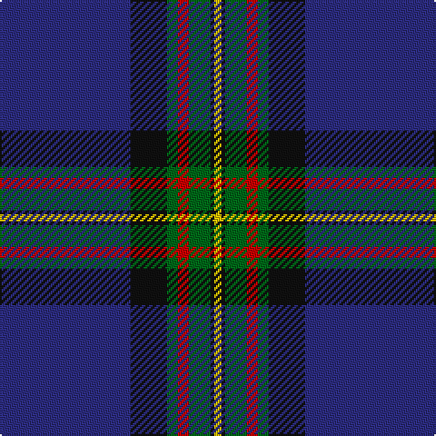

In pattern [BKGRGKY](/patterns/bkgrgky/).

This was sourced from house-of-tartan.  It is a [7 stripes tartan](/stripes/stripes7/).

Original link http://www.house-of-tartan.scotland.net/house/TartanViewjs.asp?colr=Def&tnam=344

## Thread count
DB/72 K20 G6 R6 G12 K2 Y/4

## Palette
Each colour and its ΔE from the base-6 reference it is a variant of.

| Colour | Shade | Base | ΔE (OKLab) |
|---|---|---|---|
| DB | <code style="background-color:#2C2C80;">#2C2C80</code> `#2C2C80` | B <code style="background-color:#2C4084;">#2C4084</code> | 0.05 |
| G | <code style="background-color:#006818;">#006818</code> `#006818` | G <code style="background-color:#006400;">#006400</code> | 0.02 |
| K | <code style="background-color:#101010;">#101010</code> `#101010` | K <code style="background-color:#000000;">#000000</code> | 0.17 |
| R | <code style="background-color:#C80000;">#C80000</code> `#C80000` | R <code style="background-color:#C80000;">#C80000</code> | 0.00 |
| Y | <code style="background-color:#E8C000;">#E8C000</code> `#E8C000` | Y <code style="background-color:#E8C000;">#E8C000</code> | 0.00 |

# Sample pattern

## Nearest tartans

The nearest existing variants by ΔTartan distance.

1. [MacLaurin of Brioch](/setts/s7/b72k20g6r6g12k2y4-b2c4084-g005020-k101010-rdc0000-ye8c000/) — ΔT 0.44
1. [MacLaurin of Broich (Clan)](/setts/s7/b72k16g6r6g12k2y4-b200088-g006818-k101010-r880000-yd09800/) — ΔT 0.81
1. [Grahame Laurie Band (Corporate)](/setts/s7/k8y2b6y2k36ba84w7-b780078-ba2c2c80-k101010-we0e0e0-yfccc00/) — ΔT 0.83
1. [Sinclair-Brown (Personal)](/setts/s8/b128k22r4k8r4k8g64y8-b2c2c80-g006818-k101010-rc80000-ybc8c00/) — ΔT 0.94
1. [Nocken (Personal)](/setts/s9/w6k12wa4k12b4k4b64k4ba2-b202060-ba5c5c5c-k101010-w98c8e8-wae8ccb8/) — ΔT 0.96
1. [Binder Wedding (Personal)](/setts/s8/g2b2k2b60k60w4b10y2-b2c4084-g649848-k101010-wffffff-yffe600/) — ΔT 1.00
1. [MacBeth (Fashion)](/setts/s8/b84k12y4k6y4g20r14k4-b1c0070-g006818-k101010-r880000-yd09800/) — ΔT 1.05
1. [Hope-Weir/Weir](/setts/s8/k16y2k2b56k24g4k2ba4-b2c4084-ba3c82af-g005020-k101010-ye8c000/) — ΔT 1.07
1. [Nocken Blue Modern Tartan (Personal)](/setts/s9/y6k12w4k12b4k4b64k4ba2-b003152-ba666666-k101010-wffffff-y7a9dc3/) — ΔT 1.07
1. [NHS Grampian](/setts/s7/b8ba72k32w2b4w2k8-b2888c4-ba2c2c80-k101010-wfcfcfc/) — ΔT 1.10

## Neighbour map

Every grey dot is one of 15726 variants placed by the first two principal components of the ΔTartan feature space (44% of its variance). Red is this tartan; blue dots are its nearest — click one to open its page.

<svg viewBox="0 0 640 380" role="img" style="max-width:100%;height:auto;border:1px solid #e0e0e0;border-radius:4px;display:block" xmlns="http://www.w3.org/2000/svg"><image href="/nn/cloud.v1.png" width="640" height="380"/><a href="/setts/s7/b72k20g6r6g12k2y4-b2c4084-g005020-k101010-rdc0000-ye8c000/"><circle cx="389.0" cy="130.7" r="4" fill="#3465a4"><title>MacLaurin of Brioch</title></circle></a><a href="/setts/s7/b72k16g6r6g12k2y4-b200088-g006818-k101010-r880000-yd09800/"><circle cx="394.6" cy="127.4" r="4" fill="#3465a4"><title>MacLaurin of Broich (Clan)</title></circle></a><a href="/setts/s7/k8y2b6y2k36ba84w7-b780078-ba2c2c80-k101010-we0e0e0-yfccc00/"><circle cx="382.2" cy="114.4" r="4" fill="#3465a4"><title>Grahame Laurie Band (Corporate)</title></circle></a><a href="/setts/s8/b128k22r4k8r4k8g64y8-b2c2c80-g006818-k101010-rc80000-ybc8c00/"><circle cx="342.3" cy="126.7" r="4" fill="#3465a4"><title>Sinclair-Brown (Personal)</title></circle></a><a href="/setts/s9/w6k12wa4k12b4k4b64k4ba2-b202060-ba5c5c5c-k101010-w98c8e8-wae8ccb8/"><circle cx="401.9" cy="115.4" r="4" fill="#3465a4"><title>Nocken (Personal)</title></circle></a><a href="/setts/s8/g2b2k2b60k60w4b10y2-b2c4084-g649848-k101010-wffffff-yffe600/"><circle cx="353.2" cy="123.2" r="4" fill="#3465a4"><title>Binder Wedding (Personal)</title></circle></a><a href="/setts/s8/b84k12y4k6y4g20r14k4-b1c0070-g006818-k101010-r880000-yd09800/"><circle cx="338.1" cy="135.3" r="4" fill="#3465a4"><title>MacBeth (Fashion)</title></circle></a><a href="/setts/s8/k16y2k2b56k24g4k2ba4-b2c4084-ba3c82af-g005020-k101010-ye8c000/"><circle cx="365.3" cy="143.3" r="4" fill="#3465a4"><title>Hope-Weir/Weir</title></circle></a><a href="/setts/s9/y6k12w4k12b4k4b64k4ba2-b003152-ba666666-k101010-wffffff-y7a9dc3/"><circle cx="403.1" cy="119.8" r="4" fill="#3465a4"><title>Nocken Blue Modern Tartan (Personal)</title></circle></a><a href="/setts/s7/b8ba72k32w2b4w2k8-b2888c4-ba2c2c80-k101010-wfcfcfc/"><circle cx="390.6" cy="142.9" r="4" fill="#3465a4"><title>NHS Grampian</title></circle></a><circle cx="381.0" cy="126.7" r="5" fill="#c00000"/></svg>

ID: /setts/s7/b72k20g6r6g12k2y4-b2c2c80-g006818-k101010-rc80000-ye8c000/
