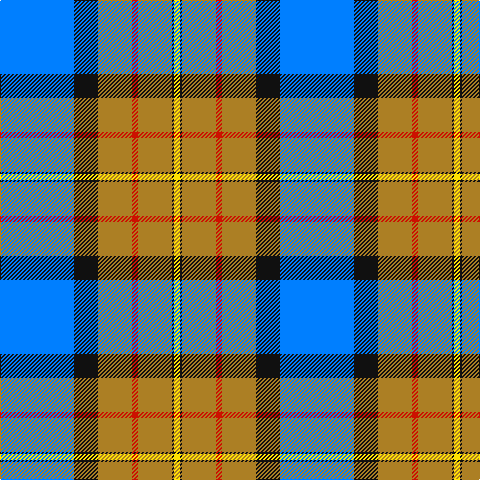

In pattern [BKRRRKY](/patterns/bkrrrky/).

This was sourced from register-of-tartans.  It is a [7 stripes tartan](/stripes/stripes7/).

Original link https://www.tartanregister.gov.uk/tartanDetails.aspx?ref=10058

## Thread count
B/74 K24 LT34 R6 LT34 K2 Y/6

## Palette
Each colour and its ΔE from the base-6 reference it is a variant of.

| Colour | Shade | Base | ΔE (OKLab) |
|---|---|---|---|
| B | <code style="background-color:#007FFF;">#007FFF</code> `#007FFF` | B <code style="background-color:#2C4084;">#2C4084</code> | 0.24 |
| K | <code style="background-color:#101010;">#101010</code> `#101010` | K <code style="background-color:#000000;">#000000</code> | 0.17 |
| LT | <code style="background-color:#AC7F24;">#AC7F24</code> `#AC7F24` | R <code style="background-color:#C80000;">#C80000</code> | 0.20 |
| R | <code style="background-color:#CC1100;">#CC1100</code> `#CC1100` | R <code style="background-color:#C80000;">#C80000</code> | 0.01 |
| Y | <code style="background-color:#FFE303;">#FFE303</code> `#FFE303` | Y <code style="background-color:#E8C000;">#E8C000</code> | 0.10 |

# Sample pattern

ID: /setts/s7/b74k24r34ra6r34k2y6-b007fff-k101010-rac7f24-racc1100-yffe303/
