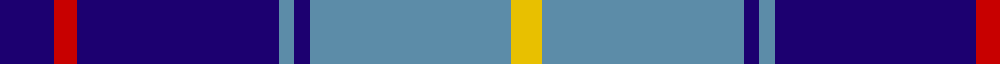

In pattern [BRBBBBY](/patterns/brbbbby/).

This was sourced from tartans-authority.  It is a [7 stripes tartan](/stripes/stripes7/).

Original link http://www.tartansauthority.com/tartan-ferret/display/10174/

## Thread count
DB/14 R6 DB52 B4 DB4 B52 Y/8

## Palette
Each colour and its ΔE from the base-6 reference it is a variant of.

| Colour | Shade | Base | ΔE (OKLab) |
|---|---|---|---|
| B | <code style="background-color:#5C8CA8;">#5C8CA8</code> `#5C8CA8` | B <code style="background-color:#2A418A;">#2A418A</code> | 0.23 |
| DB | <code style="background-color:#1C0070;">#1C0070</code> `#1C0070` | B <code style="background-color:#2A418A;">#2A418A</code> | 0.14 |
| R | <code style="background-color:#C80000;">#C80000</code> `#C80000` | R <code style="background-color:#CC0000;">#CC0000</code> | 0.01 |
| Y | <code style="background-color:#E8C000;">#E8C000</code> `#E8C000` | Y <code style="background-color:#F2BF00;">#F2BF00</code> | 0.02 |

# Sample pattern

## Nearest tartans

The nearest existing variants by ΔTartan distance.

1. [Federal Bureau of Investigation](/setts/s7/b6w2b2w3b16ba26r2x2~b1c0070-ba1870a4-r880000-wc0c0c0/) — ΔT 1.01
1. [Highlands School, (North Carolina)](/setts/s8/g12b2g2b30ba3b2ba13w4x2~b304080-ba000050-g908000-we0e0e0/) — ΔT 1.04
1. [Highlands School (N. Carolina) Corporate Tartan Tartan Number: 2109. Earliest known date: 1990 Highlands in North Carolina is the home of the Scottish Tartans Society's Museum Extension. The school tartan was designed by Bob Martin who is a 'Fellow of the Society'. Blue and Gold are the school colours. See products available Copyright © Blair Urquhart, Comrie, 2015](/setts/s8/y12b2y2b30ba3b2ba13w4x2~b2c2c80-ba202060-we0e0e0-ye8c000/) — ΔT 1.05
1. [Detroit Lions](/setts/s8/b30w2k9wa3b6wa4k3w6x2~b2c4084-k101010-wc8c8c8-waffffff/) — ΔT 1.06
1. [Highlands School (North Carolina)](/setts/s8/y12b2y2b30ba2b2ba13w4x2~b1c0070-ba14283c-wc0c0c0-yd09800/) — ΔT 1.08
1. [Longniddry Eildon Blue Dress Fancy Tartan Tartan Number: 5486. Earliest known date: pre 1992 Dancers tartan See products available Copyright © Blair Urquhart, Comrie, 2015](/setts/s8/b42w2wa2w2b5ba12wa32b4x2~b202060-ba003c64-wa8ace8-wac0c0c0/) — ΔT 1.12
1. [Rutherford](/setts/s8/k8r1k1r1k4b11y1b2x6~b6060c8-k101010-rc80000-ye8c000/) — ΔT 1.12
1. [Wolverine Corporate Tartan Tartan Number: 10748. Earliest known date: 03/12/2012 Created by the designer to celebrate an exclusive group of work colleagues known affectionately as the 'Wolverines'. Many within this close group share a proud Scottish heritage and wished to acknowledge this strong affiliation by commissioning a tartan. Yes. The Wolverine tartan has been created for the exclusive use of the 'Wolverines'. No commercial use of this tartan is permitted without expressed permission from the designer, and any party wishing to use or reproduce this tartan should first seek permission by email from the designer. See products available Copyright © Blair Urquhart, Comrie, 2015](/setts/s6/y8k3b40ka12k3y3x2~b0c4ba8-k000000-ka101010-yaba712/) — ΔT 1.14
1. [Wolverines (Corporate)](/setts/s6/y8w3b40k12w3y3x2~b2c2c80-k101010-we0e0e0-yfcb464/) — ΔT 1.16
1. [Wolverine (Corporate)](/setts/s6/y8w3b40k12w3y3x2~b0c4ba8-k101010-wffffff-yaba712/) — ΔT 1.16

## Neighbour map

Every grey dot is one of 15726 variants placed by the first two principal components of the ΔTartan feature space (44% of its variance). Red is this tartan; blue dots are its nearest — click one to open its page.

<svg viewBox="0 0 640 380" role="img" style="max-width:100%;height:auto;border:1px solid #e0e0e0;border-radius:4px;display:block" xmlns="http://www.w3.org/2000/svg"><image href="/nn/cloud.v1.png" width="640" height="380"/><a href="/setts/s7/b6w2b2w3b16ba26r2x2~b1c0070-ba1870a4-r880000-wc0c0c0/"><circle cx="284.9" cy="188.2" r="4" fill="#3465a4"><title>Federal Bureau of Investigation</title></circle></a><a href="/setts/s8/g12b2g2b30ba3b2ba13w4x2~b304080-ba000050-g908000-we0e0e0/"><circle cx="277.1" cy="169.5" r="4" fill="#3465a4"><title>Highlands School, (North Carolina)</title></circle></a><a href="/setts/s8/y12b2y2b30ba3b2ba13w4x2~b2c2c80-ba202060-we0e0e0-ye8c000/"><circle cx="257.4" cy="157.3" r="4" fill="#3465a4"><title>Highlands School (N. Carolina) Corporate Tartan Tartan Number: 2109. Earliest known date: 1990 Highlands in North Carolina is the home of the Scottish Tartans Society's Museum Extension. The school tartan was designed by Bob Martin who is a 'Fellow of the Society'. Blue and Gold are the school colours. See products available Copyright © Blair Urquhart, Comrie, 2015</title></circle></a><a href="/setts/s8/b30w2k9wa3b6wa4k3w6x2~b2c4084-k101010-wc8c8c8-waffffff/"><circle cx="288.4" cy="156.4" r="4" fill="#3465a4"><title>Detroit Lions</title></circle></a><a href="/setts/s8/y12b2y2b30ba2b2ba13w4x2~b1c0070-ba14283c-wc0c0c0-yd09800/"><circle cx="270.0" cy="161.4" r="4" fill="#3465a4"><title>Highlands School (North Carolina)</title></circle></a><a href="/setts/s8/b42w2wa2w2b5ba12wa32b4x2~b202060-ba003c64-wa8ace8-wac0c0c0/"><circle cx="286.3" cy="141.0" r="4" fill="#3465a4"><title>Longniddry Eildon Blue Dress Fancy Tartan Tartan Number: 5486. Earliest known date: pre 1992 Dancers tartan See products available Copyright © Blair Urquhart, Comrie, 2015</title></circle></a><a href="/setts/s8/k8r1k1r1k4b11y1b2x6~b6060c8-k101010-rc80000-ye8c000/"><circle cx="258.8" cy="181.6" r="4" fill="#3465a4"><title>Rutherford</title></circle></a><a href="/setts/s6/y8k3b40ka12k3y3x2~b0c4ba8-k000000-ka101010-yaba712/"><circle cx="311.0" cy="181.9" r="4" fill="#3465a4"><title>Wolverine Corporate Tartan Tartan Number: 10748. Earliest known date: 03/12/2012 Created by the designer to celebrate an exclusive group of work colleagues known affectionately as the 'Wolverines'. Many within this close group share a proud Scottish heritage and wished to acknowledge this strong affiliation by commissioning a tartan. Yes. The Wolverine tartan has been created for the exclusive use of the 'Wolverines'. No commercial use of this tartan is permitted without expressed permission from the designer, and any party wishing to use or reproduce this tartan should first seek permission by email from the designer. See products available Copyright © Blair Urquhart, Comrie, 2015</title></circle></a><a href="/setts/s6/y8w3b40k12w3y3x2~b2c2c80-k101010-we0e0e0-yfcb464/"><circle cx="304.2" cy="170.4" r="4" fill="#3465a4"><title>Wolverines (Corporate)</title></circle></a><a href="/setts/s6/y8w3b40k12w3y3x2~b0c4ba8-k101010-wffffff-yaba712/"><circle cx="299.3" cy="173.6" r="4" fill="#3465a4"><title>Wolverine (Corporate)</title></circle></a><circle cx="285.3" cy="180.8" r="5" fill="#c00000"/></svg>

ID: /setts/s7/b7r3b26ba2b2ba26y4x2~b1c0070-ba5c8ca8-rc80000-ye8c000/
