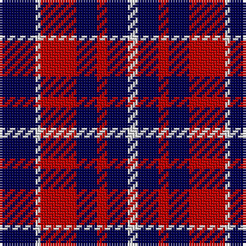

In pattern [BWRBRBW](/patterns/bwrbrbw/).

This was sourced from weddslist.  It is a [7 stripes tartan](/stripes/stripes7/).

Original link http://www.weddslist.com/cgi-bin/tartans/pg.pl?source=sts

## Thread count
DB/14 LN2 R14 DB8 R4 DB8 LN/4

## Palette
Each colour and its ΔE from the base-6 reference it is a variant of.

| Colour | Shade | Base | ΔE (OKLab) |
|---|---|---|---|
| DB | <code style="background-color:#000050;">#000050</code> `#000050` | B <code style="background-color:#2A418A;">#2A418A</code> | 0.21 |
| LN | <code style="background-color:#E0E0E0;">#E0E0E0</code> `#E0E0E0` | W <code style="background-color:#F7F7F7;">#F7F7F7</code> | 0.07 |
| R | <code style="background-color:#C00000;">#C00000</code> `#C00000` | R <code style="background-color:#CC0000;">#CC0000</code> | 0.03 |

# Sample pattern

## Nearest tartans

The nearest existing variants by ΔTartan distance.

1. [Coronation Commemorative Tartan Tartan Number: 661. Earliest known date: 1936 Designed to commemorate the coronation of King George VI and Queen Elizabeth in 1936. There is another count estimated from a drawing by Coulson Bonner which is now in the possession of the Scottish Tartan Society. B22 W2 R24 B12 R2 B12 W2 See products available Copyright © Blair Urquhart, Comrie, 2015](/setts/s7/b7w1r7b4r2b4w2~b202060-rc80000-we0e0e0~x2/) — ΔT 0.79
1. [Hamilton](/setts/s5/b6r1b6r9w1~b00004c-rc80000-wd0d0d0~x2/) — ΔT 1.19
1. [Edinburgh Marketing](/setts/s8/b38r6b6r9w5r12b8r16~b000050-rc00000-we0e0e0/) — ΔT 1.21
1. [Hamilton](/setts/s5/b6r1b6r9y1~b000052-raa0000-yaaaaaa~x2/) — ΔT 1.32
1. [Coronation](/setts/s7/b7w1r7b4r2b4w2~b2c4084-rdc0000-we0e0e0~x2/) — ΔT 1.35
1. [U.S. Coast Guard](/setts/s8/r5b6r1b6r1b6r5w5~b2c2c80-rc80000-we0e0e0~x4/) — ΔT 1.40
1. [Laval (Tartan de..)](/setts/s5/b2w2ba8b8w1~b000050-ba600030-we0e0e0~x2/) — ΔT 1.40
1. [Laval (Tartan de..) District Tartan Tartan Number: 2120. Earliest known date: 1988 "Purple (Wine red is sample) and blue (Dark blue) are the city's official colours. The symbolize the wealth and the quality of life and the development of a human city. White combines with blue and red to remind us of our French and British origins." (Guy Menard - Communication Services, Laval) See products available Copyright © Blair Urquhart, Comrie, 2015](/setts/s5/b2w2ba8b8w1~b202060-ba680028-we0e0e0~x2/) — ΔT 1.42
1. [Johore Regiment (Military)](/setts/s5/b20k5b18y26k6~b2c2c80-k101010-yd09800~x2/) — ΔT 1.52
1. [Edinburgh Marketing](/setts/s8/b6r1b1r2w1r2b1r3~b1c0070-rc80000-wfcfcfc~x4/) — ΔT 1.56

## Neighbour map

Every grey dot is one of 15726 variants placed by the first two principal components of the ΔTartan feature space (44% of its variance). Red is this tartan; blue dots are its nearest — click one to open its page.

<svg viewBox="0 0 640 380" role="img" style="max-width:100%;height:auto;border:1px solid #e0e0e0;border-radius:4px;display:block" xmlns="http://www.w3.org/2000/svg"><image href="/nn/cloud.v1.png" width="640" height="380"/><a href="/setts/s7/b7w1r7b4r2b4w2~b202060-rc80000-we0e0e0~x2/"><circle cx="270.2" cy="247.7" r="4" fill="#3465a4"><title>Coronation Commemorative Tartan Tartan Number: 661. Earliest known date: 1936 Designed to commemorate the coronation of King George VI and Queen Elizabeth in 1936. There is another count estimated from a drawing by Coulson Bonner which is now in the possession of the Scottish Tartan Society. B22 W2 R24 B12 R2 B12 W2 See products available Copyright © Blair Urquhart, Comrie, 2015</title></circle></a><a href="/setts/s5/b6r1b6r9w1~b00004c-rc80000-wd0d0d0~x2/"><circle cx="297.8" cy="245.9" r="4" fill="#3465a4"><title>Hamilton</title></circle></a><a href="/setts/s8/b38r6b6r9w5r12b8r16~b000050-rc00000-we0e0e0/"><circle cx="290.8" cy="219.2" r="4" fill="#3465a4"><title>Edinburgh Marketing</title></circle></a><a href="/setts/s5/b6r1b6r9y1~b000052-raa0000-yaaaaaa~x2/"><circle cx="311.4" cy="254.0" r="4" fill="#3465a4"><title>Hamilton</title></circle></a><a href="/setts/s7/b7w1r7b4r2b4w2~b2c4084-rdc0000-we0e0e0~x2/"><circle cx="275.5" cy="247.4" r="4" fill="#3465a4"><title>Coronation</title></circle></a><a href="/setts/s8/r5b6r1b6r1b6r5w5~b2c2c80-rc80000-we0e0e0~x4/"><circle cx="222.1" cy="258.2" r="4" fill="#3465a4"><title>U.S. Coast Guard</title></circle></a><a href="/setts/s5/b2w2ba8b8w1~b000050-ba600030-we0e0e0~x2/"><circle cx="251.8" cy="246.3" r="4" fill="#3465a4"><title>Laval (Tartan de..)</title></circle></a><a href="/setts/s5/b2w2ba8b8w1~b202060-ba680028-we0e0e0~x2/"><circle cx="264.4" cy="246.3" r="4" fill="#3465a4"><title>Laval (Tartan de..) District Tartan Tartan Number: 2120. Earliest known date: 1988 &quot;Purple (Wine red is sample) and blue (Dark blue) are the city's official colours. The symbolize the wealth and the quality of life and the development of a human city. White combines with blue and red to remind us of our French and British origins.&quot; (Guy Menard - Communication Services, Laval) See products available Copyright © Blair Urquhart, Comrie, 2015</title></circle></a><a href="/setts/s5/b20k5b18y26k6~b2c2c80-k101010-yd09800~x2/"><circle cx="224.9" cy="278.8" r="4" fill="#3465a4"><title>Johore Regiment (Military)</title></circle></a><a href="/setts/s8/b6r1b1r2w1r2b1r3~b1c0070-rc80000-wfcfcfc~x4/"><circle cx="259.6" cy="225.8" r="4" fill="#3465a4"><title>Edinburgh Marketing</title></circle></a><circle cx="257.6" cy="248.8" r="5" fill="#c00000"/></svg>

ID: /setts/s7/b7w1r7b4r2b4w2~b000050-rc00000-we0e0e0~x2/
