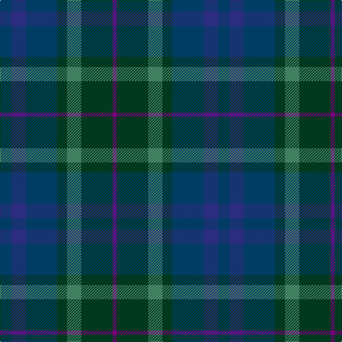

In pattern [BBBGGGB](/patterns/bbbgggb/).

This was sourced from register-of-tartans.  It is a [7 stripes tartan](/stripes/stripes7/).

Original link https://www.tartanregister.gov.uk/tartanDetails.aspx?ref=219

## Attestations

This cloth appears in 2 source records; the oldest owns this page.

- 01/12/2005 — Baron of Crawfordjohn (Personal) (register-of-tartans, [record](https://www.tartanregister.gov.uk/tartanDetails.aspx?ref=219))
- 2005 December — Baron of Crawfordjohn (Personal) (tartans-authority, [record](http://www.tartansauthority.com/tartan-ferret/display/6864/))

## Thread count
DB/16 DBa20 DB44 DG14 G20 DG44 P/6

## Palette
Each colour and its ΔE from the base-6 reference it is a variant of.

| Colour | Shade | Base | ΔE (OKLab) |
|---|---|---|---|
| DB | <code style="background-color:#003C64;">#003C64</code> `#003C64` | B <code style="background-color:#2A418A;">#2A418A</code> | 0.08 |
| DBa | <code style="background-color:#2C2C80;">#2C2C80</code> `#2C2C80` | B <code style="background-color:#2A418A;">#2A418A</code> | 0.06 |
| DG | <code style="background-color:#003820;">#003820</code> `#003820` | G <code style="background-color:#006100;">#006100</code> | 0.15 |
| G | <code style="background-color:#408060;">#408060</code> `#408060` | G <code style="background-color:#006100;">#006100</code> | 0.14 |
| P | <code style="background-color:#780078;">#780078</code> `#780078` | B <code style="background-color:#2A418A;">#2A418A</code> | 0.17 |

# Sample pattern

## Nearest tartans

The nearest existing variants by ΔTartan distance.

1. [Paul Henry (Personal)](/setts/s11/b4ba3bb7bc9bb13r2b13ba9bb7bc3bb4~b2f5980-ba0b1245-bb515151-bc1e1e1e-rb3020e~x2/) — ΔT 1.38
1. [Crawfordjohn Personal Tartan Tartan Number: 6864. Earliest known date: 2005 A tartan for the Barony of Crawfordjohn designed by the present baron, Travis K Svensson. See products available Copyright © Blair Urquhart, Comrie, 2015](/setts/s12/b10ba22g7ga10g22bb3g22ga10g7ba22b10ba8~b2c2c80-ba003c64-bb780078-g003820-ga006818~x2/) — ΔT 1.43
1. [House of Bruar (Corporate)](/setts/s6/b6ba26bb28g26bb8ga3~b4c0000-ba4c3428-bb14283c-g006818-ga8c7038~x2/) — ΔT 1.47
1. [Cairngorm #2](/setts/s7/b5ba4b22k15g22r4g4~b445464-ba607c88-g406454-k101010-r982c2c~x2/) — ΔT 1.49
1. [House of Bruar](/setts/s10/b26ba28g26ba8ga3ba8g26ba28b26bb6~b4c3428-ba14283c-bb4c0000-g006818-ga8c7038~x2/) — ΔT 1.52
1. [Myres Castle](/setts/s7/g3ga12b6gb3ba15r2ba2~b282d4b-ba200a4a-g233d30-ga0e3820-gb2d503c-r8d815b~x2/) — ΔT 1.53
1. [I Y](/setts/s6/k4g16k13b16ba3b3~b141e46-ba5f749c-g005448-k101010~x2/) — ΔT 1.56
1. [Buchanan Hunting](/setts/s11/b3g14ga14g2b14g2b14g2ga14g14r3~b2c4084-g503c14-ga005020-rdc0000~x2/) — ΔT 1.64
1. [Cowal Highland Gathering](/setts/s9/g2ga8b1ga1b1ga1b8ba9bb1~b14283c-ba003c64-bb5c5c5c-g003820-ga5c6428~x4/) — ΔT 1.65
1. [Sanix Modern](/setts/s5/r1b8k6ba10y1~b003c64-ba202060-k101010-r880000-yd09800~x4/) — ΔT 1.72

## Neighbour map

Every grey dot is one of 15726 variants placed by the first two principal components of the ΔTartan feature space (44% of its variance). Red is this tartan; blue dots are its nearest — click one to open its page.

<svg viewBox="0 0 640 380" role="img" style="max-width:100%;height:auto;border:1px solid #e0e0e0;border-radius:4px;display:block" xmlns="http://www.w3.org/2000/svg"><image href="/nn/cloud.v1.png" width="640" height="380"/><a href="/setts/s11/b4ba3bb7bc9bb13r2b13ba9bb7bc3bb4~b2f5980-ba0b1245-bb515151-bc1e1e1e-rb3020e~x2/"><circle cx="229.7" cy="255.0" r="4" fill="#3465a4"><title>Paul Henry (Personal)</title></circle></a><a href="/setts/s12/b10ba22g7ga10g22bb3g22ga10g7ba22b10ba8~b2c2c80-ba003c64-bb780078-g003820-ga006818~x2/"><circle cx="249.5" cy="270.5" r="4" fill="#3465a4"><title>Crawfordjohn Personal Tartan Tartan Number: 6864. Earliest known date: 2005 A tartan for the Barony of Crawfordjohn designed by the present baron, Travis K Svensson. See products available Copyright © Blair Urquhart, Comrie, 2015</title></circle></a><a href="/setts/s6/b6ba26bb28g26bb8ga3~b4c0000-ba4c3428-bb14283c-g006818-ga8c7038~x2/"><circle cx="249.8" cy="258.4" r="4" fill="#3465a4"><title>House of Bruar (Corporate)</title></circle></a><a href="/setts/s7/b5ba4b22k15g22r4g4~b445464-ba607c88-g406454-k101010-r982c2c~x2/"><circle cx="216.4" cy="255.4" r="4" fill="#3465a4"><title>Cairngorm #2</title></circle></a><a href="/setts/s10/b26ba28g26ba8ga3ba8g26ba28b26bb6~b4c3428-ba14283c-bb4c0000-g006818-ga8c7038~x2/"><circle cx="247.5" cy="252.5" r="4" fill="#3465a4"><title>House of Bruar</title></circle></a><a href="/setts/s7/g3ga12b6gb3ba15r2ba2~b282d4b-ba200a4a-g233d30-ga0e3820-gb2d503c-r8d815b~x2/"><circle cx="253.0" cy="240.3" r="4" fill="#3465a4"><title>Myres Castle</title></circle></a><a href="/setts/s6/k4g16k13b16ba3b3~b141e46-ba5f749c-g005448-k101010~x2/"><circle cx="236.0" cy="296.8" r="4" fill="#3465a4"><title>I Y</title></circle></a><a href="/setts/s11/b3g14ga14g2b14g2b14g2ga14g14r3~b2c4084-g503c14-ga005020-rdc0000~x2/"><circle cx="265.2" cy="263.6" r="4" fill="#3465a4"><title>Buchanan Hunting</title></circle></a><a href="/setts/s9/g2ga8b1ga1b1ga1b8ba9bb1~b14283c-ba003c64-bb5c5c5c-g003820-ga5c6428~x4/"><circle cx="253.7" cy="221.6" r="4" fill="#3465a4"><title>Cowal Highland Gathering</title></circle></a><a href="/setts/s5/r1b8k6ba10y1~b003c64-ba202060-k101010-r880000-yd09800~x4/"><circle cx="259.2" cy="258.0" r="4" fill="#3465a4"><title>Sanix Modern</title></circle></a><circle cx="239.6" cy="276.8" r="5" fill="#c00000"/></svg>

ID: /setts/s7/b8ba10b22g7ga10g22bb3~b003c64-ba2c2c80-bb780078-g003820-ga408060~x2/
