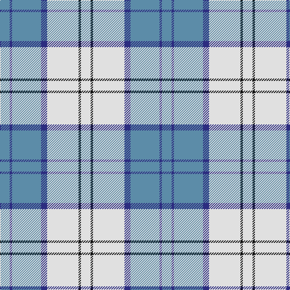

In pattern [BBBBWKW](/patterns/bbbbwkw/).

This was sourced from house-of-tartan.  It is a [7 stripes tartan](/stripes/stripes7/).

Original link http://www.house-of-tartan.scotland.net/house/TartanViewjs.asp?colr=Def&tnam=8190

## Thread count
B/16 DB4 B48 DB10 LN52 K4 LN/16

## Palette
Each colour and its ΔE from the base-6 reference it is a variant of.

| Colour | Shade | Base | ΔE (OKLab) |
|---|---|---|---|
| B | <code style="background-color:#5C8CA8;">#5C8CA8</code> `#5C8CA8` | B <code style="background-color:#2A418A;">#2A418A</code> | 0.23 |
| DB | <code style="background-color:#2C2C80;">#2C2C80</code> `#2C2C80` | B <code style="background-color:#2A418A;">#2A418A</code> | 0.06 |
| K | <code style="background-color:#101010;">#101010</code> `#101010` | K <code style="background-color:#000000;">#000000</code> | 0.17 |
| LN | <code style="background-color:#E0E0E0;">#E0E0E0</code> `#E0E0E0` | W <code style="background-color:#F7F7F7;">#F7F7F7</code> | 0.07 |

# Sample pattern

## Nearest tartans

The nearest existing variants by ΔTartan distance.

1. [MacPherson Turquoise Dress Tartan Tartan Number: 8183. Earliest known date: Threadcount and colours aren't 100% original. Generated manually. See products available Copyright © Blair Urquhart, Comrie, 2015](/setts/s7/w4k2w26b23w3b8ba3~b2888c4-ba8c008c-k101010-we0e0e0~x2/) — ΔT 0.64
1. [St. John's (Corporate)](/setts/s7/w2b1w15ba12w1y3b1~b1c0070-ba2888c4-we0e0e0-ye8c000~x6/) — ΔT 0.93
1. [Conquergood Family Tartan Tartan Number: 2095. Earliest known date: 1982 Designed to represent Canadian landscape in winter and sandy beaches in summer. Robert Conquergood, born in 1818 in Ormston, in the Parish of Roxburgh, Scotland, emigrated to Ontario, Canada with his father, also Robert, who was born in 1781. The Conquergood family in Canada approved this tartan at their 1990 biennial family reunion held at Kelowna, British Columbia. See products available Copyright © Blair Urquhart, Comrie, 2015](/setts/s8/b2ba2w11ba5r5w2b1ba2~b003c64-ba2888c4-r888888-we0e0e0~x2/) — ΔT 0.99
1. [Galloway (Dance)](/setts/s6/g3r2b35w35b2r3~b1474b4-g007800-rc80000-wfcfcfc~x2/) — ΔT 1.18
1. [Silver (Personal)](/setts/s9/w24b24y6w1ba4w20b10y3w4~b2474b4-ba202060-we0e0e0-y7c98bc~x2/) — ΔT 1.21
1. [MacPherson, Blue & White](/setts/s7/w5r3w26b21w3b8y3~b304080-rc00000-we0e0e0-yf0c000~x2/) — ΔT 1.24
1. [Islander Dress](/setts/s5/k3w29r9wa19k3~k101010-r9c68a4-we0e0e0-wa98c8e8~x2/) — ΔT 1.26
1. [Longniddry, dress (Turquoise)](/setts/s8/b42k2w2k2b5ba12w32b4~b5480b0-ba606080-k000000-we0e0e0~x2/) — ΔT 1.30
1. [Galloway (Dance)](/setts/s10/g3r2b35w35b2r3b2w35b35r2~b1474b4-g007800-rc80000-wfcfcfc~x2/) — ΔT 1.31
1. [Torridon, Royal Blue (Dance)](/setts/s7/b3ba2w2ba30w30r2w3~b003c64-ba0c5488-rc80000-wf0e0c8~x2/) — ΔT 1.36

## Neighbour map

Every grey dot is one of 15726 variants placed by the first two principal components of the ΔTartan feature space (44% of its variance). Red is this tartan; blue dots are its nearest — click one to open its page.

<svg viewBox="0 0 640 380" role="img" style="max-width:100%;height:auto;border:1px solid #e0e0e0;border-radius:4px;display:block" xmlns="http://www.w3.org/2000/svg"><image href="/nn/cloud.v1.png" width="640" height="380"/><a href="/setts/s7/w4k2w26b23w3b8ba3~b2888c4-ba8c008c-k101010-we0e0e0~x2/"><circle cx="276.2" cy="174.0" r="4" fill="#3465a4"><title>MacPherson Turquoise Dress Tartan Tartan Number: 8183. Earliest known date: Threadcount and colours aren't 100% original. Generated manually. See products available Copyright © Blair Urquhart, Comrie, 2015</title></circle></a><a href="/setts/s7/w2b1w15ba12w1y3b1~b1c0070-ba2888c4-we0e0e0-ye8c000~x6/"><circle cx="285.2" cy="155.6" r="4" fill="#3465a4"><title>St. John's (Corporate)</title></circle></a><a href="/setts/s8/b2ba2w11ba5r5w2b1ba2~b003c64-ba2888c4-r888888-we0e0e0~x2/"><circle cx="205.5" cy="183.8" r="4" fill="#3465a4"><title>Conquergood Family Tartan Tartan Number: 2095. Earliest known date: 1982 Designed to represent Canadian landscape in winter and sandy beaches in summer. Robert Conquergood, born in 1818 in Ormston, in the Parish of Roxburgh, Scotland, emigrated to Ontario, Canada with his father, also Robert, who was born in 1781. The Conquergood family in Canada approved this tartan at their 1990 biennial family reunion held at Kelowna, British Columbia. See products available Copyright © Blair Urquhart, Comrie, 2015</title></circle></a><a href="/setts/s6/g3r2b35w35b2r3~b1474b4-g007800-rc80000-wfcfcfc~x2/"><circle cx="269.0" cy="147.8" r="4" fill="#3465a4"><title>Galloway (Dance)</title></circle></a><a href="/setts/s9/w24b24y6w1ba4w20b10y3w4~b2474b4-ba202060-we0e0e0-y7c98bc~x2/"><circle cx="281.8" cy="150.9" r="4" fill="#3465a4"><title>Silver (Personal)</title></circle></a><a href="/setts/s7/w5r3w26b21w3b8y3~b304080-rc00000-we0e0e0-yf0c000~x2/"><circle cx="239.7" cy="182.6" r="4" fill="#3465a4"><title>MacPherson, Blue &amp; White</title></circle></a><a href="/setts/s5/k3w29r9wa19k3~k101010-r9c68a4-we0e0e0-wa98c8e8~x2/"><circle cx="214.2" cy="201.7" r="4" fill="#3465a4"><title>Islander Dress</title></circle></a><a href="/setts/s8/b42k2w2k2b5ba12w32b4~b5480b0-ba606080-k000000-we0e0e0~x2/"><circle cx="294.9" cy="138.7" r="4" fill="#3465a4"><title>Longniddry, dress (Turquoise)</title></circle></a><a href="/setts/s10/g3r2b35w35b2r3b2w35b35r2~b1474b4-g007800-rc80000-wfcfcfc~x2/"><circle cx="268.6" cy="134.5" r="4" fill="#3465a4"><title>Galloway (Dance)</title></circle></a><a href="/setts/s7/b3ba2w2ba30w30r2w3~b003c64-ba0c5488-rc80000-wf0e0c8~x2/"><circle cx="282.7" cy="146.0" r="4" fill="#3465a4"><title>Torridon, Royal Blue (Dance)</title></circle></a><circle cx="247.4" cy="178.4" r="5" fill="#c00000"/></svg>

ID: /setts/s7/b8ba2b24ba5w26k2w8~b5c8ca8-ba2c2c80-k101010-we0e0e0~x2/
