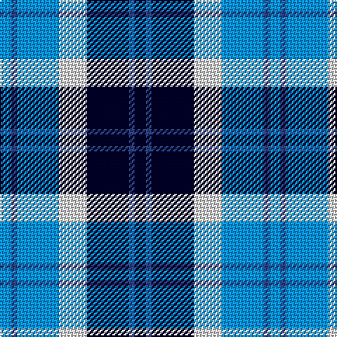

In pattern [BBBWKBK](/patterns/bbbwkbk/).

This was sourced from register-of-tartans.  It is a [7 stripes tartan](/stripes/stripes7/).

Original link https://www.tartanregister.gov.uk/tartanDetails.aspx?ref=3979

## Thread count
B/8 Ba4 B30 LN20 DB30 Ba4 DB/8

## Palette
Each colour and its ΔE from the base-6 reference it is a variant of.

| Colour | Shade | Base | ΔE (OKLab) |
|---|---|---|---|
| B | <code style="background-color:#0596FA;">#0596FA</code> `#0596FA` | B <code style="background-color:#2C4084;">#2C4084</code> | 0.28 |
| Ba | <code style="background-color:#2C4084;">#2C4084</code> `#2C4084` | B <code style="background-color:#2C4084;">#2C4084</code> | 0.00 |
| DB | <code style="background-color:#000028;">#000028</code> `#000028` | K <code style="background-color:#000000;">#000000</code> | 0.15 |
| LN | <code style="background-color:#E0E0E0;">#E0E0E0</code> `#E0E0E0` | W <code style="background-color:#F4F4F0;">#F4F4F0</code> | 0.06 |

# Sample pattern

ID: /setts/s7/b8ba4b30w20k30ba4k8-b0596fa-ba2c4084-k000028-we0e0e0/
