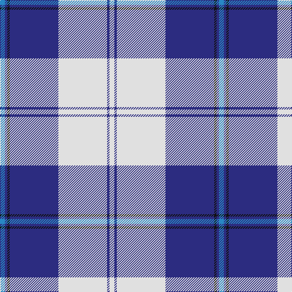

In pattern [BBKBWBW](/patterns/bbkbwbw/).

This was sourced from house-of-tartan.  It is a [7 stripes tartan](/stripes/stripes7/).

Original link http://www.house-of-tartan.scotland.net/house/TartanViewjs.asp?colr=Def&tnam=4642

## Thread count
B/8 DB4 K4 DB80 LN80 DB4 LN/8

## Palette
Each colour and its ΔE from the base-6 reference it is a variant of.

| Colour | Shade | Base | ΔE (OKLab) |
|---|---|---|---|
| B | <code style="background-color:#2888C4;">#2888C4</code> `#2888C4` | B <code style="background-color:#2A418A;">#2A418A</code> | 0.21 |
| DB | <code style="background-color:#2C2C80;">#2C2C80</code> `#2C2C80` | B <code style="background-color:#2A418A;">#2A418A</code> | 0.06 |
| K | <code style="background-color:#101010;">#101010</code> `#101010` | K <code style="background-color:#000000;">#000000</code> | 0.17 |
| LN | <code style="background-color:#E0E0E0;">#E0E0E0</code> `#E0E0E0` | W <code style="background-color:#F7F7F7;">#F7F7F7</code> | 0.07 |

# Sample pattern

## Nearest tartans

The nearest existing variants by ΔTartan distance.

1. [Cunningham, Dress Blue (Dance)](/setts/s7/b6ba4k4ba56w60ba4w6-b2474e8-ba1c0070-k101010-we0e0e0/) — ΔT 0.68
1. [Harmony, Eildon](/setts/s8/b82ba4w4ba4b10bb24w62b8-b304080-ba5480b0-bb8080d0-we0e0e0/) — ΔT 0.91
1. [Harmony Eildon (Dance)](/setts/s8/b82ba4w4ba4b10bb24w62b8-b2c2c80-ba5c8ca8-bb2888c4-we0e0e0/) — ΔT 0.91
1. [Gothenburg/Goteborg](/setts/s7/b52w56b28y6k2y4k2-b2c4084-k101010-we0e0e0-ye8c000/) — ΔT 1.00
1. [Torridon, Saphire (Dance)](/setts/s7/w6b4w60ba60k4ba4y6-b2c2c80-ba20008c-k000c14-wf0e0c8-ye8c000/) — ΔT 1.04
1. [Eildon/Longniddry Blue Dress Fashion Tartan Tartan Number: 4799. Earliest known date: 01/01/1980 A Dancers' Fancy from Dalgliesh. This appears under three different names - Longniddry #5486, Eildon #4799 and Harmony Eildon #87 (original Scottish Tartans Authority references). Needs resolving. Sample in Scottish Tartans Authority's Dalgety Collection. /Threadcount and colours aren't 100% original. Generated manually./ See products available Copyright © Blair Urquhart, Comrie, 2015](/setts/s8/b60ba4w4ba4b8bb20w50b8-b202060-ba2888c4-bb5c8ca8-we0e0e0/) — ΔT 1.11
1. [Gothenburg](/setts/s7/b52w56b28y6k2y4k2-b3850c8-k101010-we0e0e0-ye8c000/) — ΔT 1.13
1. [Torridon, Royal Blue (Dance)](/setts/s7/b6ba4w4ba60w60r4w6-b003c64-ba0c5488-rc80000-wf0e0c8/) — ΔT 1.14
1. [Harris, Royal Blue (Dance)](/setts/s10/w6b4k8b4w4b52r8w60r4w6-b1c0070-k101010-rc80000-wf0e0c8/) — ΔT 1.30
1. [Ailsa, Royal Blue (Dance)](/setts/s6/b16ba6b56w64bb6w8-b2c2c80-ba5c8ca8-bb003c64-wf0e0c8/) — ΔT 1.34

## Neighbour map

Every grey dot is one of 15726 variants placed by the first two principal components of the ΔTartan feature space (44% of its variance). Red is this tartan; blue dots are its nearest — click one to open its page.

<svg viewBox="0 0 640 380" role="img" style="max-width:100%;height:auto;border:1px solid #e0e0e0;border-radius:4px;display:block" xmlns="http://www.w3.org/2000/svg"><image href="/nn/cloud.v1.png" width="640" height="380"/><a href="/setts/s7/b6ba4k4ba56w60ba4w6-b2474e8-ba1c0070-k101010-we0e0e0/"><circle cx="265.7" cy="142.3" r="4" fill="#3465a4"><title>Cunningham, Dress Blue (Dance)</title></circle></a><a href="/setts/s8/b82ba4w4ba4b10bb24w62b8-b304080-ba5480b0-bb8080d0-we0e0e0/"><circle cx="283.1" cy="135.1" r="4" fill="#3465a4"><title>Harmony, Eildon</title></circle></a><a href="/setts/s8/b82ba4w4ba4b10bb24w62b8-b2c2c80-ba5c8ca8-bb2888c4-we0e0e0/"><circle cx="275.4" cy="133.9" r="4" fill="#3465a4"><title>Harmony Eildon (Dance)</title></circle></a><a href="/setts/s7/b52w56b28y6k2y4k2-b2c4084-k101010-we0e0e0-ye8c000/"><circle cx="306.1" cy="133.4" r="4" fill="#3465a4"><title>Gothenburg/Goteborg</title></circle></a><a href="/setts/s7/w6b4w60ba60k4ba4y6-b2c2c80-ba20008c-k000c14-wf0e0c8-ye8c000/"><circle cx="236.0" cy="123.5" r="4" fill="#3465a4"><title>Torridon, Saphire (Dance)</title></circle></a><a href="/setts/s8/b60ba4w4ba4b8bb20w50b8-b202060-ba2888c4-bb5c8ca8-we0e0e0/"><circle cx="240.6" cy="147.5" r="4" fill="#3465a4"><title>Eildon/Longniddry Blue Dress Fashion Tartan Tartan Number: 4799. Earliest known date: 01/01/1980 A Dancers' Fancy from Dalgliesh. This appears under three different names - Longniddry #5486, Eildon #4799 and Harmony Eildon #87 (original Scottish Tartans Authority references). Needs resolving. Sample in Scottish Tartans Authority's Dalgety Collection. /Threadcount and colours aren't 100% original. Generated manually./ See products available Copyright © Blair Urquhart, Comrie, 2015</title></circle></a><a href="/setts/s7/b52w56b28y6k2y4k2-b3850c8-k101010-we0e0e0-ye8c000/"><circle cx="310.3" cy="134.5" r="4" fill="#3465a4"><title>Gothenburg</title></circle></a><a href="/setts/s7/b6ba4w4ba60w60r4w6-b003c64-ba0c5488-rc80000-wf0e0c8/"><circle cx="282.6" cy="143.2" r="4" fill="#3465a4"><title>Torridon, Royal Blue (Dance)</title></circle></a><a href="/setts/s10/w6b4k8b4w4b52r8w60r4w6-b1c0070-k101010-rc80000-wf0e0c8/"><circle cx="255.7" cy="115.4" r="4" fill="#3465a4"><title>Harris, Royal Blue (Dance)</title></circle></a><a href="/setts/s6/b16ba6b56w64bb6w8-b2c2c80-ba5c8ca8-bb003c64-wf0e0c8/"><circle cx="241.3" cy="177.6" r="4" fill="#3465a4"><title>Ailsa, Royal Blue (Dance)</title></circle></a><circle cx="286.0" cy="130.0" r="5" fill="#c00000"/></svg>

ID: /setts/s7/b8ba4k4ba80w80ba4w8-b2888c4-ba2c2c80-k101010-we0e0e0/
