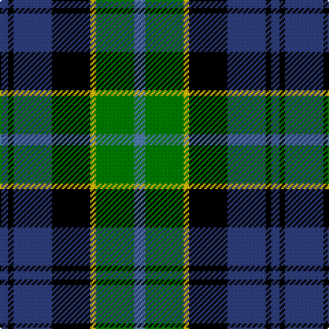

In pattern [BGYKBKB](/patterns/bgykbkb/).

This was sourced from weddslist.  It is a [7 stripes tartan](/stripes/stripes7/).

Original link http://www.weddslist.com/cgi-bin/tartans/pg.pl?source=sts

## Thread count
B/6 K4 B28 K28 Y4 G28 Ba/8

## Palette
Each colour and its ΔE from the base-6 reference it is a variant of.

| Colour | Shade | Base | ΔE (OKLab) |
|---|---|---|---|
| B | <code style="background-color:#304080;">#304080</code> `#304080` | B <code style="background-color:#2C4084;">#2C4084</code> | 0.01 |
| Ba | <code style="background-color:#5480B0;">#5480B0</code> `#5480B0` | B <code style="background-color:#2C4084;">#2C4084</code> | 0.20 |
| G | <code style="background-color:#008000;">#008000</code> `#008000` | G <code style="background-color:#006400;">#006400</code> | 0.09 |
| K | <code style="background-color:#000000;">#000000</code> `#000000` | K <code style="background-color:#000000;">#000000</code> | 0.00 |
| Y | <code style="background-color:#F0C000;">#F0C000</code> `#F0C000` | Y <code style="background-color:#E8C000;">#E8C000</code> | 0.01 |

# Sample pattern

## Nearest tartans

The nearest existing variants by ΔTartan distance.

1. [Hogarth, of Firhill](/setts/s7/b4g12y2k12ba12k2ba2-b8080d0-ba304080-g008000-k000000-yf0c000/) — ΔT 0.32
1. [Argyll / MacCorquodale](/setts/s7/b4k2g16k16ba16k2r4-b5480b0-ba304080-g008000-k000000-rc00000/) — ΔT 0.43
1. [Wellington](/setts/s6/b2r2b12k12g12w2-b304080-g008000-k000000-rc00000-we0e0e0/) — ΔT 0.48
1. [Colquhoun](/setts/s7/r8g32w4k32b32k4b4-b304080-g008000-k000000-rc00000-we0e0e0/) — ΔT 0.49
1. [MacDonald, (Flora.. )](/setts/s7/g34y4k28r4b18r4b20-b304080-g008000-k000000-rc00000-yf0c000/) — ΔT 0.54
1. [Leslie, hunting](/setts/s6/r4b16k16w2g16k2-b304080-g008000-k000000-rc00000-we0e0e0/) — ΔT 0.55
1. [Royal Highland](/setts/s6/y8g34k34b34r6b6-b304080-g008000-k000000-rc00000-yb0b0b0/) — ΔT 0.57
1. [Junior Chamber International](/setts/s7/r8g32k32b8g6b24y4-b304080-g008000-k000000-rc00000-yf0c000/) — ΔT 0.59
1. [MacNeil 6](/setts/s6/w6b28k24g24k4y6-b304080-g008000-k000000-we0e0e0-yf0c000/) — ΔT 0.67
1. [MacNeil 4](/setts/s6/w4b32k36g36k4y4-b304080-g008000-k000000-we0e0e0-yf0c000/) — ΔT 0.72

## Neighbour map

Every grey dot is one of 15726 variants placed by the first two principal components of the ΔTartan feature space (44% of its variance). Red is this tartan; blue dots are its nearest — click one to open its page.

<svg viewBox="0 0 640 380" role="img" style="max-width:100%;height:auto;border:1px solid #e0e0e0;border-radius:4px;display:block" xmlns="http://www.w3.org/2000/svg"><image href="/nn/cloud.v1.png" width="640" height="380"/><a href="/setts/s7/b4g12y2k12ba12k2ba2-b8080d0-ba304080-g008000-k000000-yf0c000/"><circle cx="78.8" cy="209.0" r="4" fill="#3465a4"><title>Hogarth, of Firhill</title></circle></a><a href="/setts/s7/b4k2g16k16ba16k2r4-b5480b0-ba304080-g008000-k000000-rc00000/"><circle cx="107.9" cy="198.1" r="4" fill="#3465a4"><title>Argyll / MacCorquodale</title></circle></a><a href="/setts/s6/b2r2b12k12g12w2-b304080-g008000-k000000-rc00000-we0e0e0/"><circle cx="98.1" cy="216.5" r="4" fill="#3465a4"><title>Wellington</title></circle></a><a href="/setts/s7/r8g32w4k32b32k4b4-b304080-g008000-k000000-rc00000-we0e0e0/"><circle cx="106.3" cy="191.3" r="4" fill="#3465a4"><title>Colquhoun</title></circle></a><a href="/setts/s7/g34y4k28r4b18r4b20-b304080-g008000-k000000-rc00000-yf0c000/"><circle cx="112.7" cy="198.1" r="4" fill="#3465a4"><title>MacDonald, (Flora.. )</title></circle></a><a href="/setts/s6/r4b16k16w2g16k2-b304080-g008000-k000000-rc00000-we0e0e0/"><circle cx="103.6" cy="205.8" r="4" fill="#3465a4"><title>Leslie, hunting</title></circle></a><a href="/setts/s6/y8g34k34b34r6b6-b304080-g008000-k000000-rc00000-yb0b0b0/"><circle cx="89.7" cy="223.2" r="4" fill="#3465a4"><title>Royal Highland</title></circle></a><a href="/setts/s7/r8g32k32b8g6b24y4-b304080-g008000-k000000-rc00000-yf0c000/"><circle cx="105.6" cy="200.1" r="4" fill="#3465a4"><title>Junior Chamber International</title></circle></a><a href="/setts/s6/w6b28k24g24k4y6-b304080-g008000-k000000-we0e0e0-yf0c000/"><circle cx="74.0" cy="212.0" r="4" fill="#3465a4"><title>MacNeil 6</title></circle></a><a href="/setts/s6/w4b32k36g36k4y4-b304080-g008000-k000000-we0e0e0-yf0c000/"><circle cx="124.8" cy="195.7" r="4" fill="#3465a4"><title>MacNeil 4</title></circle></a><circle cx="96.6" cy="204.2" r="5" fill="#c00000"/></svg>

ID: /setts/s7/b8g28y4k28ba28k4ba6-b5480b0-ba304080-g008000-k000000-yf0c000/
