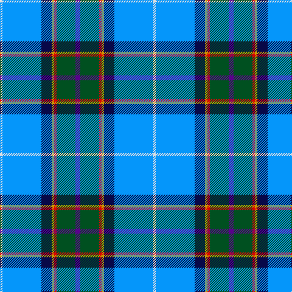

In pattern [BGRYBBW](/patterns/bgrybbw/).

This was sourced from register-of-tartans.  It is a [7 stripes tartan](/stripes/stripes7/).

Original link https://www.tartanregister.gov.uk/tartanDetails.aspx?ref=2823

## Thread count
LN/4 B64 DB17 DY4 R4 G31 P/8

## Palette
Each colour and its ΔE from the base-6 reference it is a variant of.

| Colour | Shade | Base | ΔE (OKLab) |
|---|---|---|---|
| B | <code style="background-color:#0596FA;">#0596FA</code> `#0596FA` | B <code style="background-color:#2C4084;">#2C4084</code> | 0.28 |
| DB | <code style="background-color:#080848;">#080848</code> `#080848` | B <code style="background-color:#2C4084;">#2C4084</code> | 0.19 |
| DY | <code style="background-color:#C89600;">#C89600</code> `#C89600` | Y <code style="background-color:#E8C000;">#E8C000</code> | 0.12 |
| G | <code style="background-color:#005020;">#005020</code> `#005020` | G <code style="background-color:#006400;">#006400</code> | 0.08 |
| LN | <code style="background-color:#E0E0E0;">#E0E0E0</code> `#E0E0E0` | W <code style="background-color:#F4F4F0;">#F4F4F0</code> | 0.06 |
| P | <code style="background-color:#5A008C;">#5A008C</code> `#5A008C` | B <code style="background-color:#2C4084;">#2C4084</code> | 0.12 |
| R | <code style="background-color:#DC0000;">#DC0000</code> `#DC0000` | R <code style="background-color:#C80000;">#C80000</code> | 0.04 |

# Sample pattern

ID: /setts/s7/b8g31r4y4ba17bb64w4-b5a008c-ba080848-bb0596fa-g005020-rdc0000-we0e0e0-yc89600/
