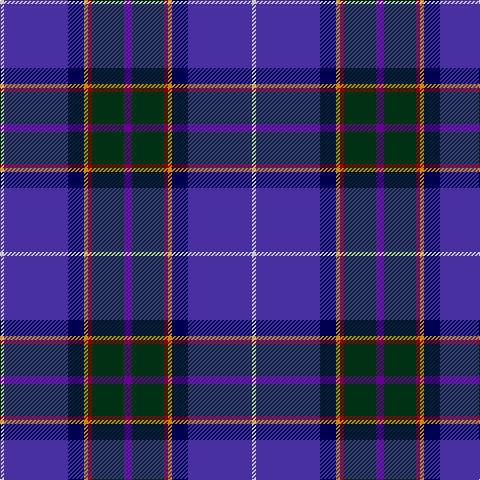

In pattern [BGRYBBW](/patterns/bgrybbw/).

This was sourced from register-of-tartans.  It is a [7 stripes tartan](/stripes/stripes7/).

Original link https://www.tartanregister.gov.uk/tartanDetails.aspx?ref=1100

## Thread count
N/4 B64 DB16 DY4 DR4 DG32 P/8

## Palette
Each colour and its ΔE from the base-6 reference it is a variant of.

| Colour | Shade | Base | ΔE (OKLab) |
|---|---|---|---|
| B | <code style="background-color:#4830A0;">#4830A0</code> `#4830A0` | B <code style="background-color:#2C4084;">#2C4084</code> | 0.07 |
| DB | <code style="background-color:#000050;">#000050</code> `#000050` | B <code style="background-color:#2C4084;">#2C4084</code> | 0.20 |
| DG | <code style="background-color:#003014;">#003014</code> `#003014` | G <code style="background-color:#006400;">#006400</code> | 0.18 |
| DR | <code style="background-color:#8C0000;">#8C0000</code> `#8C0000` | R <code style="background-color:#C80000;">#C80000</code> | 0.13 |
| DY | <code style="background-color:#C88C00;">#C88C00</code> `#C88C00` | Y <code style="background-color:#E8C000;">#E8C000</code> | 0.15 |
| N | <code style="background-color:#C8C8C8;">#C8C8C8</code> `#C8C8C8` | W <code style="background-color:#F4F4F0;">#F4F4F0</code> | 0.13 |
| P | <code style="background-color:#64008C;">#64008C</code> `#64008C` | B <code style="background-color:#2C4084;">#2C4084</code> | 0.13 |

# Sample pattern

ID: /setts/s7/b8g32r4y4ba16bb64w4-b64008c-ba000050-bb4830a0-g003014-r8c0000-wc8c8c8-yc88c00/
