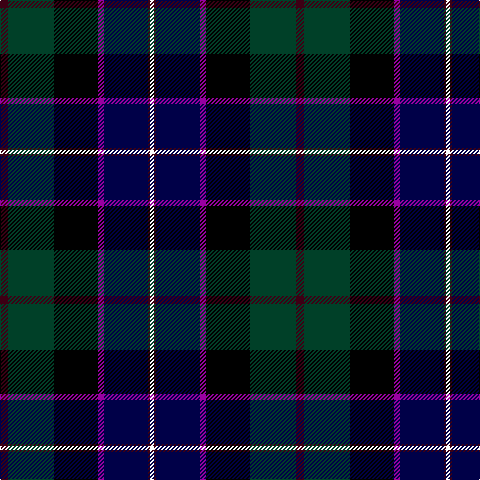

In pattern [BGKBBBW](/patterns/bgkbbbw/).

This was sourced from register-of-tartans.  It is a [7 stripes tartan](/stripes/stripes7/).

Original link https://www.tartanregister.gov.uk/tartanDetails.aspx?ref=1173

## Attestations

This cloth appears in 2 source records; the oldest owns this page.

- 01/01/2002 — Fettes College (register-of-tartans, [record](https://www.tartanregister.gov.uk/tartanDetails.aspx?ref=1173))
- pre 2002 — Fettes College (Corporate) (tartans-authority, [record](http://www.tartansauthority.com/tartan-ferret/display/4850/))

## Thread count
DR/8 DG46 K44 P6 DB44 DR2 W/4

## Palette
Each colour and its ΔE from the base-6 reference it is a variant of.

| Colour | Shade | Base | ΔE (OKLab) |
|---|---|---|---|
| DB | <code style="background-color:#000048;">#000048</code> `#000048` | B <code style="background-color:#2C4084;">#2C4084</code> | 0.21 |
| DG | <code style="background-color:#004028;">#004028</code> `#004028` | G <code style="background-color:#006400;">#006400</code> | 0.14 |
| DR | <code style="background-color:#3C0014;">#3C0014</code> `#3C0014` | B <code style="background-color:#2C4084;">#2C4084</code> | 0.23 |
| K | <code style="background-color:#000000;">#000000</code> `#000000` | K <code style="background-color:#000000;">#000000</code> | 0.00 |
| P | <code style="background-color:#9800A0;">#9800A0</code> `#9800A0` | B <code style="background-color:#2C4084;">#2C4084</code> | 0.21 |
| W | <code style="background-color:#FCFCFC;">#FCFCFC</code> `#FCFCFC` | W <code style="background-color:#F4F4F0;">#F4F4F0</code> | 0.03 |

# Sample pattern

ID: /setts/s7/b8g46k44ba6bb44b2w4-b3c0014-ba9800a0-bb000048-g004028-k000000-wfcfcfc/
