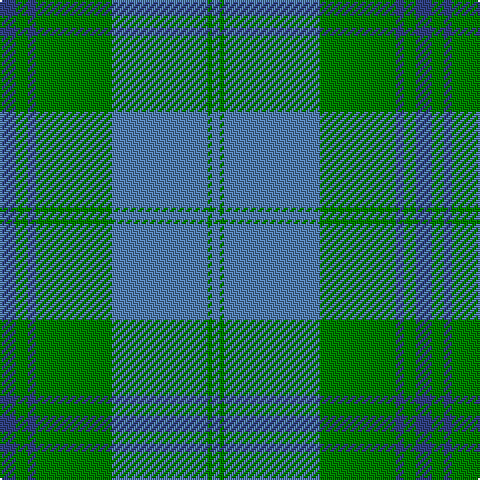

In pattern [BGBGBGB](/patterns/bgbgbgb/).

This was sourced from weddslist.  It is a [7 stripes tartan](/stripes/stripes7/).

Original link http://www.weddslist.com/cgi-bin/tartans/pg.pl?source=sts

## Thread count
B/8 G6 B4 G38 Ba48 G2 Ba/4

## Palette
Each colour and its ΔE from the base-6 reference it is a variant of.

| Colour | Shade | Base | ΔE (OKLab) |
|---|---|---|---|
| B | <code style="background-color:#304080;">#304080</code> `#304080` | B <code style="background-color:#2A418A;">#2A418A</code> | 0.02 |
| Ba | <code style="background-color:#5480B0;">#5480B0</code> `#5480B0` | B <code style="background-color:#2A418A;">#2A418A</code> | 0.19 |
| G | <code style="background-color:#008000;">#008000</code> `#008000` | G <code style="background-color:#006100;">#006100</code> | 0.10 |

# Sample pattern

## Nearest tartans

The nearest existing variants by ΔTartan distance.

1. [Unidentified #6](/setts/s7/b8g6b4g38ba48g2ba4-b2c4084-ba3c82af-g005020/) — ΔT 0.77
1. [Melville (Two black lines)](/setts/s6/b16k8b104g104w4g16-b1474b4-g285800-k101010-wfcfcfc/) — ΔT 1.42
1. [Greenlaw, American (Name)](/setts/s8/b92r4b6r4b28g76k6g8-b1474b4-g006818-k101010-rc80000/) — ΔT 1.43
1. [Irvine of Drum](/setts/s8/b6k6b42g98b42k6b6w6-b5c8ca8-g408060-k101010-wfcfcfc/) — ΔT 1.47
1. [Lennox Dress, Purple (Dance)](/setts/s7/b12ba4b50ba8g50ba4g12-b2888c4-ba44546c-g289c18/) — ΔT 1.52
1. [Yarmouth NS (District)](/setts/s12/y4b4y2b36g4b20g20b4g36ya2g4ya4-b2888c4-g5c6428-ya08858-yafccc00/) — ΔT 1.60
1. [Lockhart](/setts/s9/g26k4g68k12b32r4b32k4g26-b1474b4-g408060-k101010-rc80000/) — ΔT 1.69
1. [Milligan](/setts/s6/b104g42b12g32k8g32-b1870a4-g289c18-k101010/) — ΔT 1.74
1. [Wcwm 1530](/setts/s8/g72b6g6b6g12ba68r8ba8-b0000e0-ba306084-g004c00-r8c0000/) — ΔT 1.79
1. [MacAuliffe/McAucliffe](/setts/s8/g76w4g12b48r12b4r6b4-b2c4084-g005020-rc87814-we0e0e0/) — ΔT 1.80

## Neighbour map

Every grey dot is one of 15726 variants placed by the first two principal components of the ΔTartan feature space (44% of its variance). Red is this tartan; blue dots are its nearest — click one to open its page.

<svg viewBox="0 0 640 380" role="img" style="max-width:100%;height:auto;border:1px solid #e0e0e0;border-radius:4px;display:block" xmlns="http://www.w3.org/2000/svg"><image href="/nn/cloud.v1.png" width="640" height="380"/><a href="/setts/s7/b8g6b4g38ba48g2ba4-b2c4084-ba3c82af-g005020/"><circle cx="388.5" cy="204.0" r="4" fill="#3465a4"><title>Unidentified #6</title></circle></a><a href="/setts/s6/b16k8b104g104w4g16-b1474b4-g285800-k101010-wfcfcfc/"><circle cx="366.3" cy="187.4" r="4" fill="#3465a4"><title>Melville (Two black lines)</title></circle></a><a href="/setts/s8/b92r4b6r4b28g76k6g8-b1474b4-g006818-k101010-rc80000/"><circle cx="406.2" cy="176.0" r="4" fill="#3465a4"><title>Greenlaw, American (Name)</title></circle></a><a href="/setts/s8/b6k6b42g98b42k6b6w6-b5c8ca8-g408060-k101010-wfcfcfc/"><circle cx="363.3" cy="192.4" r="4" fill="#3465a4"><title>Irvine of Drum</title></circle></a><a href="/setts/s7/b12ba4b50ba8g50ba4g12-b2888c4-ba44546c-g289c18/"><circle cx="310.5" cy="215.7" r="4" fill="#3465a4"><title>Lennox Dress, Purple (Dance)</title></circle></a><a href="/setts/s12/y4b4y2b36g4b20g20b4g36ya2g4ya4-b2888c4-g5c6428-ya08858-yafccc00/"><circle cx="338.5" cy="169.1" r="4" fill="#3465a4"><title>Yarmouth NS (District)</title></circle></a><a href="/setts/s9/g26k4g68k12b32r4b32k4g26-b1474b4-g408060-k101010-rc80000/"><circle cx="370.6" cy="206.2" r="4" fill="#3465a4"><title>Lockhart</title></circle></a><a href="/setts/s6/b104g42b12g32k8g32-b1870a4-g289c18-k101010/"><circle cx="351.0" cy="242.7" r="4" fill="#3465a4"><title>Milligan</title></circle></a><a href="/setts/s8/g72b6g6b6g12ba68r8ba8-b0000e0-ba306084-g004c00-r8c0000/"><circle cx="356.8" cy="209.4" r="4" fill="#3465a4"><title>Wcwm 1530</title></circle></a><a href="/setts/s8/g76w4g12b48r12b4r6b4-b2c4084-g005020-rc87814-we0e0e0/"><circle cx="360.4" cy="173.5" r="4" fill="#3465a4"><title>MacAuliffe/McAucliffe</title></circle></a><circle cx="382.7" cy="199.5" r="5" fill="#c00000"/></svg>

ID: /setts/s7/b8g6b4g38ba48g2ba4-b304080-ba5480b0-g008000/
