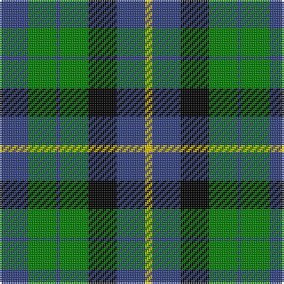

In pattern [BGBGKBY](/patterns/bgbgkby/).

This was sourced from weddslist.  It is a [7 stripes tartan](/stripes/stripes7/).

Original link http://www.weddslist.com/cgi-bin/tartans/pg.pl?source=sts

## Thread count
B/16 G16 B2 G16 K16 B16 Y/4

## Palette
Each colour and its ΔE from the base-6 reference it is a variant of.

| Colour | Shade | Base | ΔE (OKLab) |
|---|---|---|---|
| B | <code style="background-color:#304080;">#304080</code> `#304080` | B <code style="background-color:#2A418A;">#2A418A</code> | 0.02 |
| G | <code style="background-color:#008000;">#008000</code> `#008000` | G <code style="background-color:#006100;">#006100</code> | 0.10 |
| K | <code style="background-color:#000000;">#000000</code> `#000000` | K <code style="background-color:#000000;">#000000</code> | 0.00 |
| Y | <code style="background-color:#F0C000;">#F0C000</code> `#F0C000` | Y <code style="background-color:#F2BF00;">#F2BF00</code> | 0.00 |

# Sample pattern

## Nearest tartans

The nearest existing variants by ΔTartan distance.

1. [Unidentified No 31](/setts/s7/k8g8k1g8k8b8w2~b0596fa-g005020-k101010-we0e0e0~x2/) — ΔT 0.44
1. [MacNeil of Colonsay](/setts/s7/b4g6w1g6k6b6k2~b304080-g008000-k000000-we0e0e0~x4/) — ΔT 0.57
1. [Unnamed, No 31](/setts/s7/k8g8k1g8k8b8w2~b8080d0-g008000-k000000-we0e0e0~x2/) — ΔT 0.78
1. [Wellington, or Waterloo](/setts/s6/b3g6k6b4r1b1~b5480b0-g008000-k000000-rc00000~x2/) — ΔT 0.89
1. [Fletcher #2](/setts/s7/b10k3b10k14r2g14k4~b1474b4-g007800-k000000-rc80000~x2/) — ΔT 0.92
1. [MacIntyre](/setts/s7/k12g12k2g12k12b12ba3~b304080-ba5480b0-g008000-k000000~x2/) — ΔT 0.99
1. [MacCallum](/setts/s7/g8k2b1g4k6ba6k1~b5480b0-ba304080-g008000-k000000~x2/) — ΔT 1.03
1. [MacLaggan](/setts/s7/k7g6w1g6k7b7k1~b304080-g008000-k000000-we0e0e0~x4/) — ΔT 1.07
1. [MacCallum](/setts/s7/k6g6r1g6k6b6k1~b304080-g008000-k000000-rc00000~x2/) — ΔT 1.09
1. [Melville](/setts/s6/k4w2g13k13b12k2~b608c9c-g408060-k101010-wfcfcfc~x2/) — ΔT 1.13

## Neighbour map

Every grey dot is one of 15726 variants placed by the first two principal components of the ΔTartan feature space (44% of its variance). Red is this tartan; blue dots are its nearest — click one to open its page.

<svg viewBox="0 0 640 380" role="img" style="max-width:100%;height:auto;border:1px solid #e0e0e0;border-radius:4px;display:block" xmlns="http://www.w3.org/2000/svg"><image href="/nn/cloud.v1.png" width="640" height="380"/><a href="/setts/s7/k8g8k1g8k8b8w2~b0596fa-g005020-k101010-we0e0e0~x2/"><circle cx="148.6" cy="251.2" r="4" fill="#3465a4"><title>Unidentified No 31</title></circle></a><a href="/setts/s7/b4g6w1g6k6b6k2~b304080-g008000-k000000-we0e0e0~x4/"><circle cx="116.0" cy="261.4" r="4" fill="#3465a4"><title>MacNeil of Colonsay</title></circle></a><a href="/setts/s7/k8g8k1g8k8b8w2~b8080d0-g008000-k000000-we0e0e0~x2/"><circle cx="124.8" cy="241.8" r="4" fill="#3465a4"><title>Unnamed, No 31</title></circle></a><a href="/setts/s6/b3g6k6b4r1b1~b5480b0-g008000-k000000-rc00000~x2/"><circle cx="124.8" cy="245.1" r="4" fill="#3465a4"><title>Wellington, or Waterloo</title></circle></a><a href="/setts/s7/b10k3b10k14r2g14k4~b1474b4-g007800-k000000-rc80000~x2/"><circle cx="127.6" cy="238.9" r="4" fill="#3465a4"><title>Fletcher #2</title></circle></a><a href="/setts/s7/k12g12k2g12k12b12ba3~b304080-ba5480b0-g008000-k000000~x2/"><circle cx="126.6" cy="262.7" r="4" fill="#3465a4"><title>MacIntyre</title></circle></a><a href="/setts/s7/g8k2b1g4k6ba6k1~b5480b0-ba304080-g008000-k000000~x2/"><circle cx="167.4" cy="231.5" r="4" fill="#3465a4"><title>MacCallum</title></circle></a><a href="/setts/s7/k7g6w1g6k7b7k1~b304080-g008000-k000000-we0e0e0~x4/"><circle cx="148.6" cy="250.2" r="4" fill="#3465a4"><title>MacLaggan</title></circle></a><a href="/setts/s7/k6g6r1g6k6b6k1~b304080-g008000-k000000-rc00000~x2/"><circle cx="137.5" cy="258.7" r="4" fill="#3465a4"><title>MacCallum</title></circle></a><a href="/setts/s6/k4w2g13k13b12k2~b608c9c-g408060-k101010-wfcfcfc~x2/"><circle cx="163.3" cy="238.3" r="4" fill="#3465a4"><title>Melville</title></circle></a><circle cx="141.5" cy="248.0" r="5" fill="#c00000"/></svg>

ID: /setts/s7/b8g8b1g8k8b8y2~b304080-g008000-k000000-yf0c000~x2/
