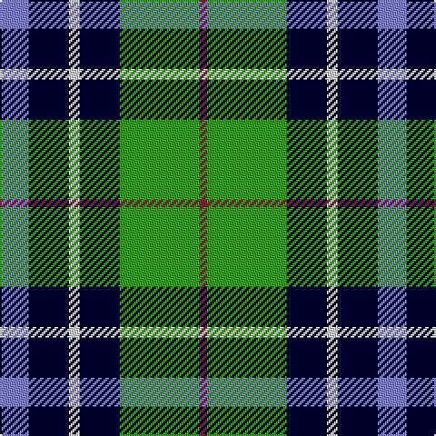

In pattern [BKWKGGR](/stripes/bkwkggr/).

This was sourced from weddslist.  It is a [7 stripe tartan](/stripes/stripes7/).

Original link http://www.weddslist.com/cgi-bin/tartans/pg.pl?source=sts

## Thread count
B/16 DB22 LN6 DB22 G24 G20 DR/4

## Palette
Each colour and the base-6 reference it is a variant of.

| Colour | Shade | Base |
|---|---|---|
| B | <code style="background-color:#8080D0;">#8080D0</code> `oklch(63.4% 0.119 282.5)` <small>#8080D0</small> | B <code style="background-color:#2A418A;">#2A418A</code> |
| DB | <code style="background-color:#000030;">#000030</code> `oklch(14.0% 0.097 264.1)` <small>#000030</small> | K <code style="background-color:#000000;">#000000</code> |
| DR | <code style="background-color:#802040;">#802040</code> `oklch(40.8% 0.132 5.2)` <small>#802040</small> | R <code style="background-color:#CC0000;">#CC0000</code> |
| G | <code style="background-color:#30A010;">#30A010</code> `oklch(61.9% 0.195 140.5)` <small>#30A010</small> | G <code style="background-color:#006100;">#006100</code> |
| LN | <code style="background-color:#E0E0E0;">#E0E0E0</code> `oklch(90.7% 0.000 89.9)` <small>#E0E0E0</small> | W <code style="background-color:#F7F7F7;">#F7F7F7</code> |

# Sample pattern

## Nearest tartans

The nearest existing variants by ΔTartan distance, with this tartan at the top so the swatches line up against it.

ΔTartan

Tartan

Sett

—

<a href="/ttd/edit/#slug=b8k11w3k11g12g10m2~x2">Loch Katrine</a> <a class="nn-out" href="/setts/s7/b8k11w3k11g12g10m2~x2/" title="open its dictionary page">↗</a>

1.17

<a href="/ttd/edit/#slug=db4g6w1g6k6db6k2~x4">MacNeil of Colonsay</a> <a class="nn-out" href="/setts/s7/db4g6w1g6k6db6k2~x4/" title="open its dictionary page">↗</a>

1.18

<a href="/ttd/edit/#slug=db8g8db1g8k8db8ly2~x2">MacKay</a> <a class="nn-out" href="/setts/s7/db8g8db1g8k8db8ly2~x2/" title="open its dictionary page">↗</a>

1.22

<a href="/ttd/edit/#slug=t3g6k6t4r1t1~x2">Wellington, or Waterloo</a> <a class="nn-out" href="/setts/s6/t3g6k6t4r1t1~x2/" title="open its dictionary page">↗</a>

1.32

<a href="/ttd/edit/#slug=k2g13k11t4w9k2~x2">Loch Leven, Check</a> <a class="nn-out" href="/setts/s6/k2g13k11t4w9k2~x2/" title="open its dictionary page">↗</a>

1.33

<a href="/ttd/edit/#slug=k8dg8k1dg8k8b8w2~x2">Unidentified No 31</a> <a class="nn-out" href="/setts/s7/k8dg8k1dg8k8b8w2~x2/" title="open its dictionary page">↗</a>

1.34

<a href="/ttd/edit/#slug=r2db10k5g12w2~x2">Davidson of Tulloch</a> <a class="nn-out" href="/setts/s5/r2db10k5g12w2~x2/" title="open its dictionary page">↗</a>

1.34

<a href="/ttd/edit/#slug=k8g8k1g8k8b8w2~x2">Unnamed, No 31</a> <a class="nn-out" href="/setts/s7/k8g8k1g8k8b8w2~x2/" title="open its dictionary page">↗</a>

1.34

<a href="/ttd/edit/#slug=w3dt10dt12g11db3g11g4g2~x2">Queen of the South</a> <a class="nn-out" href="/setts/s8/w3dt10dt12g11db3g11g4g2~x2/" title="open its dictionary page">↗</a>

1.36

<a href="/ttd/edit/#slug=k6g6w1g6k6p6g1~x4">Wilson's, No 233</a> <a class="nn-out" href="/setts/s7/k6g6w1g6k6p6g1~x4/" title="open its dictionary page">↗</a>

1.37

<a href="/ttd/edit/#slug=r1db6k3g6w1~x4">Davidson</a> <a class="nn-out" href="/setts/s5/r1db6k3g6w1~x4/" title="open its dictionary page">↗</a>

## Neighbour map

Every grey dot is one of 14299 variants placed by the first two principal components of the ΔTartan feature space (44% of its variance). Red is this tartan; blue dots are its nearest — click one to open its page.

<svg viewBox="0 0 640 380" role="img" style="max-width:100%;height:auto;border:1px solid #e0e0e0;border-radius:4px;display:block" xmlns="http://www.w3.org/2000/svg"><image href="/nn/cloud.v1.png" width="640" height="380"/><a href="/setts/s7/db4g6w1g6k6db6k2~x4/"><circle cx="119.9" cy="261.1" r="4" fill="#3465a4"><title>MacNeil of Colonsay</title></circle></a><a href="/setts/s7/db8g8db1g8k8db8ly2~x2/"><circle cx="145.1" cy="248.0" r="4" fill="#3465a4"><title>MacKay</title></circle></a><a href="/setts/s6/t3g6k6t4r1t1~x2/"><circle cx="128.6" cy="243.8" r="4" fill="#3465a4"><title>Wellington, or Waterloo</title></circle></a><a href="/setts/s6/k2g13k11t4w9k2~x2/"><circle cx="113.1" cy="227.8" r="4" fill="#3465a4"><title>Loch Leven, Check</title></circle></a><a href="/setts/s7/k8dg8k1dg8k8b8w2~x2/"><circle cx="152.3" cy="252.1" r="4" fill="#3465a4"><title>Unidentified No 31</title></circle></a><a href="/setts/s5/r2db10k5g12w2~x2/"><circle cx="119.5" cy="224.9" r="4" fill="#3465a4"><title>Davidson of Tulloch</title></circle></a><a href="/setts/s7/k8g8k1g8k8b8w2~x2/"><circle cx="128.6" cy="239.7" r="4" fill="#3465a4"><title>Unnamed, No 31</title></circle></a><a href="/setts/s8/w3dt10dt12g11db3g11g4g2~x2/"><circle cx="141.9" cy="225.0" r="4" fill="#3465a4"><title>Queen of the South</title></circle></a><a href="/setts/s7/k6g6w1g6k6p6g1~x4/"><circle cx="99.6" cy="233.3" r="4" fill="#3465a4"><title>Wilson's, No 233</title></circle></a><a href="/setts/s5/r1db6k3g6w1~x4/"><circle cx="111.2" cy="229.6" r="4" fill="#3465a4"><title>Davidson</title></circle></a><circle cx="92.4" cy="235.2" r="5" fill="#c00000"/></svg>

ID: /setts/s7/b8k11w3k11g12g10m2~x2/
