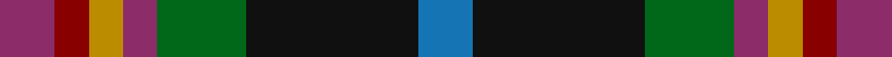
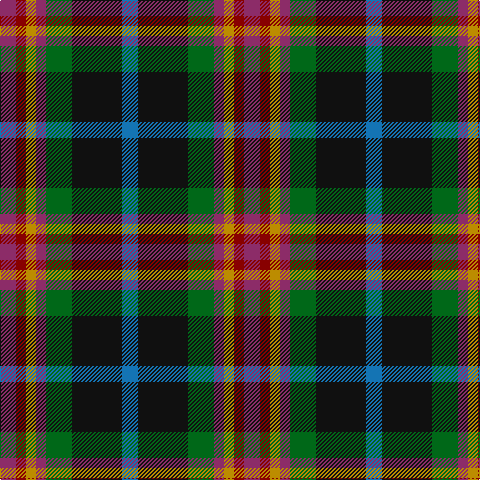

**Bands:** [RRYRGKB](/stripes/rryrgkb/) · **Stripes:** [M R LO M G K B](/stripes/stripes7/) M R LO M G K B

This was sourced from tartans-authority.  It is a [7 band tartan](/bands/bands7/).

Original link http://www.tartansauthority.com/tartan-ferret/display/7905/

## Thread count
DR/16 DRa10 DY10 DR10 G26 K50 B/16

## Palette
Each colour and its ΔE from the base-6 reference it is a variant of.

| Colour | Shade | Base | ΔE (OKLab) |
|---|---|---|---|
| B | <code style="background-color:#1474B4;">#1474B4</code> `#1474B4` | B <code style="background-color:#2A418A;">#2A418A</code> | 0.15 |
| DR | <code style="background-color:#8C2C68;">#8C2C68</code> `#8C2C68` | R <code style="background-color:#CC0000;">#CC0000</code> | 0.17 |
| DRa | <code style="background-color:#880000;">#880000</code> `#880000` | R <code style="background-color:#CC0000;">#CC0000</code> | 0.15 |
| DY | <code style="background-color:#BC8C00;">#BC8C00</code> `#BC8C00` | Y <code style="background-color:#F2BF00;">#F2BF00</code> | 0.16 |
| G | <code style="background-color:#006818;">#006818</code> `#006818` | G <code style="background-color:#006100;">#006100</code> | 0.02 |
| K | <code style="background-color:#101010;">#101010</code> `#101010` | K <code style="background-color:#000000;">#000000</code> | 0.17 |

# Sample pattern

## Nearest tartans

The nearest existing variants by ΔTartan distance.

1. [Eichelberger Family, Jörg (Personal)](/setts/s7/k10r3lo4dt12dg4r4w2~x4/) — ΔT 0.82
1. [Burnfoot Check](/setts/s8/r3dg2n2dg3k6db2o10db2~x2/) — ΔT 0.92
1. [Caledonian Labrador Retrievers](/setts/s8/m21db4dr5db4m5k21g21ly5~x2/) — ΔT 0.96
1. [Gracey (2013)](/setts/s7/r3dp8g20k20db17k3lg3~x2/) — ΔT 1.04
1. [Caledonian Labrador Retrievers](/setts/s8/m21lg4do5lg4m5k21g21lo5~x2/) — ΔT 1.09
1. [Mekos, The](/setts/s6/do19dg23lo3db15r11w5~x2/) — ΔT 1.09
1. [Labrador Club of Scotland (Corporate](/setts/s8/o21ly4dy5ly4o5k21g21lo5~x2/) — ΔT 1.16
1. [Gallowater, Original](/setts/s6/r10k17t10dp17g40ly10~x2/) — ΔT 1.16
1. [Jamestown Parish Church (Corporate)](/setts/s6/r3ly2g12k12db14w3~x2/) — ΔT 1.19
1. [Glen Chalmadale](/setts/s9/g13w2g10k5r13k3r5dt15o5~x2/) — ΔT 1.20

## Neighbour map

Every grey dot is one of 14299 variants placed by the first two principal components of the ΔTartan feature space (44% of its variance). Red is this tartan; blue dots are its nearest — click one to open its page.

<svg viewBox="0 0 640 380" role="img" style="max-width:100%;height:auto;border:1px solid #e0e0e0;border-radius:4px;display:block" xmlns="http://www.w3.org/2000/svg"><image href="/nn/cloud.v1.png" width="640" height="380"/><a href="/setts/s7/k10r3lo4dt12dg4r4w2~x4/"><circle cx="67.0" cy="204.2" r="4" fill="#3465a4"><title>Eichelberger Family, Jörg (Personal)</title></circle></a><a href="/setts/s8/r3dg2n2dg3k6db2o10db2~x2/"><circle cx="60.9" cy="192.3" r="4" fill="#3465a4"><title>Burnfoot Check</title></circle></a><a href="/setts/s8/m21db4dr5db4m5k21g21ly5~x2/"><circle cx="62.8" cy="189.7" r="4" fill="#3465a4"><title>Caledonian Labrador Retrievers</title></circle></a><a href="/setts/s7/r3dp8g20k20db17k3lg3~x2/"><circle cx="111.3" cy="212.4" r="4" fill="#3465a4"><title>Gracey (2013)</title></circle></a><a href="/setts/s8/m21lg4do5lg4m5k21g21lo5~x2/"><circle cx="64.6" cy="188.8" r="4" fill="#3465a4"><title>Caledonian Labrador Retrievers</title></circle></a><a href="/setts/s6/do19dg23lo3db15r11w5~x2/"><circle cx="86.6" cy="217.0" r="4" fill="#3465a4"><title>Mekos, The</title></circle></a><a href="/setts/s8/o21ly4dy5ly4o5k21g21lo5~x2/"><circle cx="70.7" cy="192.2" r="4" fill="#3465a4"><title>Labrador Club of Scotland (Corporate</title></circle></a><a href="/setts/s6/r10k17t10dp17g40ly10~x2/"><circle cx="75.0" cy="223.0" r="4" fill="#3465a4"><title>Gallowater, Original</title></circle></a><a href="/setts/s6/r3ly2g12k12db14w3~x2/"><circle cx="75.0" cy="202.7" r="4" fill="#3465a4"><title>Jamestown Parish Church (Corporate)</title></circle></a><a href="/setts/s9/g13w2g10k5r13k3r5dt15o5~x2/"><circle cx="91.3" cy="197.2" r="4" fill="#3465a4"><title>Glen Chalmadale</title></circle></a><circle cx="98.3" cy="212.6" r="5" fill="#c00000"/></svg>

ID: /setts/s7/b8k25g13m5lo5r5m8~x2/
