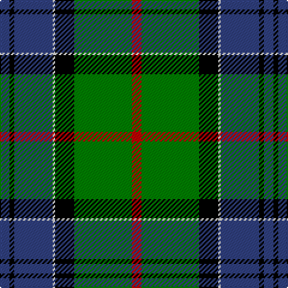

In pattern [BKBWKGR](/patterns/bkbwkgr/).

This was sourced from weddslist.  It is a [7 stripes tartan](/stripes/stripes7/).

Original link http://www.weddslist.com/cgi-bin/tartans/pg.pl?source=sts

## Thread count
B/8 K4 B32 LN2 K16 G48 R/8

## Palette
Each colour and its ΔE from the base-6 reference it is a variant of.

| Colour | Shade | Base | ΔE (OKLab) |
|---|---|---|---|
| B | <code style="background-color:#304080;">#304080</code> `#304080` | B <code style="background-color:#2C4084;">#2C4084</code> | 0.01 |
| G | <code style="background-color:#008000;">#008000</code> `#008000` | G <code style="background-color:#006400;">#006400</code> | 0.09 |
| K | <code style="background-color:#000000;">#000000</code> `#000000` | K <code style="background-color:#000000;">#000000</code> | 0.00 |
| LN | <code style="background-color:#E0E0E0;">#E0E0E0</code> `#E0E0E0` | W <code style="background-color:#F4F4F0;">#F4F4F0</code> | 0.06 |
| R | <code style="background-color:#C00000;">#C00000</code> `#C00000` | R <code style="background-color:#C80000;">#C80000</code> | 0.02 |

# Sample pattern

## Nearest tartans

The nearest existing variants by ΔTartan distance.

1. [MacLaren](/setts/s7/b48k16g16r4g16k2y4-b304080-g008000-k000000-rc00000-yf0c000/) — ΔT 0.62
1. [MacNeil 3](/setts/s8/g90w4r6k30r6b30r6b30-b304080-g008000-k000000-rc00000-we0e0e0/) — ΔT 0.63
1. [Ferguson of Athol](/setts/s7/b48k16g16r4g16k2w4-b304080-g008000-k000000-rc00000-we0e0e0/) — ΔT 0.71
1. [Ogilvie 1](/setts/s9/b48y4k16g32k2g6k2g6r8-b304080-g008000-k000000-rc00000-yf0c000/) — ΔT 0.72
1. [Lochaber](/setts/s8/g12r4g72k80r4b72ba4g8-b304080-ba5480b0-g008000-k000000-rc00000/) — ΔT 0.89
1. [Sinclair, hunting](/setts/s7/g4r2g60k32w2b32r4-b304080-g008000-k000000-rc00000-we0e0e0/) — ΔT 0.90
1. [Big Sur MacLaren (Personal)](/setts/s7/y62k36g26r6g26k2ya6-g005030-k101010-rc80000-y88acb8-yae8c000/) — ΔT 0.97
1. [Chiti, Cristiano (Personal)](/setts/s6/g40b22w12r4ba6w2-b002814-ba780078-g004c00-r880000-wc0c0c0/) — ΔT 1.02
1. [MacTaggert](/setts/s7/g60b8g4k40b36r2b8-b304080-g008000-k000000-rc00000/) — ΔT 1.04
1. [Black Gold](/setts/s9/g6k6g6k36b56w2ga44k4g4-b3c5070-g604000-ga008b45-k000000-wffffff/) — ΔT 1.05

## Neighbour map

Every grey dot is one of 15726 variants placed by the first two principal components of the ΔTartan feature space (44% of its variance). Red is this tartan; blue dots are its nearest — click one to open its page.

<svg viewBox="0 0 640 380" role="img" style="max-width:100%;height:auto;border:1px solid #e0e0e0;border-radius:4px;display:block" xmlns="http://www.w3.org/2000/svg"><image href="/nn/cloud.v1.png" width="640" height="380"/><a href="/setts/s7/b48k16g16r4g16k2y4-b304080-g008000-k000000-rc00000-yf0c000/"><circle cx="231.8" cy="145.2" r="4" fill="#3465a4"><title>MacLaren</title></circle></a><a href="/setts/s8/g90w4r6k30r6b30r6b30-b304080-g008000-k000000-rc00000-we0e0e0/"><circle cx="225.6" cy="133.3" r="4" fill="#3465a4"><title>MacNeil 3</title></circle></a><a href="/setts/s7/b48k16g16r4g16k2w4-b304080-g008000-k000000-rc00000-we0e0e0/"><circle cx="230.1" cy="144.6" r="4" fill="#3465a4"><title>Ferguson of Athol</title></circle></a><a href="/setts/s9/b48y4k16g32k2g6k2g6r8-b304080-g008000-k000000-rc00000-yf0c000/"><circle cx="204.9" cy="124.5" r="4" fill="#3465a4"><title>Ogilvie 1</title></circle></a><a href="/setts/s8/g12r4g72k80r4b72ba4g8-b304080-ba5480b0-g008000-k000000-rc00000/"><circle cx="184.0" cy="141.5" r="4" fill="#3465a4"><title>Lochaber</title></circle></a><a href="/setts/s7/g4r2g60k32w2b32r4-b304080-g008000-k000000-rc00000-we0e0e0/"><circle cx="247.0" cy="129.6" r="4" fill="#3465a4"><title>Sinclair, hunting</title></circle></a><a href="/setts/s7/y62k36g26r6g26k2ya6-g005030-k101010-rc80000-y88acb8-yae8c000/"><circle cx="193.9" cy="138.4" r="4" fill="#3465a4"><title>Big Sur MacLaren (Personal)</title></circle></a><a href="/setts/s6/g40b22w12r4ba6w2-b002814-ba780078-g004c00-r880000-wc0c0c0/"><circle cx="241.2" cy="167.1" r="4" fill="#3465a4"><title>Chiti, Cristiano (Personal)</title></circle></a><a href="/setts/s7/g60b8g4k40b36r2b8-b304080-g008000-k000000-rc00000/"><circle cx="239.2" cy="158.6" r="4" fill="#3465a4"><title>MacTaggert</title></circle></a><a href="/setts/s9/g6k6g6k36b56w2ga44k4g4-b3c5070-g604000-ga008b45-k000000-wffffff/"><circle cx="184.1" cy="120.4" r="4" fill="#3465a4"><title>Black Gold</title></circle></a><circle cx="208.1" cy="146.8" r="5" fill="#c00000"/></svg>

ID: /setts/s7/b8k4b32w2k16g48r8-b304080-g008000-k000000-rc00000-we0e0e0/
