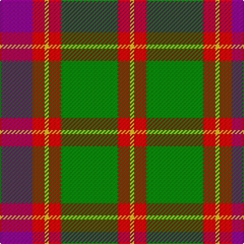

In pattern [BRYRGRY](/patterns/bryrgry/).

This was sourced from weddslist.  It is a [7 stripes tartan](/stripes/stripes7/).

Original link http://www.weddslist.com/cgi-bin/tartans/pg.pl?source=sts

## Thread count
P/32 R12 Y4 R12 G56 R12 Y/4

## Palette
Each colour and its ΔE from the base-6 reference it is a variant of.

| Colour | Shade | Base | ΔE (OKLab) |
|---|---|---|---|
| G | <code style="background-color:#008000;">#008000</code> `#008000` | G <code style="background-color:#006100;">#006100</code> | 0.10 |
| P | <code style="background-color:#800080;">#800080</code> `#800080` | B <code style="background-color:#2A418A;">#2A418A</code> | 0.17 |
| R | <code style="background-color:#C00000;">#C00000</code> `#C00000` | R <code style="background-color:#CC0000;">#CC0000</code> | 0.03 |
| Y | <code style="background-color:#F0C000;">#F0C000</code> `#F0C000` | Y <code style="background-color:#F2BF00;">#F2BF00</code> | 0.00 |

# Sample pattern

## Nearest tartans

The nearest existing variants by ΔTartan distance.

1. [Cranston Dress Family Tartan Tartan Number: 753. Earliest known date: pre 2003 Restricted See products available Copyright © Blair Urquhart, Comrie, 2015](/setts/s8/r30b3r2b3r6b14g26ga6~b2c2c80-g289c18-ga006818-rc80000/) — ΔT 0.33
1. [Cranston, dress](/setts/s8/r30b3r2b3r6b14g26ga6~b304080-g30a010-ga008000-rc00000/) — ΔT 0.38
1. [Cranston Dress](/setts/s8/r15b2r1b2r3b7g13ga3x2~b2c2c80-g289c18-ga006818-rc80000/) — ΔT 0.41
1. [Logan with Yellow](/setts/s7/b8r3y1r3g14r3y1x4~b780078-g006818-rc80000-ye8c000/) — ΔT 0.42
1. [Logan, Light](/setts/s7/b9r4b1r4g15ra4b1x2~b800080-g30a010-rd03030-rac00000/) — ΔT 0.60
1. [McCook/Cook (Name)](/setts/s7/g12b6g6r15k1r1k2x4~b2888c4-g006818-k101010-rc80000/) — ΔT 0.67
1. [Logan #3](/setts/s7/b9y4b1y4g15r4b1x4~b440044-g00801c-rc8002c-ye08070/) — ΔT 0.67
1. [Logan - 1819 (with yellow)](/setts/s7/b8r3y1r3g14r3y1x4~b440044-g285800-rc80000-ye8c000/) — ΔT 0.71
1. [Logan Light](/setts/s7/b9r4b1r4g15ra4b1x2~b5a008c-g309c18-rc82828-radc0000/) — ΔT 0.73
1. [MacKintosh, Geddes](/setts/s7/b1r5g18r4b9r10w1x4~b304080-g008000-rc00000-we0e0e0/) — ΔT 0.74

## Neighbour map

Every grey dot is one of 15726 variants placed by the first two principal components of the ΔTartan feature space (44% of its variance). Red is this tartan; blue dots are its nearest — click one to open its page.

<svg viewBox="0 0 640 380" role="img" style="max-width:100%;height:auto;border:1px solid #e0e0e0;border-radius:4px;display:block" xmlns="http://www.w3.org/2000/svg"><image href="/nn/cloud.v1.png" width="640" height="380"/><a href="/setts/s8/r30b3r2b3r6b14g26ga6~b2c2c80-g289c18-ga006818-rc80000/"><circle cx="235.5" cy="167.0" r="4" fill="#3465a4"><title>Cranston Dress Family Tartan Tartan Number: 753. Earliest known date: pre 2003 Restricted See products available Copyright © Blair Urquhart, Comrie, 2015</title></circle></a><a href="/setts/s8/r30b3r2b3r6b14g26ga6~b304080-g30a010-ga008000-rc00000/"><circle cx="241.4" cy="169.8" r="4" fill="#3465a4"><title>Cranston, dress</title></circle></a><a href="/setts/s8/r15b2r1b2r3b7g13ga3x2~b2c2c80-g289c18-ga006818-rc80000/"><circle cx="227.8" cy="169.8" r="4" fill="#3465a4"><title>Cranston Dress</title></circle></a><a href="/setts/s7/b8r3y1r3g14r3y1x4~b780078-g006818-rc80000-ye8c000/"><circle cx="246.1" cy="178.0" r="4" fill="#3465a4"><title>Logan with Yellow</title></circle></a><a href="/setts/s7/b9r4b1r4g15ra4b1x2~b800080-g30a010-rd03030-rac00000/"><circle cx="217.6" cy="174.2" r="4" fill="#3465a4"><title>Logan, Light</title></circle></a><a href="/setts/s7/g12b6g6r15k1r1k2x4~b2888c4-g006818-k101010-rc80000/"><circle cx="247.8" cy="188.1" r="4" fill="#3465a4"><title>McCook/Cook (Name)</title></circle></a><a href="/setts/s7/b9y4b1y4g15r4b1x4~b440044-g00801c-rc8002c-ye08070/"><circle cx="209.1" cy="177.1" r="4" fill="#3465a4"><title>Logan #3</title></circle></a><a href="/setts/s7/b8r3y1r3g14r3y1x4~b440044-g285800-rc80000-ye8c000/"><circle cx="247.2" cy="180.3" r="4" fill="#3465a4"><title>Logan - 1819 (with yellow)</title></circle></a><a href="/setts/s7/b9r4b1r4g15ra4b1x2~b5a008c-g309c18-rc82828-radc0000/"><circle cx="208.9" cy="173.9" r="4" fill="#3465a4"><title>Logan Light</title></circle></a><a href="/setts/s7/b1r5g18r4b9r10w1x4~b304080-g008000-rc00000-we0e0e0/"><circle cx="247.8" cy="181.6" r="4" fill="#3465a4"><title>MacKintosh, Geddes</title></circle></a><circle cx="238.5" cy="174.8" r="5" fill="#c00000"/></svg>

ID: /setts/s7/b8r3y1r3g14r3y1x4~b800080-g008000-rc00000-yf0c000/
