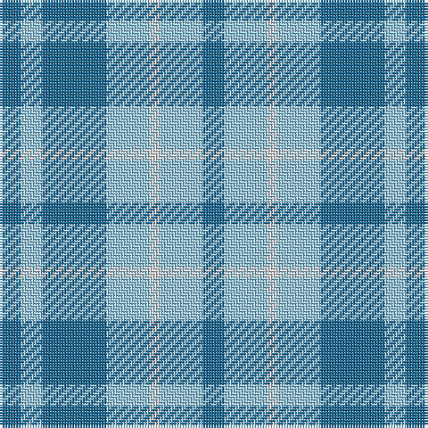

In pattern [BWBWWWB](/patterns/bwbwwwb/).

This was sourced from tartans-authority.  It is a [7 stripes tartan](/stripes/stripes7/).

Original link http://www.tartansauthority.com/tartan-ferret/display/10103/

## Thread count
B/8 LB8 B24 LB16 LN4 LB16 B/8

## Palette
Each colour and its ΔE from the base-6 reference it is a variant of.

| Colour | Shade | Base | ΔE (OKLab) |
|---|---|---|---|
| B | <code style="background-color:#1C6894;">#1C6894</code> `#1C6894` | B <code style="background-color:#2C4084;">#2C4084</code> | 0.11 |
| LB | <code style="background-color:#98C8E8;">#98C8E8</code> `#98C8E8` | W <code style="background-color:#F4F4F0;">#F4F4F0</code> | 0.17 |
| LN | <code style="background-color:#E0E0E0;">#E0E0E0</code> `#E0E0E0` | W <code style="background-color:#F4F4F0;">#F4F4F0</code> | 0.06 |

# Sample pattern

## Nearest tartans

The nearest existing variants by ΔTartan distance.

1. [Langdons](/setts/s7/b8ba16w4ba16b24ba8b8-b144683-ba2194d3-wffffff/) — ΔT 1.38
1. [Manx Cornaa (Personal)](/setts/s6/b20ba20w4ba20b20ba4-b2c2c80-ba2888c4-we0e0e0/) — ΔT 1.83
1. [von Prondzynski (2016)](/setts/s7/b8w8b16r16b24w24y2-b3850c8-r888888-wc0c0c0-yffff00/) — ΔT 1.87
1. [Louise Beveridge (Personal)](/setts/s5/w80wa50b32w16b8-b003c64-w98c8e8-wae0e0e0/) — ΔT 1.87
1. [Norris (1957)](/setts/s6/g24b4g28w4b28r4-b3850c8-g408060-rc80000-wfcfcfc/) — ΔT 1.88
1. [Genesee Community College](/setts/s4/b36w8b6y24-b1474b4-wffffff-ye0a126/) — ΔT 1.98
1. [Outdoorsmen (Fashion)](/setts/s7/b12k4g16k4b16g36k8-b2474e8-g408060-k101010/) — ΔT 2.04
1. [Digital Corporate Tartan Tartan Number: 2140. Earliest known date: 1991 Designed in Company colours. See products available Copyright © Blair Urquhart, Comrie, 2015](/setts/s10/b12k6b20y10b4y4b4y4b14w4-b2888c4-k101010-we0e0e0-ya08858/) — ΔT 2.05
1. [Manx Cornaa (Personal)](/setts/s4/b4ba20b20w4-b2888c4-ba2c2c80-we0e0e0/) — ΔT 2.06
1. [Manx, Cornaa](/setts/s4/b4ba20b20w4-b8080d0-ba304080-we0e0e0/) — ΔT 2.15

## Neighbour map

Every grey dot is one of 15726 variants placed by the first two principal components of the ΔTartan feature space (44% of its variance). Red is this tartan; blue dots are its nearest — click one to open its page.

<svg viewBox="0 0 640 380" role="img" style="max-width:100%;height:auto;border:1px solid #e0e0e0;border-radius:4px;display:block" xmlns="http://www.w3.org/2000/svg"><image href="/nn/cloud.v1.png" width="640" height="380"/><a href="/setts/s7/b8ba16w4ba16b24ba8b8-b144683-ba2194d3-wffffff/"><circle cx="269.0" cy="285.5" r="4" fill="#3465a4"><title>Langdons</title></circle></a><a href="/setts/s6/b20ba20w4ba20b20ba4-b2c2c80-ba2888c4-we0e0e0/"><circle cx="276.2" cy="300.5" r="4" fill="#3465a4"><title>Manx Cornaa (Personal)</title></circle></a><a href="/setts/s7/b8w8b16r16b24w24y2-b3850c8-r888888-wc0c0c0-yffff00/"><circle cx="238.5" cy="222.2" r="4" fill="#3465a4"><title>von Prondzynski (2016)</title></circle></a><a href="/setts/s5/w80wa50b32w16b8-b003c64-w98c8e8-wae0e0e0/"><circle cx="261.1" cy="232.5" r="4" fill="#3465a4"><title>Louise Beveridge (Personal)</title></circle></a><a href="/setts/s6/g24b4g28w4b28r4-b3850c8-g408060-rc80000-wfcfcfc/"><circle cx="310.4" cy="246.0" r="4" fill="#3465a4"><title>Norris (1957)</title></circle></a><a href="/setts/s4/b36w8b6y24-b1474b4-wffffff-ye0a126/"><circle cx="289.4" cy="268.3" r="4" fill="#3465a4"><title>Genesee Community College</title></circle></a><a href="/setts/s7/b12k4g16k4b16g36k8-b2474e8-g408060-k101010/"><circle cx="296.0" cy="242.2" r="4" fill="#3465a4"><title>Outdoorsmen (Fashion)</title></circle></a><a href="/setts/s10/b12k6b20y10b4y4b4y4b14w4-b2888c4-k101010-we0e0e0-ya08858/"><circle cx="322.2" cy="244.5" r="4" fill="#3465a4"><title>Digital Corporate Tartan Tartan Number: 2140. Earliest known date: 1991 Designed in Company colours. See products available Copyright © Blair Urquhart, Comrie, 2015</title></circle></a><a href="/setts/s4/b4ba20b20w4-b2888c4-ba2c2c80-we0e0e0/"><circle cx="276.8" cy="292.5" r="4" fill="#3465a4"><title>Manx Cornaa (Personal)</title></circle></a><a href="/setts/s4/b4ba20b20w4-b8080d0-ba304080-we0e0e0/"><circle cx="294.2" cy="292.3" r="4" fill="#3465a4"><title>Manx, Cornaa</title></circle></a><circle cx="258.5" cy="272.7" r="5" fill="#c00000"/></svg>

ID: /setts/s7/b8w16wa4w16b24w8b8-b1c6894-w98c8e8-wae0e0e0/
