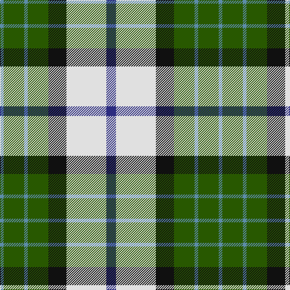

In pattern [BGBGKWB](/patterns/bgbgkwb/).

This was sourced from register-of-tartans.  It is a [7 stripes tartan](/stripes/stripes7/).

Original link https://www.tartanregister.gov.uk/tartanDetails.aspx?ref=2761

## Attestations

This cloth appears in 2 source records; the oldest owns this page.

- 01/06/1997 — MacRobart Dress (Personal) (register-of-tartans, [record](https://www.tartanregister.gov.uk/tartanDetails.aspx?ref=2761))
- June 1997 — MacRobart Dress (Personal) (tartans-authority, [record](http://www.tartansauthority.com/tartan-ferret/display/2399/))

## Thread count
B/6 G34 B6 G34 K30 LN66 DB/16

## Palette
Each colour and its ΔE from the base-6 reference it is a variant of.

| Colour | Shade | Base | ΔE (OKLab) |
|---|---|---|---|
| B | <code style="background-color:#5C8CA8;">#5C8CA8</code> `#5C8CA8` | B <code style="background-color:#2A418A;">#2A418A</code> | 0.23 |
| DB | <code style="background-color:#2C2C80;">#2C2C80</code> `#2C2C80` | B <code style="background-color:#2A418A;">#2A418A</code> | 0.06 |
| G | <code style="background-color:#285800;">#285800</code> `#285800` | G <code style="background-color:#006100;">#006100</code> | 0.03 |
| K | <code style="background-color:#101010;">#101010</code> `#101010` | K <code style="background-color:#000000;">#000000</code> | 0.17 |
| LN | <code style="background-color:#E0E0E0;">#E0E0E0</code> `#E0E0E0` | W <code style="background-color:#F7F7F7;">#F7F7F7</code> | 0.07 |

# Sample pattern

## Nearest tartans

The nearest existing variants by ΔTartan distance.

1. [MacRobart, dress](/setts/s7/b8w33k15g17ba3g17ba3x2~b304080-ba5480b0-g008000-k000000-we0e0e0/) — ΔT 0.52
1. [Inverary](/setts/s6/g10k1b13k3w9y3x2~b304080-g006030-k000000-we0e0e0-yf0c000/) — ΔT 0.84
1. [Hackett, William (Coatbridge) (Personal)](/setts/s8/k20w4r4w20g20w5g2ga2x2~g015c16-ga278f1c-k101010-rce1422-wffffff/) — ΔT 0.84
1. [Ainslie Lake.. District Tartan Tartan Number: 586. Earliest known date: 1985 On the occasion of the Cape Breton Bicentennial. See products available Copyright © Blair Urquhart, Comrie, 2015](/setts/s7/b6w10g10r2y3r1b3x2~b2c2c80-g006818-rc80000-we0e0e0-ye8c000/) — ΔT 0.85
1. [Alexander Brothers - 2007? (Corp.)](/setts/s8/g5y2b20w2k20w20k2w5x2~b5c8ca8-g289c18-k101010-we0e0e0-ye8c000/) — ΔT 0.87
1. [Northern Ontario](/setts/s7/g17ga5b2w12b2y4ga7x4~b1c0070-g603800-ga408060-wf8f8f8-ye8c000/) — ΔT 0.91
1. [Inverary Clan Tartan Tartan Number: 772. Earliest known date: pre 2003 From a miniature of Elizabeth Innes at (sic) Edingight from Adam See products available Copyright © Blair Urquhart, Comrie, 2015](/setts/s6/g10k1b13k3w9y3x2~b2c2c80-g006428-k101010-we0e0e0-ye8c000/) — ΔT 0.92
1. [Ainslie, Lake](/setts/s7/b6w10g10r2y3r1b3x2~b2c2c80-g006818-rc80000-wfcfcfc-ye8c000/) — ΔT 0.94
1. [MacLaren Dress](/setts/s8/b2w12k8g8r2g8k1y2x2~b2c2c80-g408060-k101010-rc80000-wf8f8f8-yd09800/) — ΔT 1.00
1. [Ainslie, Lake](/setts/s7/b6w10g10r2y3r1b3x2~b304080-g008000-rc00000-we0e0e0-yf0c000/) — ΔT 1.00

## Neighbour map

Every grey dot is one of 15726 variants placed by the first two principal components of the ΔTartan feature space (44% of its variance). Red is this tartan; blue dots are its nearest — click one to open its page.

<svg viewBox="0 0 640 380" role="img" style="max-width:100%;height:auto;border:1px solid #e0e0e0;border-radius:4px;display:block" xmlns="http://www.w3.org/2000/svg"><image href="/nn/cloud.v1.png" width="640" height="380"/><a href="/setts/s7/b8w33k15g17ba3g17ba3x2~b304080-ba5480b0-g008000-k000000-we0e0e0/"><circle cx="101.9" cy="174.5" r="4" fill="#3465a4"><title>MacRobart, dress</title></circle></a><a href="/setts/s6/g10k1b13k3w9y3x2~b304080-g006030-k000000-we0e0e0-yf0c000/"><circle cx="99.8" cy="180.4" r="4" fill="#3465a4"><title>Inverary</title></circle></a><a href="/setts/s8/k20w4r4w20g20w5g2ga2x2~g015c16-ga278f1c-k101010-rce1422-wffffff/"><circle cx="119.6" cy="155.3" r="4" fill="#3465a4"><title>Hackett, William (Coatbridge) (Personal)</title></circle></a><a href="/setts/s7/b6w10g10r2y3r1b3x2~b2c2c80-g006818-rc80000-we0e0e0-ye8c000/"><circle cx="78.2" cy="176.8" r="4" fill="#3465a4"><title>Ainslie Lake.. District Tartan Tartan Number: 586. Earliest known date: 1985 On the occasion of the Cape Breton Bicentennial. See products available Copyright © Blair Urquhart, Comrie, 2015</title></circle></a><a href="/setts/s8/g5y2b20w2k20w20k2w5x2~b5c8ca8-g289c18-k101010-we0e0e0-ye8c000/"><circle cx="117.5" cy="155.3" r="4" fill="#3465a4"><title>Alexander Brothers - 2007? (Corp.)</title></circle></a><a href="/setts/s7/g17ga5b2w12b2y4ga7x4~b1c0070-g603800-ga408060-wf8f8f8-ye8c000/"><circle cx="100.8" cy="177.1" r="4" fill="#3465a4"><title>Northern Ontario</title></circle></a><a href="/setts/s6/g10k1b13k3w9y3x2~b2c2c80-g006428-k101010-we0e0e0-ye8c000/"><circle cx="103.4" cy="181.4" r="4" fill="#3465a4"><title>Inverary Clan Tartan Tartan Number: 772. Earliest known date: pre 2003 From a miniature of Elizabeth Innes at (sic) Edingight from Adam See products available Copyright © Blair Urquhart, Comrie, 2015</title></circle></a><a href="/setts/s7/b6w10g10r2y3r1b3x2~b2c2c80-g006818-rc80000-wfcfcfc-ye8c000/"><circle cx="69.8" cy="172.5" r="4" fill="#3465a4"><title>Ainslie, Lake</title></circle></a><a href="/setts/s8/b2w12k8g8r2g8k1y2x2~b2c2c80-g408060-k101010-rc80000-wf8f8f8-yd09800/"><circle cx="95.1" cy="145.9" r="4" fill="#3465a4"><title>MacLaren Dress</title></circle></a><a href="/setts/s7/b6w10g10r2y3r1b3x2~b304080-g008000-rc00000-we0e0e0-yf0c000/"><circle cx="81.8" cy="178.0" r="4" fill="#3465a4"><title>Ainslie, Lake</title></circle></a><circle cx="111.6" cy="176.1" r="5" fill="#c00000"/></svg>

ID: /setts/s7/b8w33k15g17ba3g17ba3x2~b2c2c80-ba5c8ca8-g285800-k101010-we0e0e0/
