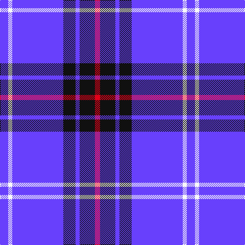

**Bands:** [BWBKBKR](/stripes/bwbkbkr/) · **Stripes:** [B W B K B K R](/stripes/stripes7/) B W B K B K R

This was sourced from tartans-authority.  It is a [7 band tartan](/bands/bands7/).

Original link http://www.tartansauthority.com/tartan-ferret/display/7569/

## Thread count
P/16 W8 P100 K24 P8 K30 R/10

## Palette
Each colour and its ΔE from the base-6 reference it is a variant of.

| Colour | Shade | Base | ΔE (OKLab) |
|---|---|---|---|
| K | <code style="background-color:#101010;">#101010</code> `#101010` | K <code style="background-color:#000000;">#000000</code> | 0.17 |
| P | <code style="background-color:#6840FC;">#6840FC</code> `#6840FC` | B <code style="background-color:#2A418A;">#2A418A</code> | 0.20 |
| R | <code style="background-color:#E40018;">#E40018</code> `#E40018` | R <code style="background-color:#CC0000;">#CC0000</code> | 0.05 |
| W | <code style="background-color:#F8F8F8;">#F8F8F8</code> `#F8F8F8` | W <code style="background-color:#F7F7F7;">#F7F7F7</code> | 0.00 |

# Sample pattern

## Nearest tartans

The nearest existing variants by ΔTartan distance.

1. [Debbie Munro Memorial (Corporate)](/setts/s5/db26lp11db3lp4k2~x4/) — ΔT 1.58
1. [Doten (2013)](/setts/s5/r14w6db38k3g2~x2/) — ΔT 1.60
1. [Kinding](/setts/s7/k10db30g3db3g3db3r6~x2/) — ΔT 1.64
1. [Presbyterian College Band (Corp)](/setts/s7/r28k2b36k2w4k2b7~x2/) — ΔT 1.66
1. [Hannah (Personal)](/setts/s6/ly2k9w3k9b35w2~x2/) — ΔT 1.71
1. [Hoosier (Fashion)](/setts/s8/b15db65ly7b4ly3db30b15w3~x2/) — ΔT 1.76
1. [Glen Moy](/setts/s5/db13lb3db1r3lb1~x6/) — ΔT 1.77
1. [Lytley alias Parsons Hunting (Personal)](/setts/s5/db10r1ly1db3ly2~x5/) — ΔT 1.78
1. [Mortell (Personal)](/setts/s10/db20b2w5r2db10b5db20b2w5r5~x2/) — ΔT 1.81
1. [International Festival of Authors](/setts/s6/dp30m5dp5t4dp4g12~x2/) — ΔT 1.82

## Neighbour map

Every grey dot is one of 14313 variants placed by the first two principal components of the ΔTartan feature space (44% of its variance). Red is this tartan; blue dots are its nearest — click one to open its page.

<svg viewBox="0 0 640 380" role="img" style="max-width:100%;height:auto;border:1px solid #e0e0e0;border-radius:4px;display:block" xmlns="http://www.w3.org/2000/svg"><image href="/nn/cloud.v1.png" width="640" height="380"/><a href="/setts/s5/db26lp11db3lp4k2~x4/"><circle cx="378.5" cy="206.4" r="4" fill="#3465a4"><title>Debbie Munro Memorial (Corporate)</title></circle></a><a href="/setts/s5/r14w6db38k3g2~x2/"><circle cx="310.5" cy="147.8" r="4" fill="#3465a4"><title>Doten (2013)</title></circle></a><a href="/setts/s7/k10db30g3db3g3db3r6~x2/"><circle cx="327.0" cy="190.6" r="4" fill="#3465a4"><title>Kinding</title></circle></a><a href="/setts/s7/r28k2b36k2w4k2b7~x2/"><circle cx="328.3" cy="151.2" r="4" fill="#3465a4"><title>Presbyterian College Band (Corp)</title></circle></a><a href="/setts/s6/ly2k9w3k9b35w2~x2/"><circle cx="321.4" cy="162.9" r="4" fill="#3465a4"><title>Hannah (Personal)</title></circle></a><a href="/setts/s8/b15db65ly7b4ly3db30b15w3~x2/"><circle cx="406.3" cy="161.9" r="4" fill="#3465a4"><title>Hoosier (Fashion)</title></circle></a><a href="/setts/s5/db13lb3db1r3lb1~x6/"><circle cx="395.5" cy="201.2" r="4" fill="#3465a4"><title>Glen Moy</title></circle></a><a href="/setts/s5/db10r1ly1db3ly2~x5/"><circle cx="283.7" cy="196.9" r="4" fill="#3465a4"><title>Lytley alias Parsons Hunting (Personal)</title></circle></a><a href="/setts/s10/db20b2w5r2db10b5db20b2w5r5~x2/"><circle cx="337.8" cy="186.8" r="4" fill="#3465a4"><title>Mortell (Personal)</title></circle></a><a href="/setts/s6/dp30m5dp5t4dp4g12~x2/"><circle cx="349.3" cy="210.7" r="4" fill="#3465a4"><title>International Festival of Authors</title></circle></a><circle cx="351.8" cy="170.0" r="5" fill="#c00000"/></svg>

ID: /setts/s7/b8w4b50k12b4k15r5~x2/
