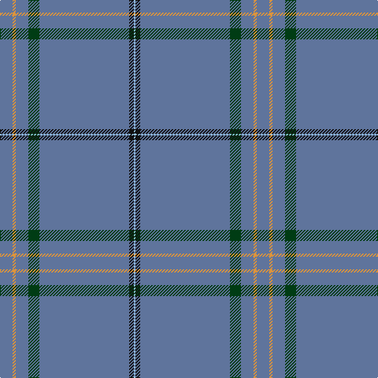

In pattern [BYBGBKW](/patterns/bybgbkw/).

This was sourced from register-of-tartans.  It is a [7 stripes tartan](/stripes/stripes7/).

Original link https://www.tartanregister.gov.uk/tartanDetails.aspx?ref=10858

## Thread count
B/16 O4 B16 DG14 B114 K6 LB/2

## Palette
Each colour and its ΔE from the base-6 reference it is a variant of.

| Colour | Shade | Base | ΔE (OKLab) |
|---|---|---|---|
| B | <code style="background-color:#5F749C;">#5F749C</code> `#5F749C` | B <code style="background-color:#2A418A;">#2A418A</code> | 0.17 |
| DG | <code style="background-color:#003C14;">#003C14</code> `#003C14` | G <code style="background-color:#006100;">#006100</code> | 0.13 |
| K | <code style="background-color:#101010;">#101010</code> `#101010` | K <code style="background-color:#000000;">#000000</code> | 0.17 |
| LB | <code style="background-color:#98C8E8;">#98C8E8</code> `#98C8E8` | W <code style="background-color:#F7F7F7;">#F7F7F7</code> | 0.18 |
| O | <code style="background-color:#DC943C;">#DC943C</code> `#DC943C` | Y <code style="background-color:#F2BF00;">#F2BF00</code> | 0.12 |

# Sample pattern

## Nearest tartans

The nearest existing variants by ΔTartan distance.

1. [Wylie (Name)](/setts/s6/b45y3b10r4k1w2x4~b587488-k101010-rc04c08-wfcfcfc-yfccc00/) — ΔT 1.03
1. [European](/setts/s8/b70y4b3y4b7k2b2r7x2~b506878-k101010-rc80000-ye8c000/) — ΔT 1.60
1. [Wylie](/setts/s6/b45k3b10r4ka1w2x4~b587488-k000000-ka101010-rc04c08-wfcfcfc/) — ΔT 1.61
1. [Highland Dusk (Fashion)](/setts/s13/b43ba2b2ba1b1r11b2ba2b1b1b20w4b7x2~b586478-ba2c2c80-re87878-we4e0b8/) — ΔT 1.76
1. [RAAF #3](/setts/s9/b48w2b7w2b7w2b20ba11r2x2~b5c8ca8-ba2c2c80-rc80000-we0e0e0/) — ΔT 1.83
1. [Heart of Strathearn](/setts/s9/g16b6r6b4w2b80y3b10ya2~b1870a4-g009420-r901c38-we0e0e0-yd87c00-yae8c000/) — ΔT 1.87
1. [Highland Dusk](/setts/s13/b43ba2b2r1b1bb11b2ba2b1b1b20w4b7x2~b586478-ba2c2c80-bb003c64-re87878-we4e0b8/) — ΔT 1.98
1. [Wylie (Ancient)](/setts/s6/b86y2b18r3k1w2x2~b1870a4-k101010-rc80000-we0e0e0-ye8c000/) — ΔT 2.01
1. [Cullen (Christian Hill)](/setts/s7/b8y2b8g7b57k3ba1x2~b202060-ba5c8ca8-g285800-k101010-yd09800/) — ΔT 2.07
1. [Wylie](/setts/s6/b45y3b10r4k1w2x2~b304080-k000000-re06000-we0e0e0-yf0c000/) — ΔT 2.15

## Neighbour map

Every grey dot is one of 15726 variants placed by the first two principal components of the ΔTartan feature space (44% of its variance). Red is this tartan; blue dots are its nearest — click one to open its page.

<svg viewBox="0 0 640 380" role="img" style="max-width:100%;height:auto;border:1px solid #e0e0e0;border-radius:4px;display:block" xmlns="http://www.w3.org/2000/svg"><image href="/nn/cloud.v1.png" width="640" height="380"/><a href="/setts/s6/b45y3b10r4k1w2x4~b587488-k101010-rc04c08-wfcfcfc-yfccc00/"><circle cx="622.1" cy="134.5" r="4" fill="#3465a4"><title>Wylie (Name)</title></circle></a><a href="/setts/s8/b70y4b3y4b7k2b2r7x2~b506878-k101010-rc80000-ye8c000/"><circle cx="626.0" cy="133.7" r="4" fill="#3465a4"><title>European</title></circle></a><a href="/setts/s6/b45k3b10r4ka1w2x4~b587488-k000000-ka101010-rc04c08-wfcfcfc/"><circle cx="598.0" cy="127.4" r="4" fill="#3465a4"><title>Wylie</title></circle></a><a href="/setts/s13/b43ba2b2ba1b1r11b2ba2b1b1b20w4b7x2~b586478-ba2c2c80-re87878-we4e0b8/"><circle cx="583.5" cy="101.0" r="4" fill="#3465a4"><title>Highland Dusk (Fashion)</title></circle></a><a href="/setts/s9/b48w2b7w2b7w2b20ba11r2x2~b5c8ca8-ba2c2c80-rc80000-we0e0e0/"><circle cx="572.9" cy="165.1" r="4" fill="#3465a4"><title>RAAF #3</title></circle></a><a href="/setts/s9/g16b6r6b4w2b80y3b10ya2~b1870a4-g009420-r901c38-we0e0e0-yd87c00-yae8c000/"><circle cx="547.2" cy="104.2" r="4" fill="#3465a4"><title>Heart of Strathearn</title></circle></a><a href="/setts/s13/b43ba2b2r1b1bb11b2ba2b1b1b20w4b7x2~b586478-ba2c2c80-bb003c64-re87878-we4e0b8/"><circle cx="604.5" cy="115.3" r="4" fill="#3465a4"><title>Highland Dusk</title></circle></a><a href="/setts/s6/b86y2b18r3k1w2x2~b1870a4-k101010-rc80000-we0e0e0-ye8c000/"><circle cx="626.0" cy="146.1" r="4" fill="#3465a4"><title>Wylie (Ancient)</title></circle></a><a href="/setts/s7/b8y2b8g7b57k3ba1x2~b202060-ba5c8ca8-g285800-k101010-yd09800/"><circle cx="626.0" cy="148.2" r="4" fill="#3465a4"><title>Cullen (Christian Hill)</title></circle></a><a href="/setts/s6/b45y3b10r4k1w2x2~b304080-k000000-re06000-we0e0e0-yf0c000/"><circle cx="592.0" cy="127.9" r="4" fill="#3465a4"><title>Wylie</title></circle></a><circle cx="626.0" cy="131.3" r="5" fill="#c00000"/></svg>

ID: /setts/s7/b8y2b8g7b57k3w1x2~b5f749c-g003c14-k101010-w98c8e8-ydc943c/
